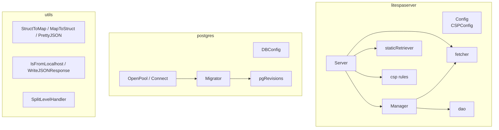
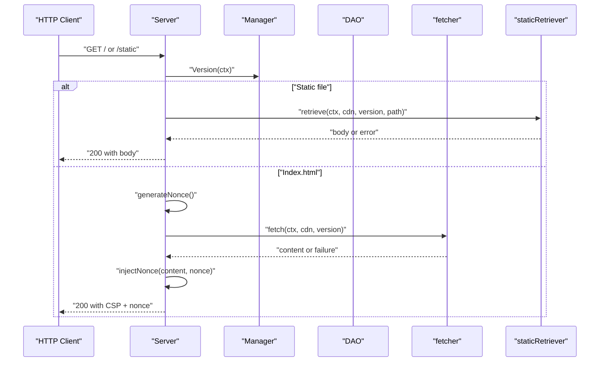
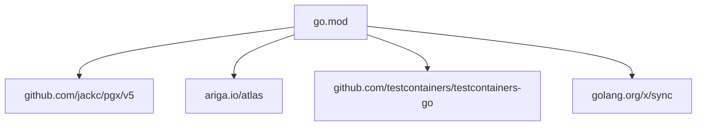

# API Reference

<cite>
**Referenced Files in This Document**
- [litespaserver.go](file://litespaserver/litespaserver.go)
- [serve.go](file://litespaserver/serve.go)
- [version.go](file://litespaserver/version.go)
- [dao.go](file://litespaserver/dao.go)
- [fetcher.go](file://litespaserver/fetcher.go)
- [static.go](file://litespaserver/static.go)
- [csp.go](file://litespaserver/csp.go)
- [dbconfig.go](file://postgres/dbconfig.go)
- [migrate.go](file://postgres/migrate.go)
- [pool.go](file://postgres/pool.go)
- [convert.go](file://utils/convert.go)
- [network.go](file://utils/network.go)
- [slog_handler.go](file://utils/slog_handler.go)
- [go.mod](file://go.mod)
</cite>

## Table of Contents
1. [Introduction](#introduction)
2. [Project Structure](#project-structure)
3. [Core Components](#core-components)
4. [Architecture Overview](#architecture-overview)
5. [Detailed Component Analysis](#detailed-component-analysis)
6. [Dependency Analysis](#dependency-analysis)
7. [Performance Considerations](#performance-considerations)
8. [Troubleshooting Guide](#troubleshooting-guide)
9. [Conclusion](#conclusion)
10. [Appendices](#appendices)

## Introduction
This document provides a comprehensive API reference for Orcacommon’s public interfaces. It covers:
- Lite SPA Server configuration and runtime APIs
- PostgreSQL utility functions for connection pooling, migrations, and configuration
- Utility APIs for conversions, HTTP helpers, and structured logging handlers

It documents exported types, methods, parameters, return values, error conditions, and behavioral specifications. Usage examples are provided via file references to concrete tests and implementation files.

## Project Structure
Orcacommon is organized into three primary packages:
- litespaserver: CDN-hosted SPA serving with dynamic CSP, version management, and caching
- postgres: database connectivity, migrations, and configuration helpers
- utils: general-purpose utilities for conversions, HTTP helpers, and logging

**Diagram sources**
- [litespaserver.go:10-57](file://litespaserver/litespaserver.go#L10-L57)
- [serve.go:29-43](file://litespaserver/serve.go#L29-L43)
- [version.go:80-89](file://litespaserver/version.go#L80-L89)
- [dao.go:24-26](file://litespaserver/dao.go#L24-L26)
- [fetcher.go:12-15](file://litespaserver/fetcher.go#L12-L15)
- [static.go:17-25](file://litespaserver/static.go#L17-L25)
- [csp.go:62-90](file://litespaserver/csp.go#L62-L90)
- [dbconfig.go:10-20](file://postgres/dbconfig.go#L10-L20)
- [pool.go:26-46](file://postgres/pool.go#L26-L46)
- [migrate.go:23-43](file://postgres/migrate.go#L23-L43)
- [convert.go:5-46](file://utils/convert.go#L5-L46)
- [network.go:10-27](file://utils/network.go#L10-L27)
- [slog_handler.go:8-42](file://utils/slog_handler.go#L8-L42)

**Section sources**
- [go.mod:1-96](file://go.mod#L1-L96)

## Core Components
This section summarizes the public APIs grouped by package.

- Lite SPA Server
  - Config: configuration for CDN prefix, pinned version, static allow-list, default version, CSP, and embedded content
  - CSPConfig: fine-tune CSP directives and behavior
  - Server: HTTP handler for root and static paths, per-request CSP nonce injection, caching, and fallbacks
  - Manager: version provider abstraction, DB-backed or static providers, change listeners, and validation
  - dao: key-value persistence for frontend version
  - fetcher: CDN index.html retrieval with validation
  - staticRetriever: allow-listed static file proxy with caching
  - CSP helpers: default policies and nonce generation

- PostgreSQL Utilities
  - DBConfig: environment-driven database configuration with URL template expansion and redacted logging
  - OpenPool: process-wide singleton connection pool with graceful shutdown and migrations
  - Connect: pool creation with support for embedded test containers
  - Migrator: Atlas-based migration runner with advisory locking and baseline handling
  - pgRevisions: PostgreSQL-backed migration revision storage

- Utilities
  - StructToMap / MapToStruct / PrettyJSON: generic JSON conversion helpers
  - IsFromLocalhost / WriteJSONResponse: HTTP helpers
  - SplitLevelHandler: slog handler routing logs to stdout/stderr by level

**Section sources**
- [litespaserver.go:10-57](file://litespaserver/litespaserver.go#L10-L57)
- [serve.go:29-43](file://litespaserver/serve.go#L29-L43)
- [version.go:80-89](file://litespaserver/version.go#L80-L89)
- [dao.go:24-26](file://litespaserver/dao.go#L24-L26)
- [fetcher.go:12-15](file://litespaserver/fetcher.go#L12-L15)
- [static.go:17-25](file://litespaserver/static.go#L17-L25)
- [csp.go:62-90](file://litespaserver/csp.go#L62-L90)
- [dbconfig.go:10-20](file://postgres/dbconfig.go#L10-L20)
- [pool.go:26-46](file://postgres/pool.go#L26-L46)
- [migrate.go:23-43](file://postgres/migrate.go#L23-L43)
- [convert.go:5-46](file://utils/convert.go#L5-L46)
- [network.go:10-27](file://utils/network.go#L10-L27)
- [slog_handler.go:8-42](file://utils/slog_handler.go#L8-L42)

## Architecture Overview
High-level interactions among Lite SPA Server components and PostgreSQL utilities.

**Diagram sources**
- [serve.go:93-188](file://litespaserver/serve.go#L93-L188)
- [version.go:138-141](file://litespaserver/version.go#L138-L141)
- [fetcher.go:32-69](file://litespaserver/fetcher.go#L32-L69)
- [static.go:52-95](file://litespaserver/static.go#L52-L95)

**Section sources**
- [serve.go:93-188](file://litespaserver/serve.go#L93-L188)
- [version.go:138-141](file://litespaserver/version.go#L138-L141)
- [fetcher.go:32-69](file://litespaserver/fetcher.go#L32-L69)
- [static.go:52-95](file://litespaserver/static.go#L52-L95)

## Detailed Component Analysis

### Lite SPA Server API

#### Config
- Purpose: Encapsulates all caller-specific configuration for serving a CDN-hosted SPA.
- Fields:
  - CDNPrefix: Base CDN URL (e.g., https://cdn.example)
  - CDNVersion: Pin a specific version; bypasses DB and fetcher
  - StaticPaths: Allow-list of static file paths served via CDN proxy
  - DefaultVersion: Seed value for DB-backed provider when no row exists
  - CSP: CSPConfig to override defaults or behavior
  - EmbeddedContent: fs.FS to serve index.html and static files directly (development)
- Behavior:
  - When EmbeddedContent is provided, the Manager uses a static provider and the DB is not touched
  - When CDNVersion is non-empty, the Manager uses a static provider and ignores DB
- Example usage references:
  - [serve_test.go:17-28](file://litespaserver/serve_test.go#L17-L28)
  - [serve_test.go:220-236](file://litespaserver/serve_test.go#L220-L236)

**Section sources**
- [litespaserver.go:10-41](file://litespaserver/litespaserver.go#L10-L41)

#### CSPConfig
- Purpose: Parameterizes Content-Security-Policy source allow-lists and behavior.
- Fields:
  - FontSrcs, ScriptSrcs, ConnectSrcs, StyleSrcs, ManifestSrcs: Override defaults
  - Disable: Suppress default CSP header emission
  - DisableAppendNonce: Suppress appending per-request nonce to style-src
- Defaults and behavior:
  - When a field is empty, built-in defaults appropriate for the SPA are used
  - Nonce is appended to style-src when present and not disabled
- Example usage references:
  - [serve.go:190-202](file://litespaserver/serve.go#L190-L202)
  - [csp.go:62-90](file://litespaserver/csp.go#L62-L90)

**Section sources**
- [litespaserver.go:43-56](file://litespaserver/litespaserver.go#L43-L56)
- [csp.go:62-90](file://litespaserver/csp.go#L62-L90)

#### Server
- Purpose: HTTP handler for SPA root and static paths; manages CSP, caching, and fallbacks.
- Constructor:
  - NewServer(ctx, pool, cfg) constructs a Server from Config; uses pool for DB-backed version provider when applicable
- Methods:
  - ServeRoot(w, r): Handles requests; returns 404 for JSON Accept, proxies static files, serves index.html with per-request CSP nonce
  - Manager(): Exposes the underlying Manager
  - RefreshVersion(ctx): Forces DB-backed provider to refresh
  - FlushCache(): Evicts in-memory index.html cache
- Behavior:
  - EmbeddedContent mode: serves index.html and static files directly from fs.FS
  - Index.html caching: version-keyed in-memory cache with capacity limit
  - Single-flight collapsing for concurrent cache misses
  - Nonce generation uses cryptographic randomness; errors return 500
- Example usage references:
  - [serve.go:45-59](file://litespaserver/serve.go#L45-L59)
  - [serve.go:93-188](file://litespaserver/serve.go#L93-L188)
  - [serve_test.go:30-80](file://litespaserver/serve_test.go#L30-L80)
  - [serve_test.go:121-145](file://litespaserver/serve_test.go#L121-L145)
  - [serve_test.go:166-186](file://litespaserver/serve_test.go#L166-L186)
  - [serve_test.go:238-267](file://litespaserver/serve_test.go#L238-L267)

**Section sources**
- [serve.go:29-43](file://litespaserver/serve.go#L29-L43)
- [serve.go:45-59](file://litespaserver/serve.go#L45-L59)
- [serve.go:93-188](file://litespaserver/serve.go#L93-L188)

#### Manager
- Purpose: Owns frontend version resolution and change notifications.
- Constructors:
  - NewManager(ctx, pool, cdn, cdnVersion, defaultVersion, embedded) selects provider:
    - Embedded mode: static provider with "embedded"
    - cdnVersion set: static provider with pinned version
    - Otherwise: DB-backed provider with default seeding
- Methods:
  - Version(ctx): Returns current version
  - ForceRefresh(ctx): Reloads from DB
  - SetVersion(ctx, candidate): Validates against CDN, persists, notifies listeners, returns acceptance
  - OnChange(fn): Registers a listener invoked after successful SetVersion
- Validation:
  - Candidate must be fetchable from CDN and contain the CDN prefix
- Example usage references:
  - [version.go:91-120](file://litespaserver/version.go#L91-L120)
  - [version.go:138-141](file://litespaserver/version.go#L138-L141)
  - [version.go:143-146](file://litespaserver/version.go#L143-L146)
  - [version.go:148-163](file://litespaserver/version.go#L148-L163)
  - [version.go:165-186](file://litespaserver/version.go#L165-L186)

**Section sources**
- [version.go:80-89](file://litespaserver/version.go#L80-L89)
- [version.go:91-120](file://litespaserver/version.go#L91-L120)
- [version.go:138-141](file://litespaserver/version.go#L138-L141)
- [version.go:143-146](file://litespaserver/version.go#L143-L146)
- [version.go:148-163](file://litespaserver/version.go#L148-L163)
- [version.go:165-186](file://litespaserver/version.go#L165-L186)

#### DAO (litespa_settings)
- Purpose: Reads and writes the frontend version key-value pair.
- Methods:
  - getVersion(ctx): Returns stored version or empty when no row exists
  - setVersion(ctx, version): Upserts version and updates timestamps
- Schema requirement:
  - Table must exist prior to use; see comments in source
- Example usage references:
  - [dao.go:28-43](file://litespaserver/dao.go#L28-L43)
  - [dao.go:45-55](file://litespaserver/dao.go#L45-L55)

**Section sources**
- [dao.go:15-26](file://litespaserver/dao.go#L15-L26)
- [dao.go:28-43](file://litespaserver/dao.go#L28-L43)
- [dao.go:45-55](file://litespaserver/dao.go#L45-L55)

#### fetcher
- Purpose: Retrieves index.html for a given version from the CDN with validation.
- Methods:
  - fetch(ctx, cdn, version): Returns fetchedVersion and success flag when response is 2xx and body contains CDN prefix
- Validation:
  - Rejects non-2xx responses and bodies not containing the CDN prefix
- Example usage references:
  - [fetcher.go:32-69](file://litespaserver/fetcher.go#L32-L69)
  - [serve_test.go:10-29](file://litespaserver/serve_test.go#L10-L29)

**Section sources**
- [fetcher.go:12-15](file://litespaserver/fetcher.go#L12-L15)
- [fetcher.go:32-69](file://litespaserver/fetcher.go#L32-L69)

#### staticRetriever
- Purpose: Proxies allow-listed static files from the CDN with bounded in-memory caching.
- Methods:
  - isStatic(path): Reports whether path is allowed
  - retrieve(ctx, cdn, version, path): Fetches and caches; returns body or error
- Caching:
  - In-memory cache keyed by full URL with capacity eviction
  - Single-flight collapsing for concurrent fetches
- Example usage references:
  - [static.go:46-50](file://litespaserver/static.go#L46-L50)
  - [static.go:52-95](file://litespaserver/static.go#L52-L95)
  - [serve_test.go:121-145](file://litespaserver/serve_test.go#L121-L145)

**Section sources**
- [static.go:17-25](file://litespaserver/static.go#L17-L25)
- [static.go:46-50](file://litespaserver/static.go#L46-L50)
- [static.go:52-95](file://litespaserver/static.go#L52-L95)

#### CSP Helpers
- Functions:
  - cspRule(csp, nonce): Builds CSP header using defaults or overrides and optional nonce
  - generateNonce(n): Generates cryptographically secure random nonce
- Defaults:
  - Built-in allow-lists for fonts, manifests, scripts, connect, and styles
- Example usage references:
  - [csp.go:62-90](file://litespaserver/csp.go#L62-L90)
  - [csp.go:100-115](file://litespaserver/csp.go#L100-L115)
  - [serve.go:190-202](file://litespaserver/serve.go#L190-L202)

**Section sources**
- [csp.go:62-90](file://litespaserver/csp.go#L62-L90)
- [csp.go:100-115](file://litespaserver/csp.go#L100-L115)

### PostgreSQL Utilities API

#### DBConfig
- Purpose: Holds database connection parameters and expands a URL template.
- Fields (env-prefixed):
  - Host, Port, User, Password, Name, CloudSQLInstance, DatabaseURLTemplate
- Methods:
  - ResolveURL(): Expands placeholders in template using credentials and URL-escapes password
  - LogValue(): slog redacts password
- Example usage references:
  - [dbconfig.go:22-33](file://postgres/dbconfig.go#L22-L33)
  - [dbconfig.go:35-46](file://postgres/dbconfig.go#L35-L46)

**Section sources**
- [dbconfig.go:10-20](file://postgres/dbconfig.go#L10-L20)
- [dbconfig.go:22-33](file://postgres/dbconfig.go#L22-L33)
- [dbconfig.go:35-46](file://postgres/dbconfig.go#L35-L46)

#### OpenPool
- Purpose: Returns a process-wide singleton pgxpool.Pool.
- Behavior:
  - Creates pool on first call; subsequent calls reuse the same instance
  - Supports Cloud SQL dialer or direct URL
  - Runs migrations via provided Migrator
  - Registers graceful shutdown on SIGTERM/SIGINT
- Example usage references:
  - [pool.go:30-46](file://postgres/pool.go#L30-L46)
  - [pool.go:48-59](file://postgres/pool.go#L48-L59)

**Section sources**
- [pool.go:26-46](file://postgres/pool.go#L26-L46)
- [pool.go:48-59](file://postgres/pool.go#L48-L59)

#### Connect
- Purpose: Creates a pgxpool.Pool for a given database URL.
- Behavior:
  - Detects "postgres:tc:" prefix and provisions a test container automatically
  - Returns a pool connected to the container or external database
- Example usage references:
  - [pool.go:84-146](file://postgres/pool.go#L84-L146)
  - [pool_test.go:74-116](file://postgres/pool_test.go#L74-L116)

**Section sources**
- [pool.go:84-146](file://postgres/pool.go#L84-L146)

#### Migrator
- Purpose: Bundles migration file source and baseline predicate for Atlas migrations.
- Fields:
  - migrationFiles: fs.FS of migration files
  - IsBaseline: Optional predicate to decide baseline-only runs
- Methods:
  - NewMigrator(migrationFiles, isBaseline): Constructs a Migrator
- Example usage references:
  - [migrate.go:23-43](file://postgres/migrate.go#L23-L43)
  - [pool_test.go:19-30](file://postgres/pool_test.go#L19-L30)

**Section sources**
- [migrate.go:23-43](file://postgres/migrate.go#L23-L43)

#### runMigrations
- Purpose: Applies pending Atlas migrations with advisory locking and baseline handling.
- Behavior:
  - Embeds migration files into memory for Atlas
  - Acquires advisory lock to serialize across replicas
  - Initializes revisions table and applies pending migrations
  - Supports baseline mode when predicate returns true
- Example usage references:
  - [migrate.go:45-131](file://postgres/migrate.go#L45-L131)

**Section sources**
- [migrate.go:45-131](file://postgres/migrate.go#L45-L131)

#### pgRevisions
- Purpose: PostgreSQL-backed migration revision storage.
- Methods:
  - init(ctx): Ensures revisions table exists
  - ReadRevisions(ctx), ReadRevision(ctx, version), WriteRevision(ctx, rev), DeleteRevision(ctx, version)
- Example usage references:
  - [migrate.go:181-314](file://postgres/migrate.go#L181-L314)

**Section sources**
- [migrate.go:181-314](file://postgres/migrate.go#L181-L314)

### Utilities API

#### StructToMap / MapToStruct / PrettyJSON
- Purpose: Generic JSON conversion helpers for structs and maps.
- Behavior:
  - StructToMap: Serializes pointer to JSON, then unmarshals to map
  - MapToStruct: Serializes map to JSON, then unmarshals to typed struct pointer
  - PrettyJSON: Returns indented JSON bytes
- Example usage references:
  - [convert.go:5-20](file://utils/convert.go#L5-L20)
  - [convert.go:22-37](file://utils/convert.go#L22-L37)
  - [convert.go:39-45](file://utils/convert.go#L39-L45)

**Section sources**
- [convert.go:5-20](file://utils/convert.go#L5-L20)
- [convert.go:22-37](file://utils/convert.go#L22-L37)
- [convert.go:39-45](file://utils/convert.go#L39-L45)

#### IsFromLocalhost / WriteJSONResponse
- Purpose: HTTP helpers for request inspection and JSON responses.
- Behavior:
  - IsFromLocalhost: Determines if remote address is loopback (IPv4/IPv6)
  - WriteJSONResponse: Sets Content-Type and encodes JSON payload
- Example usage references:
  - [network.go:10-20](file://utils/network.go#L10-L20)
  - [network.go:22-26](file://utils/network.go#L22-L26)

**Section sources**
- [network.go:10-20](file://utils/network.go#L10-L20)
- [network.go:22-26](file://utils/network.go#L22-L26)

#### SplitLevelHandler
- Purpose: slog Handler that routes records to stdout for levels below Error and to stderr for Error and above.
- Methods:
  - Enabled, Handle, WithAttrs, WithGroup
- Example usage references:
  - [slog_handler.go:8-42](file://utils/slog_handler.go#L8-L42)

**Section sources**
- [slog_handler.go:8-42](file://utils/slog_handler.go#L8-L42)

## Dependency Analysis
External dependencies and their roles in the system.

**Diagram sources**
- [go.mod:5-12](file://go.mod#L5-L12)

**Section sources**
- [go.mod:1-96](file://go.mod#L1-L96)

## Performance Considerations
- Lite SPA Server
  - Per-request CSP nonce generation uses cryptographic randomness; avoid excessive concurrency spikes to prevent entropy exhaustion
  - Index.html and static file retrieval use bounded in-memory caches with capacity eviction
  - Single-flight collapsing reduces redundant CDN calls during cache misses
- PostgreSQL
  - Advisory locking prevents migration races across replicas; tune timeouts if needed
  - Singleton pool minimizes connection overhead; ensure graceful shutdown on SIGTERM/SIGINT

[No sources needed since this section provides general guidance]

## Troubleshooting Guide
- Lite SPA Server
  - JSON Accept returns 404: Expected behavior for SPA root
  - Static file 502 Bad Gateway: CDN upstream unavailable; verify CDN path and version
  - Index.html fallback: Returned when fetch fails; check CDN availability and version
  - EmbeddedContent misconfiguration: Missing index.html triggers warning and disables embedded mode
- PostgreSQL
  - Migration failures: Check advisory lock acquisition and Atlas executor errors
  - Test container lifecycle: Ensure cleanup on pool.Close()

**Section sources**
- [serve.go:93-188](file://litespaserver/serve.go#L93-L188)
- [serve_test.go:147-164](file://litespaserver/serve_test.go#L147-L164)
- [serve_test.go:166-186](file://litespaserver/serve_test.go#L166-L186)
- [serve_test.go:291-318](file://litespaserver/serve_test.go#L291-L318)
- [migrate.go:155-179](file://postgres/migrate.go#L155-L179)
- [migrate.go:114-129](file://postgres/migrate.go#L114-L129)

## Conclusion
Orcacommon provides robust, reusable APIs for serving CDN-hosted SPAs with dynamic CSP, managing frontend versions, and handling PostgreSQL migrations and connections. The APIs emphasize safety (nonce generation, validation), resilience (caching, fallbacks, single-flight), and operational excellence (graceful shutdown, advisory locks).

[No sources needed since this section summarizes without analyzing specific files]

## Appendices

### API Summary Tables

#### Lite SPA Server Types and Methods
- Config
  - Fields: CDNPrefix, CDNVersion, StaticPaths, DefaultVersion, CSP, EmbeddedContent
- CSPConfig
  - Fields: FontSrcs, ScriptSrcs, ConnectSrcs, StyleSrcs, ManifestSrcs, Disable, DisableAppendNonce
- Server
  - Methods: NewServer, ServeRoot, Manager, RefreshVersion, FlushCache
- Manager
  - Methods: NewManager, Version, ForceRefresh, SetVersion, OnChange
- DAO
  - Methods: getVersion, setVersion
- fetcher
  - Methods: fetch
- staticRetriever
  - Methods: isStatic, retrieve
- CSP Helpers
  - Functions: cspRule, generateNonce

**Section sources**
- [litespaserver.go:10-57](file://litespaserver/litespaserver.go#L10-L57)
- [serve.go:29-43](file://litespaserver/serve.go#L29-L43)
- [version.go:80-89](file://litespaserver/version.go#L80-L89)
- [dao.go:24-26](file://litespaserver/dao.go#L24-L26)
- [fetcher.go:12-15](file://litespaserver/fetcher.go#L12-L15)
- [static.go:17-25](file://litespaserver/static.go#L17-L25)
- [csp.go:62-90](file://litespaserver/csp.go#L62-L90)

#### PostgreSQL Types and Methods
- DBConfig
  - Methods: ResolveURL, LogValue
- OpenPool
  - Methods: OpenPool
- Connect
  - Methods: Connect
- Migrator
  - Methods: NewMigrator
- pgRevisions
  - Methods: init, ReadRevisions, ReadRevision, WriteRevision, DeleteRevision

**Section sources**
- [dbconfig.go:10-20](file://postgres/dbconfig.go#L10-L20)
- [pool.go:26-46](file://postgres/pool.go#L26-L46)
- [pool.go:84-146](file://postgres/pool.go#L84-L146)
- [migrate.go:23-43](file://postgres/migrate.go#L23-L43)
- [migrate.go:181-314](file://postgres/migrate.go#L181-L314)

#### Utilities Types and Methods
- StructToMap / MapToStruct / PrettyJSON
  - Methods: StructToMap, MapToStruct, PrettyJSON
- IsFromLocalhost / WriteJSONResponse
  - Methods: IsFromLocalhost, WriteJSONResponse
- SplitLevelHandler
  - Methods: Enabled, Handle, WithAttrs, WithGroup

**Section sources**
- [convert.go:5-46](file://utils/convert.go#L5-L46)
- [network.go:10-27](file://utils/network.go#L10-L27)
- [slog_handler.go:8-42](file://utils/slog_handler.go#L8-L42)