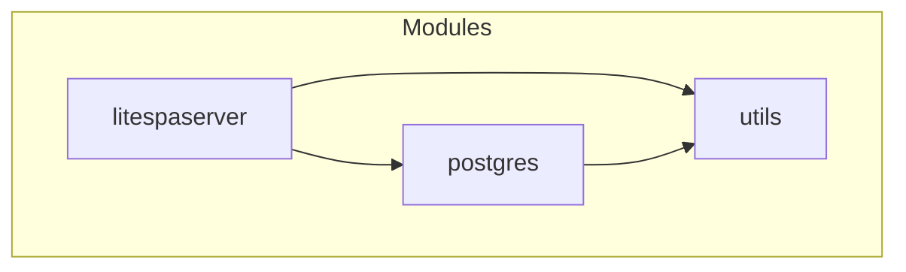
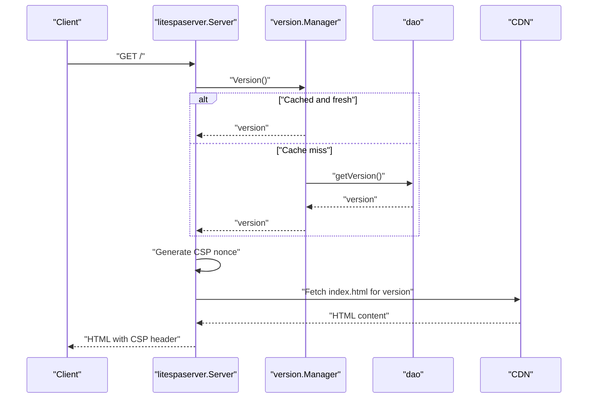
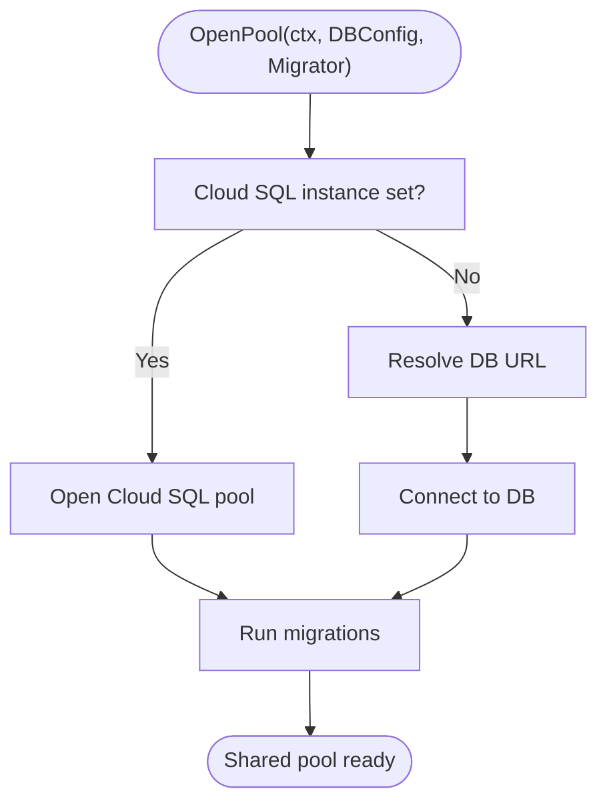
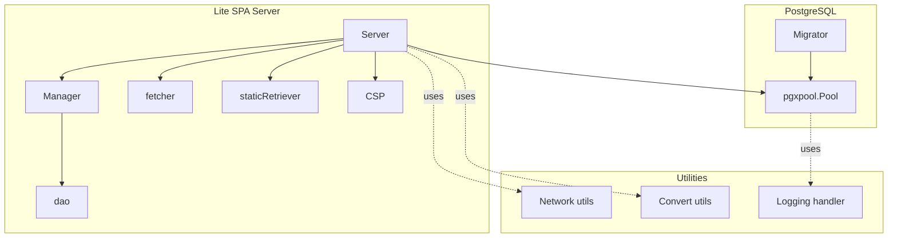
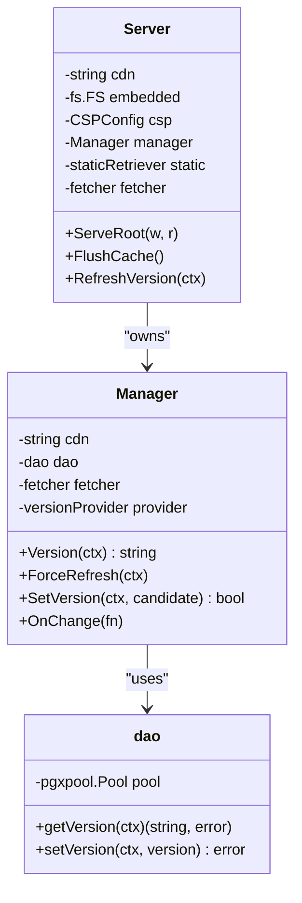
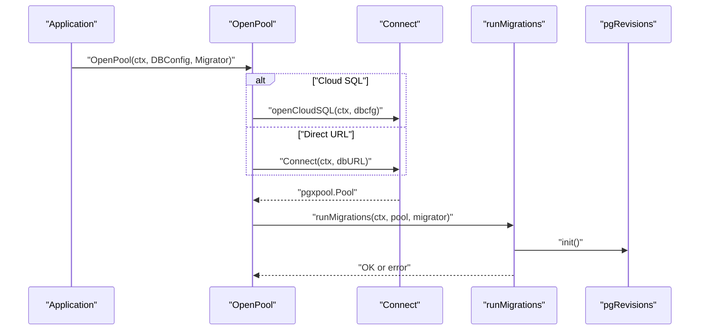
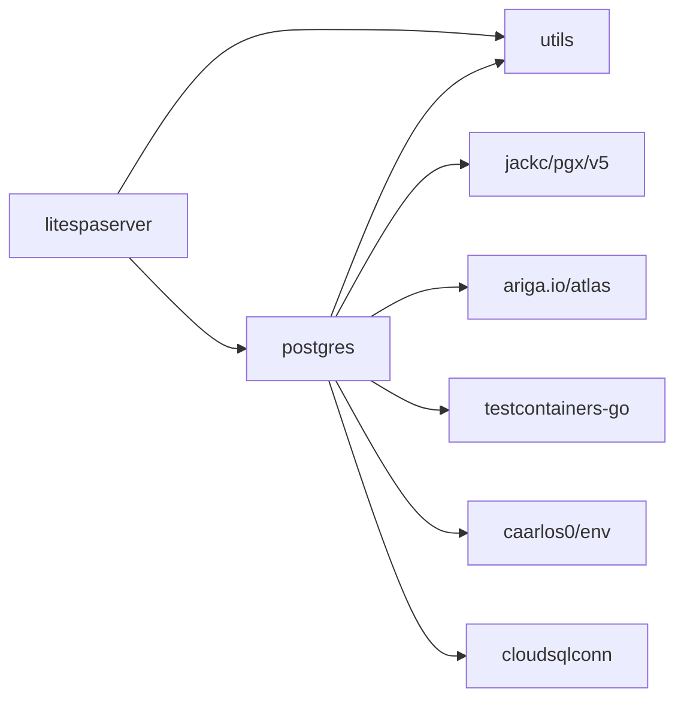

# Getting Started

<cite>
**Referenced Files in This Document**
- [go.mod](file://go.mod)
- [litespaserver.go](file://litespaserver/litespaserver.go)
- [serve.go](file://litespaserver/serve.go)
- [version.go](file://litespaserver/version.go)
- [dao.go](file://litespaserver/dao.go)
- [csp.go](file://litespaserver/csp.go)
- [fetcher.go](file://litespaserver/fetcher.go)
- [static.go](file://litespaserver/static.go)
- [dbconfig.go](file://postgres/dbconfig.go)
- [pool.go](file://postgres/pool.go)
- [migrate.go](file://postgres/migrate.go)
- [network.go](file://utils/network.go)
- [convert.go](file://utils/convert.go)
- [slog_handler.go](file://utils/slog_handler.go)
- [index.html](file://litespaserver/testdata/embed/index.html)
</cite>

## Table of Contents
1. [Introduction](#introduction)
2. [Project Structure](#project-structure)
3. [Prerequisites](#prerequisites)
4. [Installation](#installation)
5. [Quick Start Examples](#quick-start-examples)
6. [Step-by-Step Tutorials](#step-by-step-tutorials)
7. [Environment Variables and Configuration](#environment-variables-and-configuration)
8. [Initial Project Structure Recommendations](#initial-project-structure-recommendations)
9. [Architecture Overview](#architecture-overview)
10. [Detailed Component Analysis](#detailed-component-analysis)
11. [Dependency Analysis](#dependency-analysis)
12. [Performance Considerations](#performance-considerations)
13. [Troubleshooting Guide](#troubleshooting-guide)
14. [Conclusion](#conclusion)

## Introduction
This guide helps you quickly set up and use Orcacommon modules to build a modern backend service. It covers:
- Prerequisites and installation via Go modules
- Quick start examples for each major module
- Step-by-step tutorials for a basic Lite SPA server, PostgreSQL connections, and utility functions
- Environment variable configuration and basic patterns
- Common setup scenarios and recommended project structure

## Project Structure
Orcacommon is organized into three primary modules:
- litespaserver: A CDN-backed SPA server with dynamic CSP and caching
- postgres: PostgreSQL connection pooling, migrations, and configuration helpers
- utils: Common utilities for logging, networking, and conversions

**Diagram sources**
- [litespaserver.go:1-57](file://litespaserver/litespaserver.go#L1-L57)
- [serve.go:1-228](file://litespaserver/serve.go#L1-L228)
- [pool.go:1-147](file://postgres/pool.go#L1-L147)
- [network.go:1-27](file://utils/network.go#L1-L27)

**Section sources**
- [go.mod:1-96](file://go.mod#L1-L96)

## Prerequisites
- Go 1.26.4 or later
- A PostgreSQL-compatible database (local, containerized, or Google Cloud SQL)
- Optional: A CDN hosting SPA assets (for production-like Lite SPA server behavior)

**Section sources**
- [go.mod:3-3](file://go.mod#L3-L3)

## Installation
Add Orcacommon to your project using Go modules:
- Run: go get github.com/visdomtech/orcacommon
- Import the desired packages in your code

This adds the following dependencies automatically:
- PostgreSQL driver and pool: github.com/jackc/pgx/v5
- Atlas migrations: ariga.io/atlas
- Testcontainers for local DB testing: github.com/testcontainers/testcontainers-go
- Environment parsing: github.com/caarlos0/env/v11
- Google Cloud SQL connectivity: cloud.google.com/go/cloudsqlconn

**Section sources**
- [go.mod:5-12](file://go.mod#L5-L12)

## Quick Start Examples
Below are concise, code-path-based examples to demonstrate core functionality. Replace placeholders with your environment values.

- Lite SPA server
  - Build a server with CDN prefix and static allow-list
  - Reference: [litespaserver.Config:10-41](file://litespaserver/litespaserver.go#L10-L41)
  - Reference: [litespaserver.NewServer:48-59](file://litespaserver/serve.go#L48-L59)

- PostgreSQL connection and migrations
  - Configure DB credentials and URL template
  - Reference: [postgres.DBConfig:10-20](file://postgres/dbconfig.go#L10-L20)
  - Establish a pooled connection
  - Reference: [postgres.OpenPool:30-46](file://postgres/pool.go#L30-L46)
  - Apply migrations from an embedded FS
  - Reference: [postgres.NewMigrator:35-43](file://postgres/migrate.go#L35-L43)
  - Reference: [postgres.runMigrations:49-131](file://postgres/migrate.go#L49-L131)

- Utility functions
  - Network helpers
  - Reference: [utils.IsFromLocalhost:10-20](file://utils/network.go#L10-L20)
  - Reference: [utils.WriteJSONResponse:22-26](file://utils/network.go#L22-L26)
  - Struct conversions
  - Reference: [utils.StructToMap:7-20](file://utils/convert.go#L7-L20)
  - Reference: [utils.MapToStruct:24-37](file://utils/convert.go#L24-L37)
  - Logging handler
  - Reference: [utils.SplitLevelHandler:8-42](file://utils/slog_handler.go#L8-L42)

**Section sources**
- [litespaserver.go:10-41](file://litespaserver/litespaserver.go#L10-L41)
- [serve.go:48-59](file://litespaserver/serve.go#L48-L59)
- [dbconfig.go:10-20](file://postgres/dbconfig.go#L10-L20)
- [pool.go:30-46](file://postgres/pool.go#L30-L46)
- [migrate.go:35-43](file://postgres/migrate.go#L35-L43)
- [migrate.go:49-131](file://postgres/migrate.go#L49-L131)
- [network.go:10-26](file://utils/network.go#L10-L26)
- [convert.go:7-37](file://utils/convert.go#L7-L37)
- [slog_handler.go:8-42](file://utils/slog_handler.go#L8-L42)

## Step-by-Step Tutorials

### Tutorial 1: Basic Lite SPA Server
Goal: Serve an SPA from a CDN with dynamic CSP and caching.

Steps:
1. Define configuration
   - Set CDN prefix, optional pinned version, and static allow-list
   - Reference: [litespaserver.Config:10-41](file://litespaserver/litespaserver.go#L10-L41)

2. Create a server instance
   - Provide a PostgreSQL pool for version management (ignored if pinned or embedded)
   - Reference: [litespaserver.NewServer:48-59](file://litespaserver/serve.go#L48-L59)

3. Register handlers
   - Use the server’s root handler for SPA routing
   - Reference: [litespaserver.Server.ServeRoot:96-188](file://litespaserver/serve.go#L96-L188)

4. Optional: Embedded mode for local development
   - Supply an fs.FS containing index.html at root
   - Reference: [litespaserver.resolveEmbedded:61-75](file://litespaserver/serve.go#L61-L75)
   - Example SPA HTML (for local testing): [index.html:1-6](file://litespaserver/testdata/embed/index.html#L1-L6)

5. Optional: Customize CSP
   - Override default CSP directives or disable CSP
   - Reference: [litespaserver.CSPConfig:43-56](file://litespaserver/litespaserver.go#L43-L56)
   - Reference: [litespaserver.cspRule:65-90](file://litespaserver/csp.go#L65-L90)

**Diagram sources**
- [serve.go:96-188](file://litespaserver/serve.go#L96-L188)
- [version.go:139-141](file://litespaserver/version.go#L139-L141)
- [dao.go:30-43](file://litespaserver/dao.go#L30-L43)
- [csp.go:65-90](file://litespaserver/csp.go#L65-L90)

**Section sources**
- [litespaserver.go:10-56](file://litespaserver/litespaserver.go#L10-L56)
- [serve.go:48-188](file://litespaserver/serve.go#L48-L188)
- [version.go:80-141](file://litespaserver/version.go#L80-L141)
- [dao.go:15-43](file://litespaserver/dao.go#L15-L43)
- [csp.go:65-90](file://litespaserver/csp.go#L65-L90)
- [index.html:1-6](file://litespaserver/testdata/embed/index.html#L1-L6)

### Tutorial 2: Establish PostgreSQL Connections
Goal: Connect to PostgreSQL and run migrations.

Steps:
1. Configure DB settings
   - Use environment variables with DB_ prefix
   - Reference: [postgres.DBConfig:10-20](file://postgres/dbconfig.go#L10-L20)

2. Open a pooled connection
   - Supports direct URLs or containerized databases via a special scheme
   - Reference: [postgres.OpenPool:30-46](file://postgres/pool.go#L30-L46)
   - Reference: [postgres.Connect:84-146](file://postgres/pool.go#L84-L146)

3. Apply migrations
   - Provide migration files via an embedded FS and a baseline predicate
   - Reference: [postgres.NewMigrator:35-43](file://postgres/migrate.go#L35-L43)
   - Reference: [postgres.runMigrations:49-131](file://postgres/migrate.go#L49-L131)

**Diagram sources**
- [pool.go:30-46](file://postgres/pool.go#L30-L46)
- [pool.go:84-146](file://postgres/pool.go#L84-L146)
- [migrate.go:49-131](file://postgres/migrate.go#L49-L131)

**Section sources**
- [dbconfig.go:10-20](file://postgres/dbconfig.go#L10-L20)
- [pool.go:30-46](file://postgres/pool.go#L30-L46)
- [pool.go:84-146](file://postgres/pool.go#L84-L146)
- [migrate.go:35-43](file://postgres/migrate.go#L35-L43)
- [migrate.go:49-131](file://postgres/migrate.go#L49-L131)

### Tutorial 3: Use Utility Functions
Goal: Leverage logging, networking, and conversion helpers.

Steps:
1. Logging
   - Route logs to stdout/stderr by level
   - Reference: [utils.SplitLevelHandler:8-42](file://utils/slog_handler.go#L8-L42)

2. Networking
   - Detect localhost requests
   - Reference: [utils.IsFromLocalhost:10-20](file://utils/network.go#L10-L20)
   - Write JSON responses
   - Reference: [utils.WriteJSONResponse:22-26](file://utils/network.go#L22-L26)

3. Conversions
   - Convert structs to maps and back
   - Reference: [utils.StructToMap:7-20](file://utils/convert.go#L7-L20)
   - Reference: [utils.MapToStruct:24-37](file://utils/convert.go#L24-L37)

**Section sources**
- [slog_handler.go:8-42](file://utils/slog_handler.go#L8-L42)
- [network.go:10-26](file://utils/network.go#L10-L26)
- [convert.go:7-37](file://utils/convert.go#L7-L37)

## Environment Variables and Configuration
- Lite SPA server
  - Config fields and behavior
  - Reference: [litespaserver.Config:10-41](file://litespaserver/litespaserver.go#L10-L41)
  - CSP customization
  - Reference: [litespaserver.CSPConfig:43-56](file://litespaserver/litespaserver.go#L43-L56)

- PostgreSQL
  - DBConfig fields and URL template expansion
  - Reference: [postgres.DBConfig:10-33](file://postgres/dbconfig.go#L10-L33)
  - URL template placeholder substitution
  - Reference: [postgres.DBConfig.ResolveURL:22-33](file://postgres/dbconfig.go#L22-L33)

Common patterns:
- Use environment variables for DB_ prefixed settings
- Provide a default version for Lite SPA server when seeding the settings table
- Optionally pin a CDN version to bypass DB queries

**Section sources**
- [litespaserver.go:10-56](file://litespaserver/litespaserver.go#L10-L56)
- [dbconfig.go:10-33](file://postgres/dbconfig.go#L10-L33)

## Initial Project Structure Recommendations
- Keep your application entrypoint in a top-level main package
- Place migration files under a dedicated directory (e.g., migrations/) and embed them into your binary
- Organize handlers and services around the modules:
  - Lite SPA server handlers under a web/ or http/ directory
  - PostgreSQL initialization and migrations under a db/ directory
  - Utilities under a shared utils/ directory
- Example file placement:
  - Lite SPA server: [serve.go:96-188](file://litespaserver/serve.go#L96-L188)
  - PostgreSQL pool and migrations: [pool.go:30-46](file://postgres/pool.go#L30-L46), [migrate.go:49-131](file://postgres/migrate.go#L49-L131)
  - Utilities: [network.go:10-26](file://utils/network.go#L10-L26), [convert.go:7-37](file://utils/convert.go#L7-L37)

[No sources needed since this section provides general guidance]

## Architecture Overview
The system integrates three modules:
- Lite SPA server orchestrates version resolution, CSP generation, and CDN/static retrieval
- PostgreSQL module manages connections, migrations, and optional Cloud SQL integration
- Utilities provide cross-cutting concerns like logging and conversions

**Diagram sources**
- [serve.go:29-43](file://litespaserver/serve.go#L29-L43)
- [version.go:80-120](file://litespaserver/version.go#L80-L120)
- [dao.go:24-26](file://litespaserver/dao.go#L24-L26)
- [fetcher.go:12-24](file://litespaserver/fetcher.go#L12-L24)
- [static.go:17-25](file://litespaserver/static.go#L17-L25)
- [csp.go:62-90](file://litespaserver/csp.go#L62-L90)
- [pool.go:26-46](file://postgres/pool.go#L26-L46)
- [migrate.go:23-43](file://postgres/migrate.go#L23-L43)
- [network.go:10-26](file://utils/network.go#L10-L26)
- [convert.go:5-20](file://utils/convert.go#L5-L20)
- [slog_handler.go:8-27](file://utils/slog_handler.go#L8-L27)

## Detailed Component Analysis

### Lite SPA Server
- Server lifecycle and caching
  - References: [litespaserver.Server:29-43](file://litespaserver/serve.go#L29-L43), [litespaserver.NewServer:48-59](file://litespaserver/serve.go#L48-L59)
- Version management
  - References: [litespaserver.Manager:80-120](file://litespaserver/version.go#L80-L120), [litespaserver.dao:24-26](file://litespaserver/dao.go#L24-L26)
- CSP and security headers
  - References: [litespaserver.CSPConfig:43-56](file://litespaserver/litespaserver.go#L43-L56), [litespaserver.cspRule:65-90](file://litespaserver/csp.go#L65-L90)
- Static file retrieval and caching
  - References: [litespaserver.staticRetriever:17-25](file://litespaserver/static.go#L17-L25), [litespaserver.newStaticRetriever:27-44](file://litespaserver/static.go#L27-L44)

**Diagram sources**
- [serve.go:29-43](file://litespaserver/serve.go#L29-L43)
- [version.go:80-120](file://litespaserver/version.go#L80-L120)
- [dao.go:24-26](file://litespaserver/dao.go#L24-L26)

**Section sources**
- [serve.go:29-188](file://litespaserver/serve.go#L29-L188)
- [version.go:80-199](file://litespaserver/version.go#L80-L199)
- [dao.go:15-56](file://litespaserver/dao.go#L15-L56)
- [csp.go:62-115](file://litespaserver/csp.go#L62-L115)
- [static.go:17-117](file://litespaserver/static.go#L17-L117)

### PostgreSQL Module
- Pool creation and lifecycle
  - References: [postgres.OpenPool:30-46](file://postgres/pool.go#L30-L46), [postgres.gracefulShutdown:48-59](file://postgres/pool.go#L48-L59)
- Cloud SQL support
  - References: [postgres.openCloudSQL:61-82](file://postgres/pool.go#L61-L82)
- Migration engine
  - References: [postgres.NewMigrator:35-43](file://postgres/migrate.go#L35-L43), [postgres.runMigrations:49-131](file://postgres/migrate.go#L49-L131)

**Diagram sources**
- [pool.go:30-82](file://postgres/pool.go#L30-L82)
- [migrate.go:49-131](file://postgres/migrate.go#L49-L131)

**Section sources**
- [pool.go:26-147](file://postgres/pool.go#L26-L147)
- [migrate.go:23-131](file://postgres/migrate.go#L23-L131)

### Utilities
- Logging handler
  - References: [utils.SplitLevelHandler:8-42](file://utils/slog_handler.go#L8-L42)
- Networking helpers
  - References: [utils.IsFromLocalhost:10-20](file://utils/network.go#L10-L20), [utils.WriteJSONResponse:22-26](file://utils/network.go#L22-L26)
- Struct conversions
  - References: [utils.StructToMap:7-20](file://utils/convert.go#L7-L20), [utils.MapToStruct:24-37](file://utils/convert.go#L24-L37)

**Section sources**
- [slog_handler.go:8-42](file://utils/slog_handler.go#L8-L42)
- [network.go:10-26](file://utils/network.go#L10-L26)
- [convert.go:5-45](file://utils/convert.go#L5-L45)

## Dependency Analysis
- Internal dependencies
  - litespaserver depends on postgres (for version DAO) and utils (for logging)
  - postgres optionally depends on utils for logging
- External dependencies
  - PostgreSQL driver and pool: github.com/jackc/pgx/v5
  - Atlas migrations: ariga.io/atlas
  - Testcontainers: github.com/testcontainers/testcontainers-go
  - Environment parsing: github.com/caarlos0/env/v11
  - Google Cloud SQL: cloud.google.com/go/cloudsqlconn

**Diagram sources**
- [go.mod:5-12](file://go.mod#L5-L12)

**Section sources**
- [go.mod:5-12](file://go.mod#L5-L12)

## Performance Considerations
- Lite SPA server
  - Index and static file caches bound memory usage and reduce CDN load
  - Singleflight prevents thundering herd on version fetches
  - Reference: [litespaserver.indexCache:23-24](file://litespaserver/serve.go#L23-L24), [litespaserver.staticRetriever:14-25](file://litespaserver/static.go#L14-L25)
- PostgreSQL
  - Advisory locks serialize migrations across replicas
  - Connection pooling reduces overhead
  - Reference: [postgres.advisoryLockKey:21-21](file://postgres/migrate.go#L21-L21), [postgres.OpenPool:30-46](file://postgres/pool.go#L30-L46)

[No sources needed since this section provides general guidance]

## Troubleshooting Guide
- Lite SPA server
  - Missing index.html in embedded mode disables embedded mode and falls back to CDN
  - Non-2xx responses or missing CDN prefix invalidate fetched index.html
  - Reference: [litespaserver.resolveEmbedded:61-75](file://litespaserver/serve.go#L61-L75), [litespaserver.fetcher.fetch:32-69](file://litespaserver/fetcher.go#L32-L69)
- PostgreSQL
  - Advisory lock acquisition timeout indicates contention or stuck lock
  - Migration failures surface detailed error logs
  - Reference: [postgres.acquireAdvisoryLock:155-173](file://postgres/migrate.go#L155-L173), [postgres.runMigrations:111-122](file://postgres/migrate.go#L111-L122)
- Utilities
  - Logging handler routes errors to stderr and info/warn to stdout
  - Reference: [utils.SplitLevelHandler:22-26](file://utils/slog_handler.go#L22-L26)

**Section sources**
- [serve.go:61-75](file://litespaserver/serve.go#L61-L75)
- [fetcher.go:32-69](file://litespaserver/fetcher.go#L32-L69)
- [migrate.go:155-173](file://postgres/migrate.go#L155-L173)
- [migrate.go:111-122](file://postgres/migrate.go#L111-L122)
- [slog_handler.go:22-26](file://utils/slog_handler.go#L22-L26)

## Conclusion
You now have the essentials to integrate Orcacommon into your project:
- Install via Go modules
- Configure environment variables for PostgreSQL and Lite SPA server
- Initialize a pooled connection and run migrations
- Serve an SPA with dynamic CSP and caching
- Use utilities for logging, networking, and conversions

[No sources needed since this section summarizes without analyzing specific files]