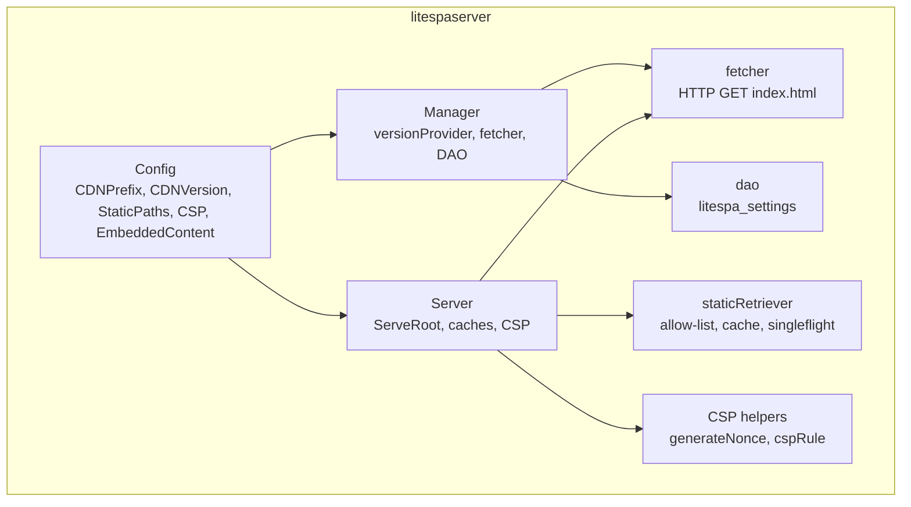
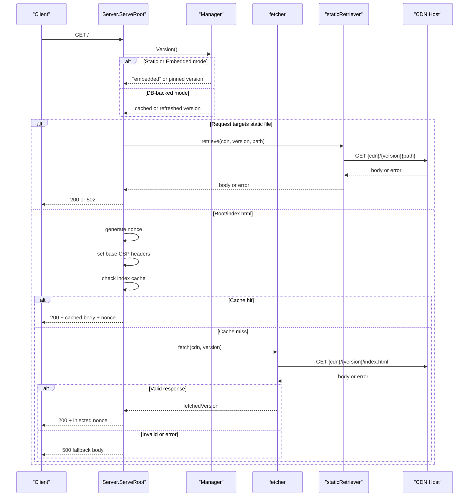
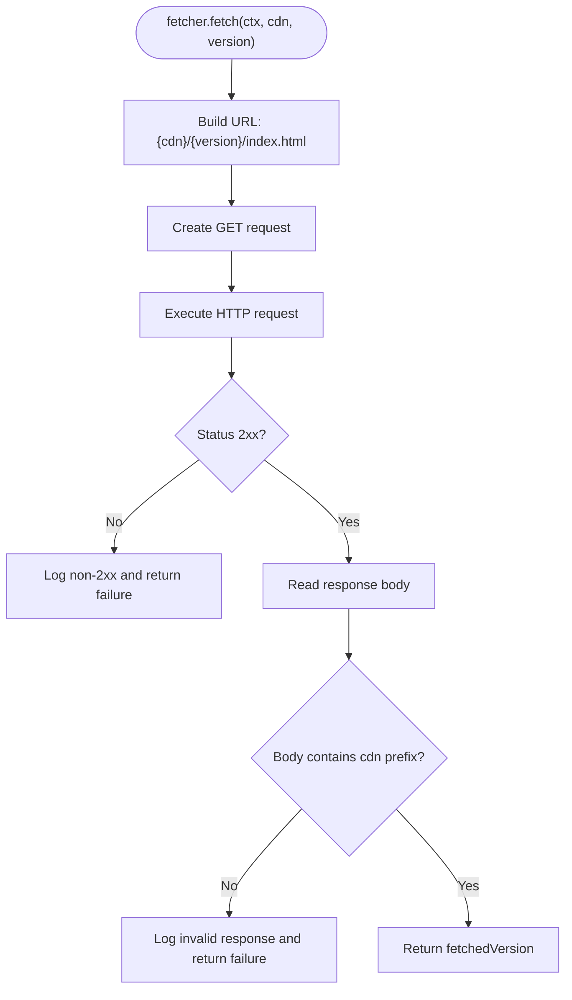
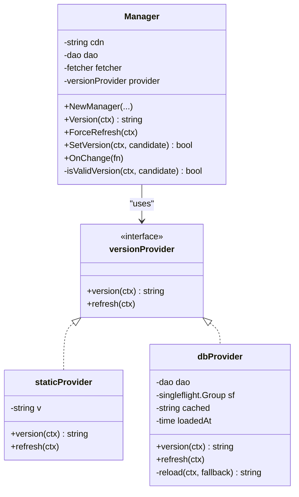
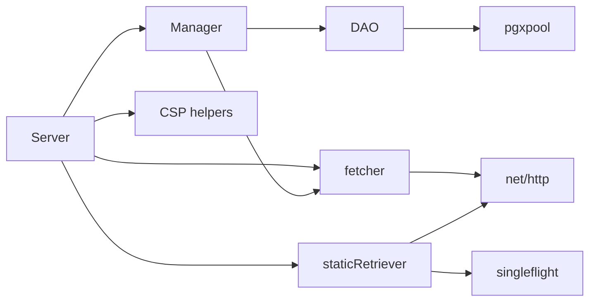

# CDN Integration

<cite>
**Referenced Files in This Document**
- [litespaserver/litespaserver.go](file://litespaserver/litespaserver.go)
- [litespaserver/version.go](file://litespaserver/version.go)
- [litespaserver/fetcher.go](file://litespaserver/fetcher.go)
- [litespaserver/static.go](file://litespaserver/static.go)
- [litespaserver/serve.go](file://litespaserver/serve.go)
- [litespaserver/dao.go](file://litespaserver/dao.go)
- [litespaserver/csp.go](file://litespaserver/csp.go)
- [litespaserver/fetcher_test.go](file://litespaserver/fetcher_test.go)
- [litespaserver/serve_test.go](file://litespaserver/serve_test.go)
- [litespaserver/static_test.go](file://litespaserver/static_test.go)
- [litespaserver/testdata/embed/index.html](file://litespaserver/testdata/embed/index.html)
- [litespaserver/testdata/embed/unsubscribed.html](file://litespaserver/testdata/embed/unsubscribed.html)
- [go.mod](file://go.mod)
</cite>

## Table of Contents
1. [Introduction](#introduction)
2. [Project Structure](#project-structure)
3. [Core Components](#core-components)
4. [Architecture Overview](#architecture-overview)
5. [Detailed Component Analysis](#detailed-component-analysis)
6. [Dependency Analysis](#dependency-analysis)
7. [Performance Considerations](#performance-considerations)
8. [Troubleshooting Guide](#troubleshooting-guide)
9. [Security Considerations](#security-considerations)
10. [Monitoring and Health Checks](#monitoring-and-health-checks)
11. [Conclusion](#conclusion)

## Introduction
This document explains the CDN integration system used to serve a CDN-hosted single-page application (SPA). It covers how the system resolves the active frontend version, fetches index.html and static assets from a CDN, validates responses, injects per-request CSP nonces, and provides fallback behavior when CDN content is unavailable. It also documents configuration options (CDNPrefix, CDNVersion, EmbeddedContent), error handling, retry and caching strategies, and operational guidance for performance and security.

## Project Structure
The CDN integration lives in the litespaserver package and consists of:
- Configuration model and CSP helpers
- Version resolution (static or database-backed)
- CDN fetcher for index.html
- Static file retriever with caching and singleflight
- HTTP server that serves index.html with CSP and proxies static files
- DAO for database-backed version storage
- Tests validating behavior and fallbacks

**Diagram sources**
- [litespaserver/litespaserver.go:10-57](file://litespaserver/litespaserver.go#L10-L57)
- [litespaserver/version.go:80-120](file://litespaserver/version.go#L80-L120)
- [litespaserver/serve.go:29-59](file://litespaserver/serve.go#L29-L59)
- [litespaserver/fetcher.go:12-24](file://litespaserver/fetcher.go#L12-L24)
- [litespaserver/static.go:17-44](file://litespaserver/static.go#L17-L44)
- [litespaserver/dao.go:15-26](file://litespaserver/dao.go#L15-L26)
- [litespaserver/csp.go:62-90](file://litespaserver/csp.go#L62-L90)

**Section sources**
- [litespaserver/litespaserver.go:10-57](file://litespaserver/litespaserver.go#L10-L57)
- [litespaserver/serve.go:29-59](file://litespaserver/serve.go#L29-L59)

## Core Components
- Config: Captures CDNPrefix, CDNVersion, StaticPaths, DefaultVersion, CSP, and EmbeddedContent. These drive runtime behavior and fallback modes.
- Manager: Resolves the active frontend version using either a static provider (CDNVersion or EmbeddedContent), or a database-backed provider with TTL caching and singleflight.
- Server: Serves index.html (with per-request CSP nonce injection) and proxies static files from the CDN, with in-memory caches and singleflight for concurrency control.
- fetcher: Fetches index.html from {CDN}/{version}/index.html and validates the response body contains the CDN prefix.
- staticRetriever: Proxies allowed static files from the CDN, with an in-memory bounded cache and singleflight to collapse concurrent requests.
- DAO: Reads/writes the frontend version from the litespa_settings table.

**Section sources**
- [litespaserver/litespaserver.go:10-57](file://litespaserver/litespaserver.go#L10-L57)
- [litespaserver/version.go:80-120](file://litespaserver/version.go#L80-L120)
- [litespaserver/serve.go:29-59](file://litespaserver/serve.go#L29-L59)
- [litespaserver/fetcher.go:12-24](file://litespaserver/fetcher.go#L12-L24)
- [litespaserver/static.go:17-44](file://litespaserver/static.go#L17-L44)
- [litespaserver/dao.go:15-26](file://litespaserver/dao.go#L15-L26)

## Architecture Overview
The system orchestrates version resolution, CDN fetching, and response serving with safety checks and fallbacks.

**Diagram sources**
- [litespaserver/serve.go:93-188](file://litespaserver/serve.go#L93-L188)
- [litespaserver/version.go:138-146](file://litespaserver/version.go#L138-L146)
- [litespaserver/fetcher.go:32-69](file://litespaserver/fetcher.go#L32-L69)
- [litespaserver/static.go:52-95](file://litespaserver/static.go#L52-L95)

## Detailed Component Analysis

### CDN Content Fetching Mechanism
- Index.html fetching: The fetcher constructs the URL {CDN}/{version}/index.html, sends an HTTP GET, validates the response is 2xx, and ensures the response body contains the CDN prefix. Only then is the content considered valid.
- Static file fetching: The staticRetriever validates the path against an allow-list, constructs {cdn}/{version}{path}, and fetches via HTTP GET. Non-2xx responses return an error; successful bodies are cached.
- Singleflight: Both index.html and static file retrieval use singleflight to collapse concurrent requests for the same resource, reducing load on the CDN.

**Diagram sources**
- [litespaserver/fetcher.go:32-69](file://litespaserver/fetcher.go#L32-L69)

**Section sources**
- [litespaserver/fetcher.go:32-69](file://litespaserver/fetcher.go#L32-L69)
- [litespaserver/static.go:52-95](file://litespaserver/static.go#L52-L95)

### CDNPrefix Configuration
- CDNPrefix defines the base URL for CDN-hosted assets. It is used to construct URLs for index.html and static files and to validate that fetched index.html references the same CDN.
- The Config struct exposes CDNPrefix as a required configuration field.

**Section sources**
- [litespaserver/litespaserver.go:13-19](file://litespaserver/litespaserver.go#L13-L19)
- [litespaserver/serve.go:51](file://litespaserver/serve.go#L51)

### Content Resolution Process
- Version selection:
  - Embedded mode: Uses a static provider with version "embedded" and bypasses the database.
  - Locked version: Uses a static provider with the configured CDNVersion.
  - Database-backed: Seeds default version if missing, then uses a provider with TTL cache and singleflight to reload on TTL expiration.
- Index caching: The Server maintains an in-memory cache of index.html keyed by version, with a bounded capacity.
- Static file caching: The staticRetriever maintains an in-memory cache keyed by full URL, with a bounded capacity and eviction policy.

**Diagram sources**
- [litespaserver/version.go:18-78](file://litespaserver/version.go#L18-L78)
- [litespaserver/version.go:80-120](file://litespaserver/version.go#L80-L120)

**Section sources**
- [litespaserver/version.go:91-136](file://litespaserver/version.go#L91-L136)
- [litespaserver/version.go:138-146](file://litespaserver/version.go#L138-L146)
- [litespaserver/version.go:148-198](file://litespaserver/version.go#L148-L198)

### Fetcher Implementation Details
- HTTP client reuse: The fetcher uses a provided HTTP client or falls back to the default client.
- Validation: Ensures 2xx status and that the response body contains the CDN prefix before considering the fetch successful.
- Error logging: Emits warnings for request building failures, network errors, read errors, non-2xx responses, and missing CDN prefix.

**Section sources**
- [litespaserver/fetcher.go:12-24](file://litespaserver/fetcher.go#L12-L24)
- [litespaserver/fetcher.go:32-69](file://litespaserver/fetcher.go#L32-L69)

### Static File Retrieval and Caching
- Allow-list enforcement: Only paths present in StaticPaths are eligible for CDN proxying.
- Singleflight: Collapses concurrent fetches for the same URL.
- In-memory cache: Stores successful responses keyed by full URL with bounded capacity and eviction.
- Error propagation: Non-2xx responses return an error; the Server translates this to a 502 Bad Gateway.

**Section sources**
- [litespaserver/static.go:17-44](file://litespaserver/static.go#L17-L44)
- [litespaserver/static.go:52-95](file://litespaserver/static.go#L52-L95)

### Server Serving Logic
- JSON request handling: Requests with Accept: application/json receive a 404 Not Found.
- Static file handling: For static paths, the Server attempts to serve from EmbeddedContent if configured; otherwise proxies from CDN. Non-2xx responses return 502.
- Index.html handling: Generates a per-request CSP nonce, injects it into the response body, sets security headers, and serves from cache if available. Otherwise, collapses concurrent fetches via singleflight and caches the result.
- Fallback: On index.html fetch failure, returns a plain-text fallback message with 500 status.

**Section sources**
- [litespaserver/serve.go:93-188](file://litespaserver/serve.go#L93-L188)

### Relationship Between CDN Content and Local Embedded Content
- EmbeddedContent: When provided, the Server serves index.html and static files directly from the filesystem. The presence of index.html at the root is validated; if missing, embedded mode is disabled and the system falls back to CDN mode.
- Static file fallback: If a static file is not present in EmbeddedContent, the Server falls back to proxying from the CDN for that path.

**Section sources**
- [litespaserver/serve.go:61-75](file://litespaserver/serve.go#L61-L75)
- [litespaserver/serve_test.go:320-354](file://litespaserver/serve_test.go#L320-L354)
- [litespaserver/testdata/embed/index.html:1-6](file://litespaserver/testdata/embed/index.html#L1-L6)
- [litespaserver/testdata/embed/unsubscribed.html:1-2](file://litespaserver/testdata/embed/unsubscribed.html#L1-L2)

### Version Locking with CDNVersion
- When CDNVersion is set, the Manager uses a static provider and ignores the database. This pins the served version for development or release pinning.
- The Manager logs a warning when a version is locked by configuration.

**Section sources**
- [litespaserver/version.go:91-119](file://litespaserver/version.go#L91-L119)

### Fallback Mechanisms
- Static file fallback: If EmbeddedContent is configured but a static file is missing, the Server proxies from CDN for that path.
- Index.html fallback: On fetch failure, the Server returns a plain-text fallback message and logs an error.
- Database-backed fallback: When reloading the version from the database fails, the dbProvider continues serving the previous cached value.

**Section sources**
- [litespaserver/serve.go:111-130](file://litespaserver/serve.go#L111-L130)
- [litespaserver/serve.go:185-187](file://litespaserver/serve.go#L185-L187)
- [litespaserver/version.go:64-78](file://litespaserver/version.go#L64-L78)

### CSP and Security Headers
- Per-request nonce generation: A random alphanumeric nonce is generated for each request and injected into the CSP style-src directive.
- CSP header construction: The Server applies base security headers and builds CSP using configurable or default source lists. When CSP is disabled, no CSP header is set.
- Static responses: Static files are served without a nonce in CSP.

**Section sources**
- [litespaserver/csp.go:62-90](file://litespaserver/csp.go#L62-L90)
- [litespaserver/csp.go:100-114](file://litespaserver/csp.go#L100-L114)
- [litespaserver/serve.go:190-202](file://litespaserver/serve.go#L190-L202)

## Dependency Analysis
- External dependencies:
  - golang.org/x/sync/singleflight: Used for collapsing concurrent requests.
  - github.com/jackc/pgx/v5/pgxpool: Used by the DAO to access the database.
- Internal dependencies:
  - Server depends on Manager, fetcher, staticRetriever, and CSP helpers.
  - Manager depends on DAO and fetcher.
  - staticRetriever depends on singleflight and uses an in-memory cache.

**Diagram sources**
- [litespaserver/serve.go:29-59](file://litespaserver/serve.go#L29-L59)
- [litespaserver/version.go:80-120](file://litespaserver/version.go#L80-L120)
- [litespaserver/static.go:17-44](file://litespaserver/static.go#L17-L44)
- [litespaserver/fetcher.go:12-24](file://litespaserver/fetcher.go#L12-L24)
- [litespaserver/dao.go:15-26](file://litespaserver/dao.go#L15-L26)
- [go.mod:5-12](file://go.mod#L5-L12)

**Section sources**
- [go.mod:5-12](file://go.mod#L5-L12)
- [litespaserver/serve.go:29-59](file://litespaserver/serve.go#L29-L59)
- [litespaserver/version.go:80-120](file://litespaserver/version.go#L80-L120)

## Performance Considerations
- Singleflight for concurrency control:
  - Index.html fetches are collapsed per version to reduce CDN load during cache misses.
  - Static file fetches are collapsed per URL to avoid redundant upstream calls.
- Caching:
  - Index.html cache: Bounded by a small capacity and evicts an arbitrary entry when full.
  - Static file cache: Bounded by a small capacity and evicts an arbitrary entry when full.
- Recommendations:
  - Tune cache capacities based on observed traffic patterns and memory footprint.
  - Consider adding timeouts to the HTTP client used by fetcher and staticRetriever to prevent slow CDN stalls.
  - Monitor X-fe-version-cache and X-fe-version-url headers to verify cache effectiveness.

**Section sources**
- [litespaserver/serve.go:167-176](file://litespaserver/serve.go#L167-L176)
- [litespaserver/static.go:65-90](file://litespaserver/static.go#L65-L90)
- [litespaserver/serve.go:204-221](file://litespaserver/serve.go#L204-L221)
- [litespaserver/static.go:97-108](file://litespaserver/static.go#L97-L108)

## Troubleshooting Guide
- Connectivity issues:
  - Verify CDNPrefix points to the correct base URL and that the target version exists at {cdn}/{version}/index.html.
  - Check that index.html contains the CDN prefix; otherwise, the fetcher rejects it as invalid.
  - For static files, confirm the path is in StaticPaths and that the CDN serves the file with a 2xx status.
- Fallback behavior:
  - If index.html cannot be fetched, the Server returns a plain-text fallback message. Inspect logs for warnings indicating non-2xx or invalid responses.
  - If a static file is missing in EmbeddedContent, the Server falls back to the CDN for that path.
- Version management:
  - When CDNVersion is set, the Manager ignores the database and serves the pinned version. Use SetVersion to change the version when using DB-backed mode.
  - If the database reload fails, the dbProvider continues serving the cached value.

**Section sources**
- [litespaserver/fetcher_test.go:31-54](file://litespaserver/fetcher_test.go#L31-L54)
- [litespaserver/serve_test.go:147-164](file://litespaserver/serve_test.go#L147-L164)
- [litespaserver/serve_test.go:166-186](file://litespaserver/serve_test.go#L166-L186)
- [litespaserver/version.go:64-78](file://litespaserver/version.go#L64-L78)

## Security Considerations
- CSP enforcement: The Server sets strict security headers and injects a per-request nonce into CSP style-src to mitigate XSS risks.
- Nonce generation: Nonces are generated using a cryptographically secure random source and must not be predictable.
- Content validation: The fetcher validates that index.html contains the CDN prefix to avoid serving error pages masquerading as valid SPA content.
- Static file handling: Static responses do not include a nonce in CSP, as they are not HTML.

**Section sources**
- [litespaserver/csp.go:62-90](file://litespaserver/csp.go#L62-L90)
- [litespaserver/csp.go:100-114](file://litespaserver/csp.go#L100-L114)
- [litespaserver/fetcher.go:63-66](file://litespaserver/fetcher.go#L63-L66)
- [litespaserver/serve.go:190-202](file://litespaserver/serve.go#L190-L202)

## Monitoring and Health Checks
- Headers:
  - X-app-version: Indicates the served frontend version.
  - X-fe-version-cache: Signals a cache hit for index.html.
  - X-fe-version-url: Indicates the URL from which index.html was fetched.
- Logging:
  - Warnings for non-2xx responses, invalid responses, and errors during fetch/read.
  - Info logs for version locking and seeding defaults.
- Health signals:
  - Monitor 502 responses for static file proxy failures.
  - Monitor 500 responses for index.html fetch failures and fallback behavior.

**Section sources**
- [litespaserver/serve.go:146](file://litespaserver/serve.go#L146)
- [litespaserver/serve.go:161-164](file://litespaserver/serve.go#L161-L164)
- [litespaserver/serve.go:180](file://litespaserver/serve.go#L180)
- [litespaserver/version.go:111-114](file://litespaserver/version.go#L111-L114)
- [litespaserver/version.go:124-135](file://litespaserver/version.go#L124-L135)

## Conclusion
The CDN integration system provides a robust, configurable mechanism to serve a CDN-hosted SPA with strong validation, caching, and fallback behavior. It supports embedded content for development, version pinning via CDNVersion, and database-backed version management. The design emphasizes resilience through singleflight, bounded caches, and explicit error handling, while maintaining security via CSP and per-request nonces.