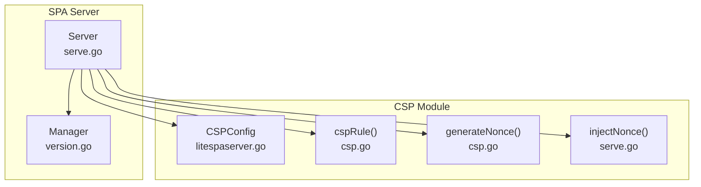
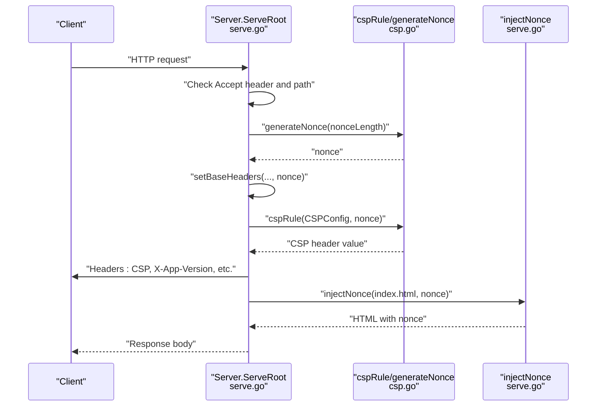
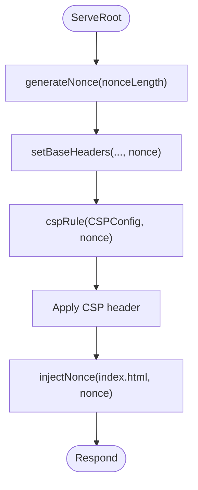
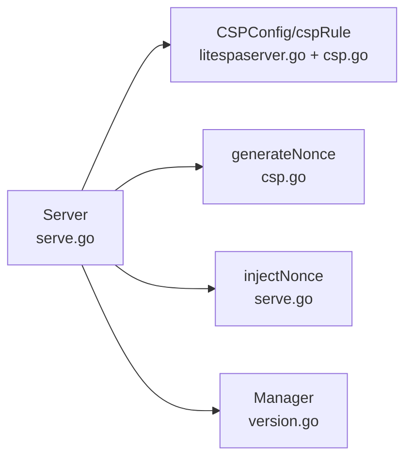

# Content Security Policy (CSP)

<cite>
**Referenced Files in This Document**
- [litespaserver.go](file://litespaserver/litespaserver.go)
- [csp.go](file://litespaserver/csp.go)
- [serve.go](file://litespaserver/serve.go)
- [version.go](file://litespaserver/version.go)
- [csp_test.go](file://litespaserver/csp_test.go)
- [serve_test.go](file://litespaserver/serve_test.go)
</cite>

## Table of Contents
1. [Introduction](#introduction)
2. [Project Structure](#project-structure)
3. [Core Components](#core-components)
4. [Architecture Overview](#architecture-overview)
5. [Detailed Component Analysis](#detailed-component-analysis)
6. [Dependency Analysis](#dependency-analysis)
7. [Performance Considerations](#performance-considerations)
8. [Troubleshooting Guide](#troubleshooting-guide)
9. [Conclusion](#conclusion)
10. [Appendices](#appendices)

## Introduction
This document explains the Content Security Policy (CSP) implementation in the Lite SPA Server. It covers the CSPConfig structure, default policy behavior, directive configuration, header injection, nonce generation for dynamic script and style elements, and the Disable and DisableAppendNonce options. It also provides guidance on custom CSP configurations, security best practices, and troubleshooting CSP-related issues, and describes how CSP fits into the overall security model of the SPA server.

## Project Structure
The CSP implementation spans several files:
- litespaserver.go defines the public configuration types, including CSPConfig and Config.
- csp.go implements default source lists, CSP rule construction, and nonce generation.
- serve.go orchestrates CSP header injection, nonce insertion into index.html, and request handling.
- version.go manages the frontend version used to key caches and validate content.
- Tests validate CSP rule composition, nonce behavior, and CSP header injection.

**Diagram sources**
- [serve.go:29-228](file://litespaserver/serve.go#L29-L228)
- [litespaserver.go:43-56](file://litespaserver/litespaserver.go#L43-L56)
- [csp.go:62-115](file://litespaserver/csp.go#L62-L115)
- [version.go:80-199](file://litespaserver/version.go#L80-L199)

**Section sources**
- [litespaserver.go:10-56](file://litespaserver/litespaserver.go#L10-L56)
- [csp.go:8-115](file://litespaserver/csp.go#L8-L115)
- [serve.go:29-228](file://litespaserver/serve.go#L29-L228)
- [version.go:80-199](file://litespaserver/version.go#L80-L199)

## Core Components
- CSPConfig: Holds per-directive allow-lists and two toggles controlling CSP behavior.
- Default source lists: Built-in allow-lists for fonts, scripts, connections, styles, and manifests.
- CSP rule builder: Composes the Content-Security-Policy header value from CSPConfig and defaults.
- Nonce generator: Produces cryptographically random nonces for per-request CSP isolation.
- Header injection: Applies CSP and related security headers during index.html serving.

Key behaviors:
- When CSPConfig fields are empty, defaults are used for each directive.
- A per-request nonce is appended to style-src unless disabled.
- The CSP header is omitted when explicitly disabled.

**Section sources**
- [litespaserver.go:43-56](file://litespaserver/litespaserver.go#L43-L56)
- [csp.go:8-60](file://litespaserver/csp.go#L8-L60)
- [csp.go:62-90](file://litespaserver/csp.go#L62-L90)
- [csp.go:100-115](file://litespaserver/csp.go#L100-L115)
- [serve.go:190-202](file://litespaserver/serve.go#L190-L202)

## Architecture Overview
The CSP pipeline integrates with the SPA server’s request lifecycle:
- A per-request nonce is generated.
- The CSP rule is computed from CSPConfig and defaults.
- The CSP header is injected into the response.
- The index.html body is prepared with the nonce for inline styles/scripts.

**Diagram sources**
- [serve.go:96-188](file://litespaserver/serve.go#L96-L188)
- [serve.go:190-202](file://litespaserver/serve.go#L190-L202)
- [csp.go:62-90](file://litespaserver/csp.go#L62-L90)
- [csp.go:100-115](file://litespaserver/csp.go#L100-L115)
- [serve.go:223-227](file://litespaserver/serve.go#L223-L227)

## Detailed Component Analysis

### CSPConfig and Directive Allow-Lists
CSPConfig exposes five directive-specific allow-lists and two toggles:
- FontSrcs: Controls font-src sources.
- ScriptSrcs: Controls script-src sources.
- ConnectSrcs: Controls connect-src sources.
- StyleSrcs: Controls style-src sources.
- ManifestSrcs: Controls manifest-src sources.
- Disable: When true, the CSP header is not injected.
- DisableAppendNonce: When true, a nonce is not appended to style-src even if present.

Behavior:
- Empty or nil directive lists fall back to built-in defaults.
- Defaults include self, CDN hosts, Google services, and wildcard entries for certain directives.

Security implications:
- Defaults are tailored for a CDN-hosted SPA and include conservative style-src hashes.
- Using wildcards increases risk; prefer least-privilege allow-lists.

**Section sources**
- [litespaserver.go:43-56](file://litespaserver/litespaserver.go#L43-L56)
- [csp.go:28-60](file://litespaserver/csp.go#L28-L60)

### Default Policy Behavior and Directive Composition
The CSP rule builder composes directives with:
- default-src 'self'
- object-src blob:
- font-src, manifest-src, script-src, connect-src, style-src
- media-src 'none'
- frame-src *
- img-src * blob: data:
- style-src includes a nonce when provided

Fallback logic:
- orDefault selects CSPConfig values when non-empty; otherwise uses built-in defaults.

Header injection:
- setBaseHeaders applies CSP only when Disable is false and DisableAppendNonce is false.

**Section sources**
- [csp.go:62-90](file://litespaserver/csp.go#L62-L90)
- [csp.go:92-98](file://litespaserver/csp.go#L92-L98)
- [serve.go:190-202](file://litespaserver/serve.go#L190-L202)

### Nonce Generation and Injection
Nonce generation:
- generateNonce produces a cryptographically secure random string using crypto/rand.
- The alphabet is alphanumeric; length is constant.

Nonce injection:
- A per-request nonce is generated during index.html serving.
- The CSP header includes style-src with 'nonce-<value>' when a nonce is present.
- The index.html body is rewritten to replace a placeholder attribute with the actual nonce.

**Diagram sources**
- [serve.go:139-144](file://litespaserver/serve.go#L139-L144)
- [serve.go:190-202](file://litespaserver/serve.go#L190-L202)
- [csp.go:62-90](file://litespaserver/csp.go#L62-L90)
- [serve.go:223-227](file://litespaserver/serve.go#L223-L227)

**Section sources**
- [serve.go:139-144](file://litespaserver/serve.go#L139-L144)
- [csp.go:100-115](file://litespaserver/csp.go#L100-L115)
- [serve.go:223-227](file://litespaserver/serve.go#L223-L227)

### CSP Header Injection Process
- Static file requests: No CSP nonce; base security headers are applied.
- Root/index requests: Per-request nonce is generated, CSP header is injected, and index.html is served.
- The CSP header is omitted when Disable is true or when DisableAppendNonce is true and a nonce would otherwise be appended.

Related headers:
- Cache-Control: no-store, max-age=0
- Content-Type: text/html
- X-Frame-Options: SAMEORIGIN
- Referrer-Policy: origin-when-cross-origin
- X-Content-Type-Options: nosniff

**Section sources**
- [serve.go:93-136](file://litespaserver/serve.go#L93-L136)
- [serve.go:190-202](file://litespaserver/serve.go#L190-L202)

### Relationship to Overall Security Model
- CSP isolates inline scripts/styles using nonces and restricts external resources.
- Related headers mitigate clickjacking, referrer leakage, and MIME sniffing.
- The server validates CDN-provided index.html by ensuring the response contains the CDN prefix, reducing risk from mispublished content.

**Section sources**
- [serve.go:190-202](file://litespaserver/serve.go#L190-L202)
- [fetcher.go:32-69](file://litespaserver/fetcher.go#L32-L69)

## Dependency Analysis
CSP-related dependencies and interactions:
- Server depends on CSPConfig and uses cspRule and generateNonce.
- setBaseHeaders conditionally applies CSP based on Disable and DisableAppendNonce.
- injectNonce transforms index.html to include the nonce.
- Manager supplies the version used for caching and validation.

**Diagram sources**
- [serve.go:29-228](file://litespaserver/serve.go#L29-L228)
- [litespaserver.go:43-56](file://litespaserver/litespaserver.go#L43-L56)
- [csp.go:62-115](file://litespaserver/csp.go#L62-L115)
- [version.go:80-199](file://litespaserver/version.go#L80-L199)

**Section sources**
- [serve.go:29-228](file://litespaserver/serve.go#L29-L228)
- [litespaserver.go:43-56](file://litespaserver/litespaserver.go#L43-L56)
- [csp.go:62-115](file://litespaserver/csp.go#L62-L115)
- [version.go:80-199](file://litespaserver/version.go#L80-L199)

## Performance Considerations
- Nonce generation uses crypto/rand; while secure, it is deterministic in tests and safe for production.
- Index.html is cached per version to reduce repeated fetches and processing.
- Static file retrieval uses singleflight to coalesce concurrent requests and an in-memory cache to minimize CDN load.

Recommendations:
- Keep CSPConfig minimal to avoid excessive directive parsing overhead.
- Prefer static allow-lists over wildcards to improve predictability and performance.

**Section sources**
- [serve.go:20-28](file://litespaserver/serve.go#L20-L28)
- [serve.go:40-59](file://litespaserver/serve.go#L40-L59)
- [serve.go:161-183](file://litespaserver/serve.go#L161-L183)
- [static.go:14-95](file://litespaserver/static.go#L14-L95)

## Troubleshooting Guide
Common issues and resolutions:
- CSP header missing:
  - Verify Disable is false and DisableAppendNonce is false.
  - Confirm ServeRoot is invoked for the root path and not static files.
- Nonce not applied:
  - Ensure a nonce is generated and passed to setBaseHeaders.
  - Confirm index.html contains the expected placeholder attribute for replacement.
- Violations reported:
  - Review directive allow-lists in CSPConfig and defaults.
  - Add required origins or hashes to the appropriate directive lists.
- Static files failing:
  - Static requests bypass CSP; confirm the path is in the static allow-list and CDN availability.

Validation references:
- Tests demonstrate nonce presence in CSP rule, custom script-src application, and absence of nonce when disabled.

**Section sources**
- [serve.go:190-202](file://litespaserver/serve.go#L190-L202)
- [serve.go:223-227](file://litespaserver/serve.go#L223-L227)
- [csp_test.go:8-40](file://litespaserver/csp_test.go#L8-L40)

## Conclusion
The Lite SPA Server’s CSP implementation enforces strong per-request isolation via nonces, applies sensible defaults for a CDN-hosted SPA, and allows customization through CSPConfig. By combining CSP with related security headers and validating CDN content, the server mitigates common web vulnerabilities while maintaining flexibility for diverse deployment needs.

## Appendices

### CSP Directive Configuration Reference
- default-src: Defaults to 'self'.
- object-src: Defaults to 'blob:'.
- font-src: Defaults to self plus CDN hosts; configurable via FontSrcs.
- manifest-src: Defaults to self plus CDN hosts; configurable via ManifestSrcs.
- script-src: Defaults to self plus CDN and trusted domains; configurable via ScriptSrcs.
- connect-src: Defaults to self plus CDN and trusted domains; configurable via ConnectSrcs.
- style-src: Defaults include hashes and self plus CDN hosts; nonce is appended when present; configurable via StyleSrcs.
- media-src: Defaults to 'none'.
- frame-src: Defaults to '*'.
- img-src: Defaults to '*' plus blob: and data:.

**Section sources**
- [csp.go:8-60](file://litespaserver/csp.go#L8-L60)
- [csp.go:62-90](file://litespaserver/csp.go#L62-L90)

### Security Best Practices
- Prefer explicit origins over wildcards.
- Include required inline styles/scripts as hashes in style-src when possible.
- Regularly audit allow-lists and remove unused origins.
- Monitor CSP violation reports to detect unintended resource loads.

[No sources needed since this section provides general guidance]