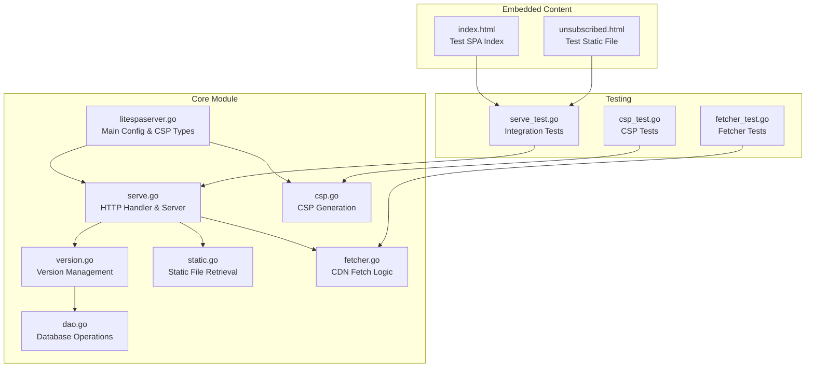
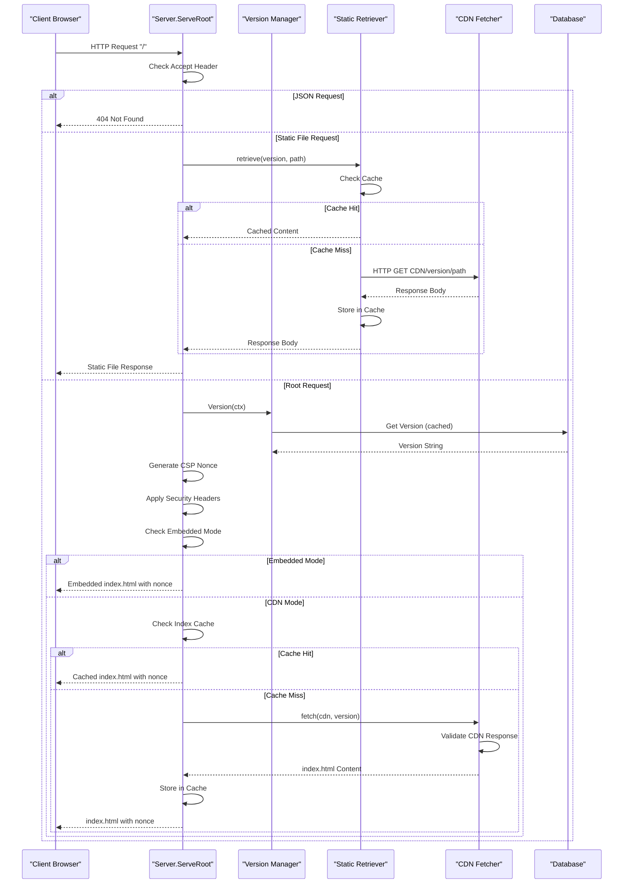
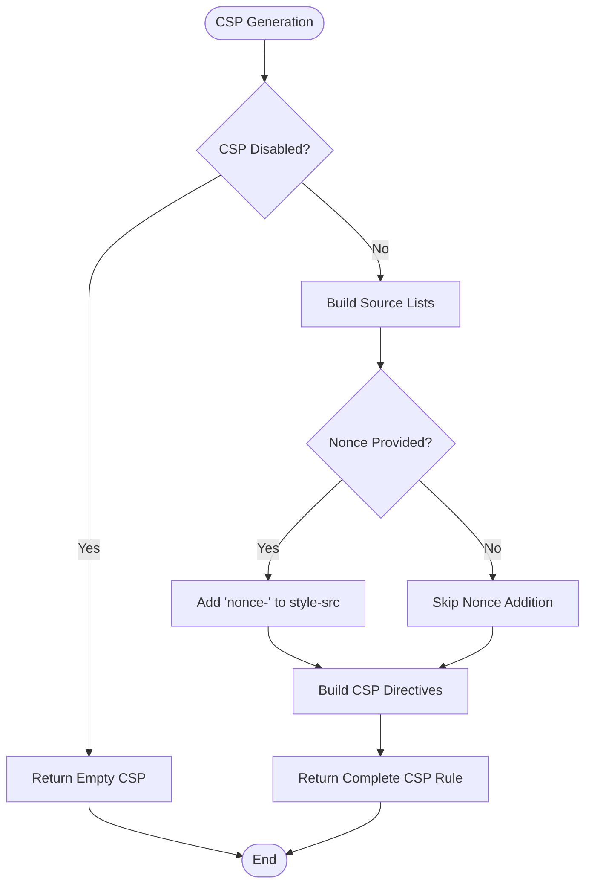
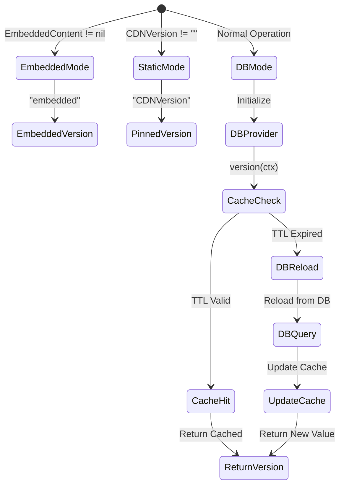
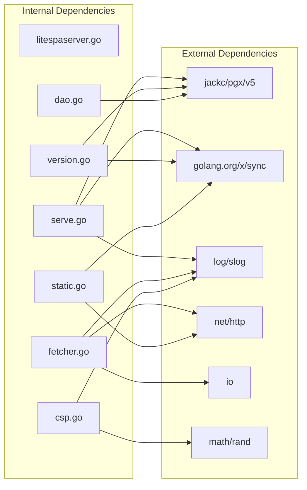

# Lite SPA Server Module

<cite>
**Referenced Files in This Document**
- [litespaserver.go](file://litespaserver/litespaserver.go)
- [serve.go](file://litespaserver/serve.go)
- [csp.go](file://litespaserver/csp.go)
- [version.go](file://litespaserver/version.go)
- [dao.go](file://litespaserver/dao.go)
- [static.go](file://litespaserver/static.go)
- [fetcher.go](file://litespaserver/fetcher.go)
- [serve_test.go](file://litespaserver/serve_test.go)
- [csp_test.go](file://litespaserver/csp_test.go)
- [fetcher_test.go](file://litespaserver/fetcher_test.go)
- [index.html](file://litespaserver/testdata/embed/index.html)
- [unsubscribed.html](file://litespaserver/testdata/embed/unsubscribed.html)
- [go.mod](file://go.mod)
</cite>

## Table of Contents
1. [Introduction](#introduction)
2. [Project Structure](#project-structure)
3. [Core Components](#core-components)
4. [Architecture Overview](#architecture-overview)
5. [Detailed Component Analysis](#detailed-component-analysis)
6. [Dependency Analysis](#dependency-analysis)
7. [Performance Considerations](#performance-considerations)
8. [Security Best Practices](#security-best-practices)
9. [Troubleshooting Guide](#troubleshooting-guide)
10. [Production Deployment Guide](#production-deployment-guide)
11. [Conclusion](#conclusion)

## Introduction
The Lite SPA Server module provides a secure, efficient way to serve CDN-hosted Single Page Applications with enhanced security features. It resolves live frontend versions, fetches SPA assets from CDNs, injects per-request CSP nonces, and serves content with robust security headers. The module is designed to be environment-agnostic while offering flexible configuration for different deployment scenarios.

Key security features include:
- Per-request Content Security Policy (CSP) nonces for inline script isolation
- Embedded content support for local development
- Database-backed version management with validation
- Comprehensive HTTP security headers
- CDN response validation to prevent serving incorrect content

## Project Structure
The Lite SPA Server module follows a clean, layered architecture with clear separation of concerns:



**Diagram sources**
- [litespaserver.go:1-57](file://litespaserver/litespaserver.go#L1-L57)
- [serve.go:1-228](file://litespaserver/serve.go#L1-L228)
- [version.go:1-199](file://litespaserver/version.go#L1-L199)
- [dao.go:1-56](file://litespaserver/dao.go#L1-L56)
- [static.go:1-117](file://litespaserver/static.go#L1-L117)
- [fetcher.go:1-70](file://litespaserver/fetcher.go#L1-L70)
- [csp.go:1-115](file://litespaserver/csp.go#L1-L115)

**Section sources**
- [litespaserver.go:1-57](file://litespaserver/litespaserver.go#L1-L57)
- [serve.go:1-228](file://litespaserver/serve.go#L1-L228)
- [version.go:1-199](file://litespaserver/version.go#L1-L199)

## Core Components
The module consists of several interconnected components that work together to deliver secure SPA serving:

### Main Configuration Structure
The Config type defines all server configuration parameters:
- CDNPrefix: Base URL for CDN hosting
- CDNVersion: Pin specific version for development
- StaticPaths: Allow-list of static files to proxy
- DefaultVersion: Seed value for new deployments
- CSP: Content Security Policy configuration
- EmbeddedContent: Local filesystem for development

### Version Management System
The Manager component handles frontend version resolution with multiple providers:
- StaticProvider: Fixed version from configuration
- DBProvider: Database-backed version with TTL caching
- Validation: Ensures versions exist on CDN before accepting

### Security Headers and CSP
Built-in security measures include:
- X-Frame-Options: SAMEORIGIN protection
- Referrer-Policy: origin-when-cross-origin
- X-Content-Type-Options: nosniff
- Content-Security-Policy with per-request nonces
- No-store caching for dynamic content

**Section sources**
- [litespaserver.go:10-57](file://litespaserver/litespaserver.go#L10-L57)
- [serve.go:29-43](file://litespaserver/serve.go#L29-L43)
- [version.go:80-120](file://litespaserver/version.go#L80-L120)

## Architecture Overview
The Lite SPA Server implements a sophisticated request processing pipeline with multiple optimization layers:



**Diagram sources**
- [serve.go:93-188](file://litespaserver/serve.go#L93-L188)
- [version.go:138-146](file://litespaserver/version.go#L138-L146)
- [static.go:52-95](file://litespaserver/static.go#L52-L95)
- [fetcher.go:32-69](file://litespaserver/fetcher.go#L32-L69)

The architecture employs several optimization strategies:
- Single-flight pattern for concurrent requests
- In-memory caching for index.html and static files
- Database TTL caching for version resolution
- Embedded content support for development

## Detailed Component Analysis

### Server Component
The Server struct orchestrates the entire request processing pipeline:

```mermaid
classDiagram
class Server {
-string cdn
-fs.FS embedded
-CSPConfig csp
-Manager manager
-staticRetriever static
-fetcher fetcher
-map~string,string~ indexCache
-singleflight.Group sf
+NewServer(ctx, pool, cfg) Server
+ServeRoot(w, r) void
+Manager() Manager
+FlushCache() void
+RefreshVersion(ctx) void
-setBaseHeaders(w, nonce) void
-indexLookup(version) (string, bool)
-indexStore(version, body) void
}
class Manager {
-string cdn
-dao dao
-fetcher fetcher
-versionProvider provider
-[]func listeners
+NewManager(ctx, pool, cdn, cdnVersion, defaultVersion, embedded) Manager
+Version(ctx) string
+ForceRefresh(ctx) void
+SetVersion(ctx, candidate) bool
+OnChange(fn) void
-seedDefaultIfAbsent(ctx, defaultVersion) void
-isValidVersion(ctx, candidate) bool
-notifyListeners() void
}
class staticRetriever {
-http.Client client
-map~string,struct{}~ allowed
-map~string,string~ fileCache
-singleflight.Group sf
+newStaticRetriever(client, paths) staticRetriever
+isStatic(path) bool
+retrieve(ctx, cdn, version, path) (string, error)
-put(url, body) void
}
class fetcher {
-http.Client client
+newFetcher(client) fetcher
+fetch(ctx, cdn, version) (fetchedVersion, bool)
}
Server --> Manager : "uses"
Server --> staticRetriever : "uses"
Server --> fetcher : "uses"
Manager --> dao : "uses"
Manager --> fetcher : "uses"
```

**Diagram sources**
- [serve.go:29-91](file://litespaserver/serve.go#L29-L91)
- [version.go:80-186](file://litespaserver/version.go#L80-L186)
- [static.go:17-44](file://litespaserver/static.go#L17-L44)
- [fetcher.go:12-24](file://litespaserver/fetcher.go#L12-L24)

### Content Security Policy Implementation
The CSP system generates dynamic policies with per-request nonces:



**Diagram sources**
- [csp.go:62-90](file://litespaserver/csp.go#L62-L90)
- [serve.go:190-202](file://litespaserver/serve.go#L190-L202)

### Version Management System
The version management system provides multiple sourcing strategies:



**Diagram sources**
- [version.go:97-120](file://litespaserver/version.go#L97-L120)
- [version.go:40-78](file://litespaserver/version.go#L40-L78)

**Section sources**
- [serve.go:29-228](file://litespaserver/serve.go#L29-L228)
- [csp.go:1-115](file://litespaserver/csp.go#L1-L115)
- [version.go:1-199](file://litespaserver/version.go#L1-L199)

## Dependency Analysis
The module maintains clean dependencies with external libraries:



**Diagram sources**
- [serve.go:3-18](file://litespaserver/serve.go#L3-L18)
- [version.go:3-12](file://litespaserver/version.go#L3-L12)
- [dao.go:3-9](file://litespaserver/dao.go#L3-L9)
- [fetcher.go:3-10](file://litespaserver/fetcher.go#L3-L10)
- [static.go:3-12](file://litespaserver/static.go#L3-L12)
- [csp.go:3-6](file://litespaserver/csp.go#L3-L6)

**Section sources**
- [go.mod:1-96](file://go.mod#L1-L96)

## Performance Considerations
The module implements several performance optimization strategies:

### Caching Strategies
- **Index Cache**: Stores parsed index.html per version with LRU eviction
- **Static Cache**: Bounded cache for frequently requested static files
- **Database TTL**: 5-minute cache for version queries
- **Single-flight Pattern**: Prevents thundering herd on cache misses

### Request Optimization
- **Concurrent Request Collapsing**: Multiple simultaneous requests collapse to single CDN fetch
- **Embedded Mode**: Eliminates CDN overhead during development
- **Selective CDN Validation**: Validates responses to prevent serving incorrect content

### Memory Management
- Fixed-size caches with automatic eviction
- Efficient string replacement for nonce injection
- Minimal allocations during request processing

**Section sources**
- [serve.go:20-27](file://litespaserver/serve.go#L20-L27)
- [static.go:14-15](file://litespaserver/static.go#L14-L15)
- [version.go:14-16](file://litespaserver/version.go#L14-L16)

## Security Best Practices
The module enforces comprehensive security measures:

### CSP Implementation
- Per-request nonces for inline script isolation
- Default restrictive policy with configurable overrides
- Automatic nonce injection into style-src directives
- Support for disabling CSP when required

### Request Validation
- JSON request detection prevents accidental HTML serving
- CDN response validation ensures legitimate content
- Embedded content verification prevents misconfiguration
- Secure header injection (X-Frame-Options, X-Content-Type-Options)

### Database Security
- Proper SQL parameterization
- Error handling without sensitive information disclosure
- Graceful fallback on database failures

### Production Hardening
- Environment-specific version pinning
- Comprehensive logging with contextual information
- Graceful degradation on upstream failures

**Section sources**
- [serve.go:93-188](file://litespaserver/serve.go#L93-L188)
- [csp.go:62-90](file://litespaserver/csp.go#L62-L90)
- [fetcher.go:32-69](file://litespaserver/fetcher.go#L32-L69)

## Troubleshooting Guide

### Common Issues and Solutions

#### CDN Fetch Failures
**Symptoms**: 502 Bad Gateway responses for static files
**Causes**: 
- CDN endpoint unreachable
- Version not published yet
- Network connectivity issues

**Solutions**:
- Verify CDN endpoint accessibility
- Check version existence on CDN
- Monitor network connectivity

#### CSP Nonce Issues
**Symptoms**: Inline scripts blocked by browser
**Causes**:
- Nonce mismatch between HTML and CSP
- CSP disabled or overridden incorrectly

**Solutions**:
- Ensure nonce injection occurs before CSP header
- Verify CSP configuration allows required sources
- Check for conflicting middleware

#### Embedded Content Problems
**Symptoms**: Missing index.html in embedded mode
**Causes**:
- Incorrect filesystem structure
- Missing index.html at root level

**Solutions**:
- Verify embedded filesystem contains index.html
- Use fs.Sub to re-root subdirectories
- Check filesystem permissions

#### Version Management Issues
**Symptoms**: Stale versions or database errors
**Causes**:
- Database connectivity problems
- Schema not initialized
- Version validation failures

**Solutions**:
- Initialize litespa_settings table
- Verify database connectivity
- Check version format and existence

**Section sources**
- [serve_test.go:147-186](file://litespaserver/serve_test.go#L147-L186)
- [serve_test.go:309-318](file://litespaserver/serve_test.go#L309-L318)
- [dao.go:15-23](file://litespaserver/dao.go#L15-L23)

## Production Deployment Guide

### Database Setup
Create the required settings table before deployment:

```sql
CREATE TABLE IF NOT EXISTS litespa_settings (
    id         TEXT PRIMARY KEY,
    value      TEXT NOT NULL,
    updated_on TIMESTAMPTZ NOT NULL DEFAULT CURRENT_TIMESTAMP
);
```

Seed initial version for new environments:
- Use environment-specific default versions
- Ensure database user has INSERT/UPDATE permissions

### Server Configuration Examples

#### Basic CDN Configuration
```go
cfg := litespaserver.Config{
    CDNPrefix: "https://your-cdn.example.com",
    StaticPaths: []string{"/unsubscribed.html", "/manifest.json"},
    DefaultVersion: "v1.0.0",
    CSP: litespaserver.CSPConfig{
        ScriptSrcs: []string{"'self'", "https://trusted-cdn.example.com"},
        ConnectSrcs: []string{"'self'", "https://api.example.com"},
    },
}
```

#### Development Configuration
```go
cfg := litespaserver.Config{
    CDNPrefix: "https://your-cdn.example.com",
    CDNVersion: "local-build", // Pin specific version
    StaticPaths: []string{"/unsubscribed.html"},
    DefaultVersion: "development",
    EmbeddedContent: embeddedFS, // Use embedded content
}
```

#### Custom Handlers Integration
```go
// Register server as HTTP handler
http.HandleFunc("/", func(w http.ResponseWriter, r *http.Request) {
    server.ServeRoot(w, r)
})

// Version management integration
http.HandleFunc("/admin/set-version", func(w http.ResponseWriter, r *http.Request) {
    if server.Manager().SetVersion(ctx, version) {
        server.FlushCache() // Clear caches on version change
        w.WriteHeader(http.StatusOK)
    } else {
        w.WriteHeader(http.StatusBadRequest)
    }
})
```

### Monitoring and Logging
- Enable structured logging for all operations
- Monitor CDN response times and error rates
- Track version change events
- Monitor cache hit ratios

### Performance Tuning
- Adjust cache sizes based on traffic patterns
- Configure database connection pooling appropriately
- Set reasonable timeouts for CDN requests
- Monitor memory usage and GC pressure

**Section sources**
- [litespaserver.go:10-57](file://litespaserver/litespaserver.go#L10-L57)
- [serve.go:45-59](file://litespaserver/serve.go#L45-L59)
- [version.go:148-163](file://litespaserver/version.go#L148-L163)

## Conclusion
The Lite SPA Server module provides a robust, secure solution for serving CDN-hosted Single Page Applications. Its architecture balances security, performance, and flexibility through:

- Comprehensive CSP enforcement with per-request nonces
- Multi-tier caching for optimal performance
- Flexible version management supporting various deployment scenarios
- Embedded content support for development workflows
- Database-backed configuration with validation
- Clean separation of concerns with well-defined interfaces

The module's design enables secure production deployments while maintaining developer productivity through embedded content support and flexible configuration options. Its comprehensive testing suite and error handling make it suitable for mission-critical applications requiring reliable SPA delivery.