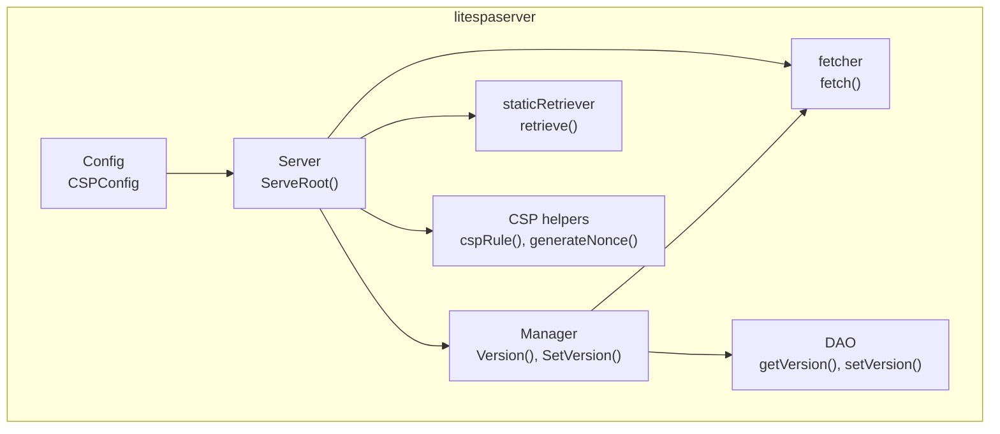
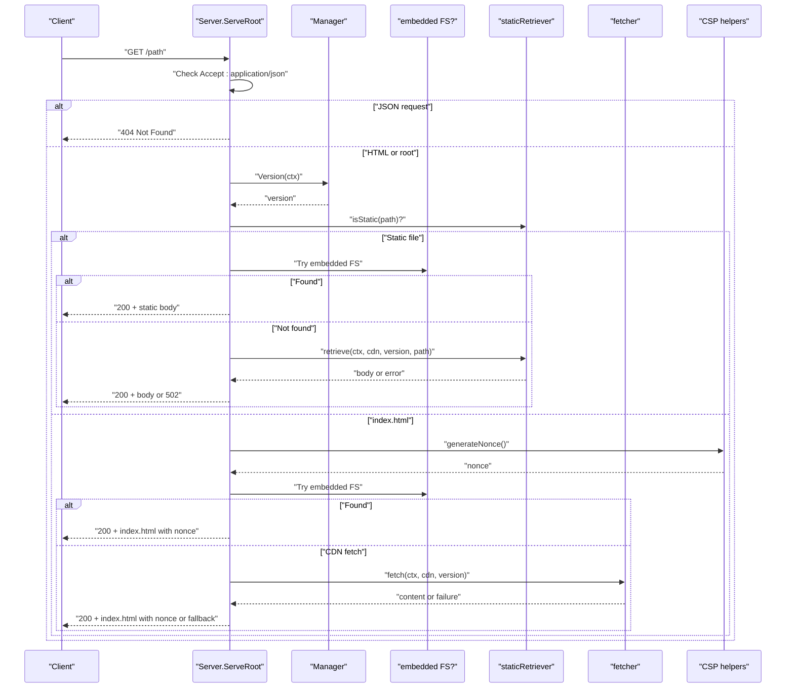
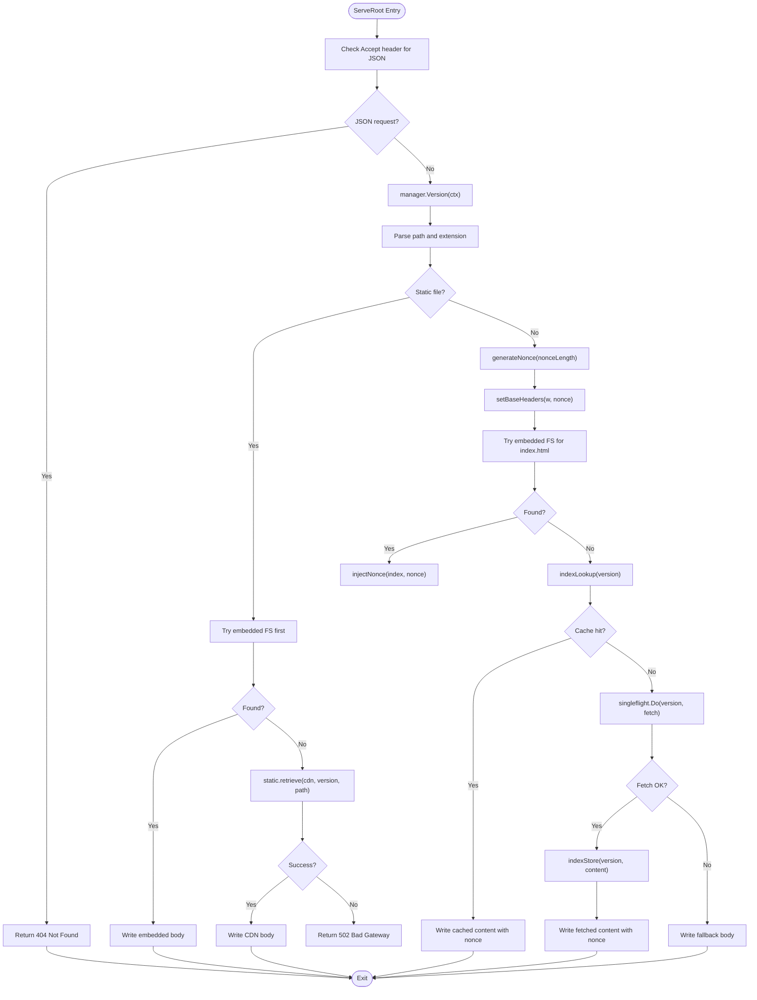
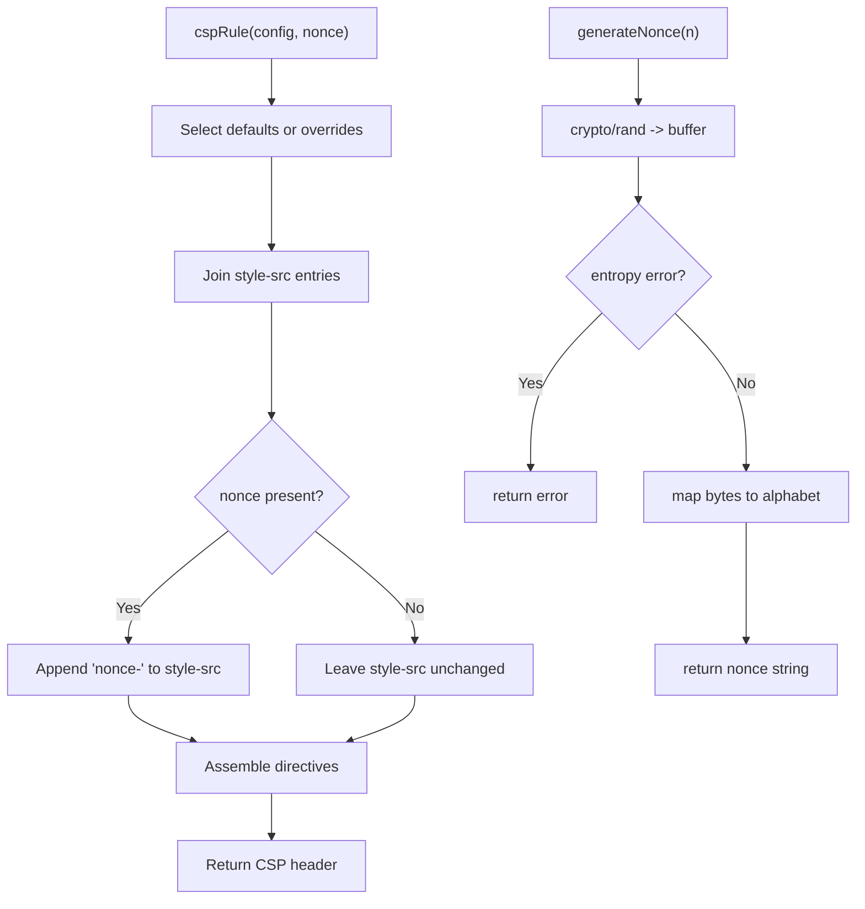
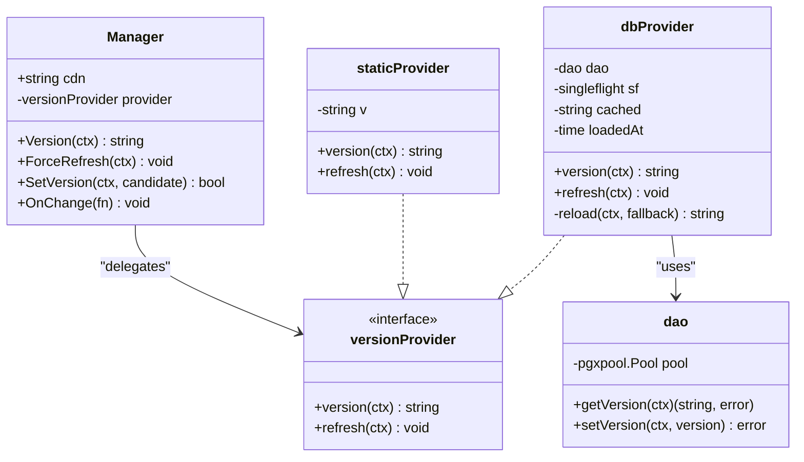
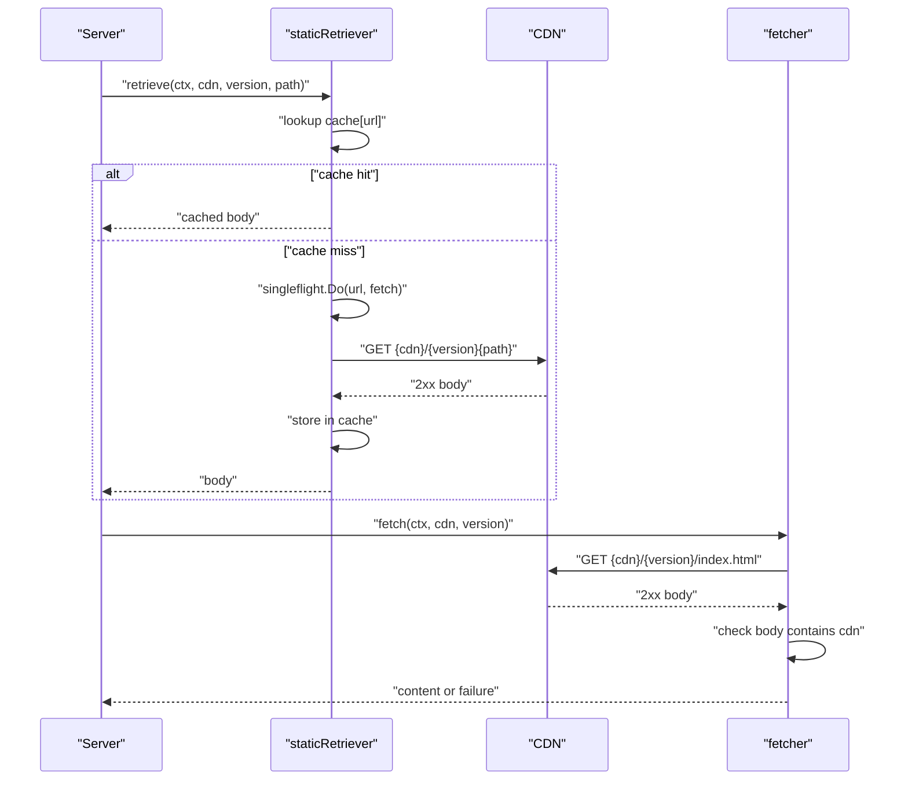
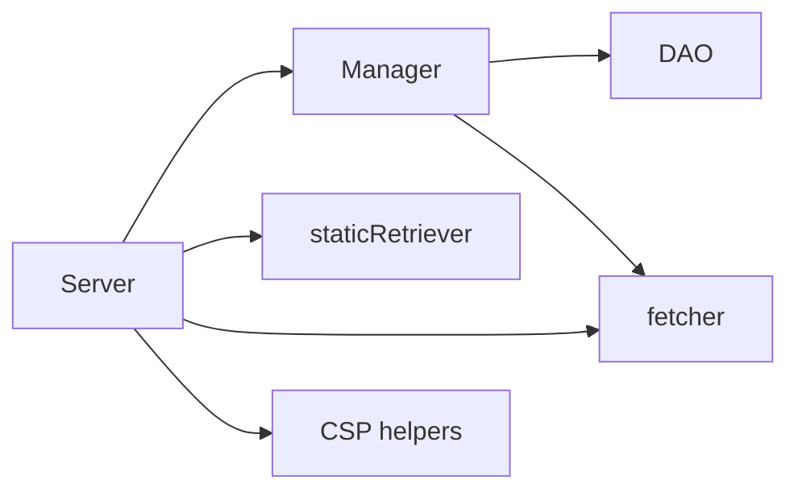

# Request Processing

<cite>
**Referenced Files in This Document**
- [litespaserver.go](file://litespaserver/litespaserver.go)
- [serve.go](file://litespaserver/serve.go)
- [csp.go](file://litespaserver/csp.go)
- [fetcher.go](file://litespaserver/fetcher.go)
- [version.go](file://litespaserver/version.go)
- [static.go](file://litespaserver/static.go)
- [dao.go](file://litespaserver/dao.go)
- [serve_test.go](file://litespaserver/serve_test.go)
- [csp_test.go](file://litespaserver/csp_test.go)
- [fetcher_test.go](file://litespaserver/fetcher_test.go)
- [static_test.go](file://litespaserver/static_test.go)
</cite>

## Table of Contents
1. [Introduction](#introduction)
2. [Project Structure](#project-structure)
3. [Core Components](#core-components)
4. [Architecture Overview](#architecture-overview)
5. [Detailed Component Analysis](#detailed-component-analysis)
6. [Dependency Analysis](#dependency-analysis)
7. [Performance Considerations](#performance-considerations)
8. [Troubleshooting Guide](#troubleshooting-guide)
9. [Conclusion](#conclusion)
10. [Appendices](#appendices)

## Introduction
This document explains the HTTP request processing pipeline for serving a CDN-hosted single-page application (SPA). It covers how requests are handled, how version resolution works, how CSP is injected per request, how static assets are fetched from the CDN, and how responses are generated. It also documents error handling, request validation, response formatting, and how to extend the pipeline with custom middleware-like stages.

## Project Structure
The request processing lives primarily in the litespaserver package. The key files are:
- Configuration and CSP model: litespaserver.go
- HTTP handler and request flow: serve.go
- CSP rule building and nonce generation: csp.go
- CDN index.html fetcher: fetcher.go
- Version resolution and persistence: version.go
- Static file proxying and caching: static.go
- Database DAO for version storage: dao.go
- Tests validating behavior: serve_test.go, csp_test.go, fetcher_test.go, static_test.go

**Diagram sources**
- [litespaserver.go:10-56](file://litespaserver/litespaserver.go#L10-L56)
- [serve.go:29-227](file://litespaserver/serve.go#L29-L227)
- [version.go:80-199](file://litespaserver/version.go#L80-L199)
- [dao.go:24-55](file://litespaserver/dao.go#L24-L55)
- [fetcher.go:12-69](file://litespaserver/fetcher.go#L12-L69)
- [static.go:17-117](file://litespaserver/static.go#L17-L117)
- [csp.go:62-115](file://litespaserver/csp.go#L62-L115)

**Section sources**
- [litespaserver.go:1-57](file://litespaserver/litespaserver.go#L1-L57)
- [serve.go:1-228](file://litespaserver/serve.go#L1-L228)

## Core Components
- Config and CSPConfig define runtime behavior: CDN base URL, pinned version, static allow-list, default version, CSP overrides, and embedded content filesystem.
- Server orchestrates request handling, caches index.html per version, and injects CSP nonces.
- Manager resolves the live frontend version from either a static provider, an embedded provider, or a database-backed provider with TTL and singleflight collapsing.
- fetcher retrieves index.html from the CDN and validates it by checking the response body contains the CDN prefix.
- staticRetriever proxies allowed static files from the CDN with in-memory caching and singleflight collapsing.
- CSP helpers build the Content-Security-Policy header and generate per-request nonces.

**Section sources**
- [litespaserver.go:10-56](file://litespaserver/litespaserver.go#L10-L56)
- [serve.go:29-227](file://litespaserver/serve.go#L29-L227)
- [version.go:80-199](file://litespaserver/version.go#L80-L199)
- [fetcher.go:12-69](file://litespaserver/fetcher.go#L12-L69)
- [static.go:17-117](file://litespaserver/static.go#L17-L117)
- [csp.go:62-115](file://litespaserver/csp.go#L62-L115)

## Architecture Overview
The request processing pipeline is centered around ServeRoot, which:
- Detects JSON requests and returns 404.
- Determines the current version from Manager.
- Checks if the request targets a static file in the allow-list; if so, proxies from CDN or embedded FS and returns immediately.
- Otherwise, serves index.html with a fresh CSP nonce, applying base security headers and version metadata.

**Diagram sources**
- [serve.go:93-188](file://litespaserver/serve.go#L93-L188)
- [version.go:138-146](file://litespaserver/version.go#L138-L146)
- [static.go:46-95](file://litespaserver/static.go#L46-L95)
- [fetcher.go:32-69](file://litespaserver/fetcher.go#L32-L69)
- [csp.go:100-115](file://litespaserver/csp.go#L100-L115)

## Detailed Component Analysis

### Server and ServeRoot
ServeRoot implements the HTTP request handling flow:
- Rejects JSON requests by returning 404.
- Applies base security headers and sets X-app-version.
- For static files: serves from embedded FS if configured, otherwise proxies from CDN with error mapping.
- For index.html: generates a per-request nonce, injects it into the HTML, and returns with CSP header.

**Diagram sources**
- [serve.go:93-188](file://litespaserver/serve.go#L93-L188)
- [serve.go:190-227](file://litespaserver/serve.go#L190-L227)
- [serve.go:204-221](file://litespaserver/serve.go#L204-L221)
- [csp.go:100-115](file://litespaserver/csp.go#L100-L115)
- [csp.go:223-227](file://litespaserver/csp.go#L223-L227)

**Section sources**
- [serve.go:93-188](file://litespaserver/serve.go#L93-L188)
- [serve.go:190-227](file://litespaserver/serve.go#L190-L227)
- [serve.go:204-221](file://litespaserver/serve.go#L204-L221)

### CSP Injection and Nonce Generation
- CSP rules are built from defaults or overrides, with style-src receiving a per-request nonce when enabled.
- Nonces are generated using cryptographic randomness and validated to be alphanumeric.
- The index.html body is scanned for a placeholder attribute and replaced with the generated nonce.

**Diagram sources**
- [csp.go:62-90](file://litespaserver/csp.go#L62-L90)
- [csp.go:100-115](file://litespaserver/csp.go#L100-L115)
- [serve.go:223-227](file://litespaserver/serve.go#L223-L227)

**Section sources**
- [csp.go:62-115](file://litespaserver/csp.go#L62-L115)
- [serve.go:223-227](file://litespaserver/serve.go#L223-L227)

### Version Resolution and Persistence
- Manager selects a provider:
  - Embedded mode: static provider with version "embedded".
  - Pinned version: static provider with configured version.
  - Database-backed: TTL-cached provider with singleflight collapsing.
- SetVersion validates the candidate against the CDN, persists it, notifies listeners, and refreshes the cache.
- DAO reads/writes the frontend version from a key-value table.

**Diagram sources**
- [version.go:80-199](file://litespaserver/version.go#L80-L199)
- [dao.go:24-55](file://litespaserver/dao.go#L24-L55)

**Section sources**
- [version.go:80-199](file://litespaserver/version.go#L80-L199)
- [dao.go:24-55](file://litespaserver/dao.go#L24-L55)

### CDN Fetching and Static Proxies
- fetcher retrieves index.html from {cdn}/{version}/index.html and validates it by ensuring the response body contains the CDN prefix.
- staticRetriever proxies allowed static files from the CDN, caching responses with a bounded in-memory cache and collapsing concurrent fetches via singleflight.

**Diagram sources**
- [static.go:52-95](file://litespaserver/static.go#L52-L95)
- [fetcher.go:32-69](file://litespaserver/fetcher.go#L32-L69)

**Section sources**
- [static.go:17-117](file://litespaserver/static.go#L17-L117)
- [fetcher.go:12-69](file://litespaserver/fetcher.go#L12-L69)

### Request Validation and Response Formatting
- JSON requests are rejected with 404 to prevent serving HTML to clients expecting JSON.
- Static file requests are validated against an allow-list; non-static extensions return 404.
- Base headers include cache-control, content-type, frame options, referrer policy, and nosniff.
- CSP is applied unless disabled; nonce is appended to style-src when enabled.
- Responses include X-app-version and, for CDN-fetched index.html, X-fe-version-url.

**Section sources**
- [serve.go:93-188](file://litespaserver/serve.go#L93-L188)
- [serve.go:190-202](file://litespaserver/serve.go#L190-L202)

### Error Handling Strategies
- JSON request detection prevents accidental HTML serving.
- Static file proxying logs and returns 502 on upstream failures.
- Index.html fetch validation ensures the response is a real SPA page by checking for the CDN prefix.
- Fallback body is returned when all else fails, with a plain text content type.
- Nonce generation errors trigger internal server error responses.

**Section sources**
- [serve.go:99-103](file://litespaserver/serve.go#L99-L103)
- [serve.go:122-127](file://litespaserver/serve.go#L122-L127)
- [serve.go:140-144](file://litespaserver/serve.go#L140-L144)
- [serve.go:168-187](file://litespaserver/serve.go#L168-L187)
- [fetcher.go:58-66](file://litespaserver/fetcher.go#L58-L66)

### Extending the Pipeline and Middleware Integration
- Custom request processing can be layered before ServeRoot by wrapping it with middleware that checks headers, logs, rate-limits, or enriches context.
- To integrate custom middleware, mount the Server’s ServeRoot behind a router that applies middleware functions.
- Version updates can trigger cache invalidation via Manager.OnChange callbacks; the Server exposes FlushCache to invalidate index.html caches.

**Section sources**
- [serve.go:85-91](file://litespaserver/serve.go#L85-L91)
- [version.go:165-186](file://litespaserver/version.go#L165-L186)

## Dependency Analysis
The following diagram shows the primary dependencies among components during request processing.

**Diagram sources**
- [serve.go:29-59](file://litespaserver/serve.go#L29-L59)
- [version.go:80-120](file://litespaserver/version.go#L80-L120)
- [dao.go:24-55](file://litespaserver/dao.go#L24-L55)
- [fetcher.go:12-24](file://litespaserver/fetcher.go#L12-L24)
- [static.go:17-44](file://litespaserver/static.go#L17-L44)
- [csp.go:62-90](file://litespaserver/csp.go#L62-L90)

**Section sources**
- [serve.go:29-59](file://litespaserver/serve.go#L29-L59)
- [version.go:80-120](file://litespaserver/version.go#L80-L120)

## Performance Considerations
- Singleflight collapsing:
  - Prevents thundering herds on version changes or cache misses by collapsing concurrent requests for the same version or URL into a single upstream call.
- Caching:
  - Index.html is cached per version with a bounded capacity.
  - Static files are cached per full URL with a bounded capacity.
- Concurrency:
  - Use a reverse proxy or load balancer to distribute load across instances.
- Logging:
  - Use structured logging to track latency, cache hits, and upstream failures.

[No sources needed since this section provides general guidance]

## Troubleshooting Guide
Common issues and diagnostics:
- JSON request unexpectedly returns HTML:
  - Verify Accept header is not application/json.
- Static file returns 502:
  - Check CDN availability and path correctness; confirm the file exists at {cdn}/{version}{path}.
- Index.html not served:
  - Confirm the CDN returns a 2xx response containing the CDN prefix; otherwise, the fetch is rejected.
- CSP not applied:
  - Ensure CSP is not disabled and that the SPA template includes the nonce placeholder.
- Embedded mode not working:
  - Ensure the embedded fs.FS contains index.html at the root; otherwise, the mode is disabled and warnings are logged.

**Section sources**
- [serve_test.go:30-42](file://litespaserver/serve_test.go#L30-L42)
- [serve_test.go:147-164](file://litespaserver/serve_test.go#L147-L164)
- [serve_test.go:166-186](file://litespaserver/serve_test.go#L166-L186)
- [serve_test.go:320-354](file://litespaserver/serve_test.go#L320-L354)
- [csp_test.go:8-40](file://litespaserver/csp_test.go#L8-L40)
- [fetcher_test.go:31-42](file://litespaserver/fetcher_test.go#L31-L42)
- [serve.go:61-75](file://litespaserver/serve.go#L61-L75)

## Conclusion
The litespaserver package provides a robust, production-ready pipeline for serving a CDN-hosted SPA. It integrates version resolution, CSP injection, CDN fetching, and response generation while offering strong error handling, caching, and concurrency controls. Extensions can be added via middleware and custom providers, and the system remains environment-agnostic through configuration-driven behavior.

[No sources needed since this section summarizes without analyzing specific files]

## Appendices

### Example: Custom Request Processing
- Wrap ServeRoot with middleware that logs requests, enforces rate limits, or injects tracing context.
- Mount the Server on a router that applies middleware globally or per-route.

**Section sources**
- [serve.go:93-188](file://litespaserver/serve.go#L93-L188)

### Example: Middleware Integration
- Use a reverse proxy or framework router to apply middleware before delegating to ServeRoot.
- Ensure middleware preserves request context and headers required by downstream components.

[No sources needed since this section provides general guidance]

### Example: Extending the Request Pipeline
- Add a custom provider to Manager for specialized version resolution.
- Extend staticRetriever to support additional caching strategies or pre-validation hooks.

**Section sources**
- [version.go:18-28](file://litespaserver/version.go#L18-L28)
- [static.go:17-44](file://litespaserver/static.go#L17-L44)