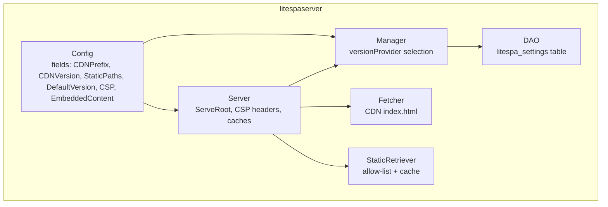
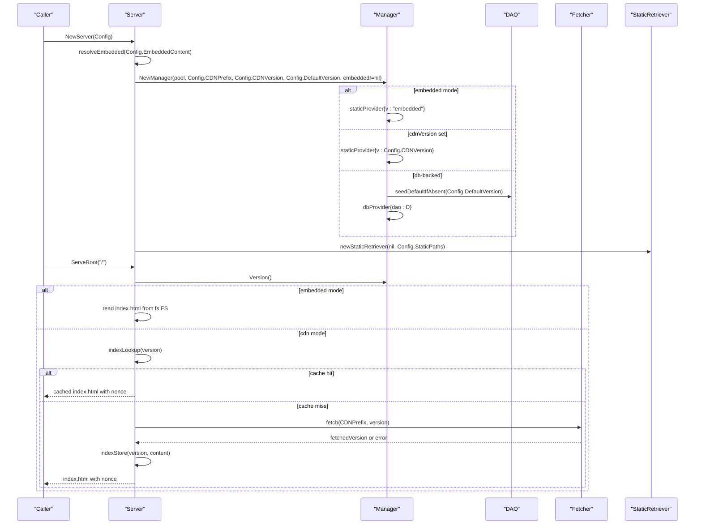
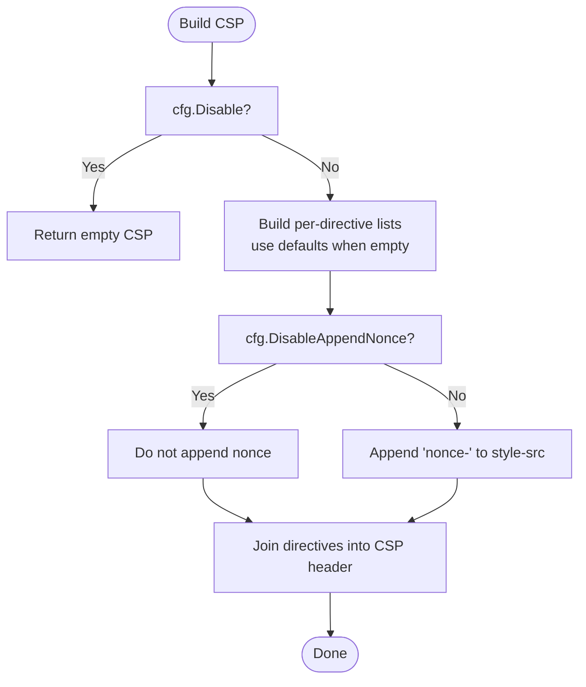
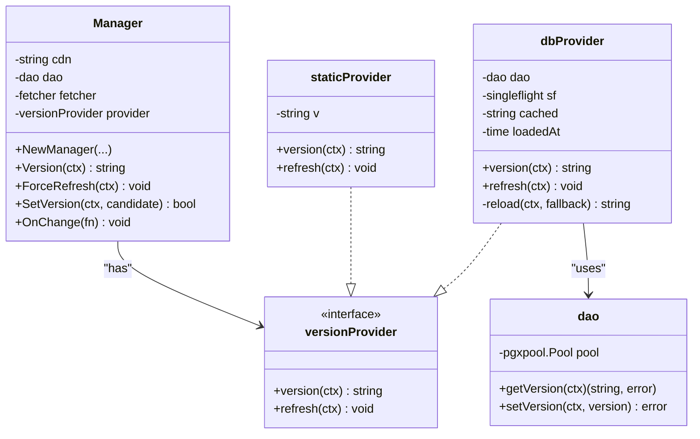
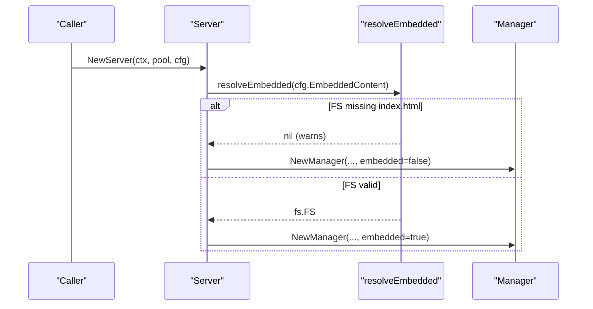
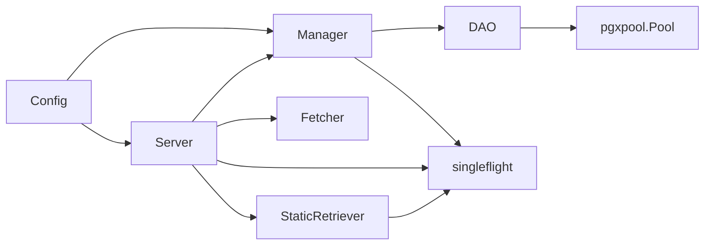

# Server Configuration

<cite>
**Referenced Files in This Document**
- [litespaserver.go](file://litespaserver/litespaserver.go)
- [version.go](file://litespaserver/version.go)
- [serve.go](file://litespaserver/serve.go)
- [csp.go](file://litespaserver/csp.go)
- [dao.go](file://litespaserver/dao.go)
- [static.go](file://litespaserver/static.go)
- [fetcher.go](file://litespaserver/fetcher.go)
- [serve_test.go](file://litespaserver/serve_test.go)
- [index.html](file://litespaserver/testdata/embed/index.html)
- [unsubscribed.html](file://litespaserver/testdata/embed/unsubscribed.html)
- [go.mod](file://go.mod)
</cite>

## Table of Contents
1. [Introduction](#introduction)
2. [Project Structure](#project-structure)
3. [Core Components](#core-components)
4. [Architecture Overview](#architecture-overview)
5. [Detailed Component Analysis](#detailed-component-analysis)
6. [Dependency Analysis](#dependency-analysis)
7. [Performance Considerations](#performance-considerations)
8. [Troubleshooting Guide](#troubleshooting-guide)
9. [Conclusion](#conclusion)
10. [Appendices](#appendices)

## Introduction
This document explains the Lite SPA Server configuration system. It focuses on the Config structure and its fields, how to initialize Config for development versus production, environment-specific defaults resolution, and the relationship between EmbeddedContent and database usage. It also covers CSP configuration, static file handling, and practical patterns for environment-agnostic configuration while allowing caller-specific customization.

## Project Structure
The Lite SPA Server lives under litespaserver and provides:
- A configuration model (Config) and CSP configuration (CSPConfig)
- A version manager that can source the live frontend version from a database or a static value
- An HTTP server that serves index.html and static assets, injecting a per-request CSP nonce
- Helpers for static file retrieval, CSP header construction, and CDN fetch validation

**Diagram sources**
- [litespaserver.go:10-57](file://litespaserver/litespaserver.go#L10-L57)
- [version.go:80-120](file://litespaserver/version.go#L80-L120)
- [serve.go:29-59](file://litespaserver/serve.go#L29-L59)
- [dao.go:15-26](file://litespaserver/dao.go#L15-L26)
- [fetcher.go:12-24](file://litespaserver/fetcher.go#L12-L24)
- [static.go:17-44](file://litespaserver/static.go#L17-L44)

**Section sources**
- [litespaserver.go:10-57](file://litespaserver/litespaserver.go#L10-L57)
- [serve.go:29-59](file://litespaserver/serve.go#L29-L59)

## Core Components
- Config: Caller-provided configuration that is environment-agnostic. The caller resolves environment-specific defaults before constructing Config.
- CSPConfig: Parameterizes Content-Security-Policy directives; when empty, sensible defaults are used.
- Manager: Owns version resolution. It selects a provider based on configuration:
  - Embedded mode: static provider with version "embedded"
  - CDNVersion present: static provider with pinned version
  - Otherwise: DB-backed provider with TTL cache and singleflight reload
- Server: Serves index.html (with per-request CSP nonce) and static files, with caches and fallbacks.

**Section sources**
- [litespaserver.go:10-57](file://litespaserver/litespaserver.go#L10-L57)
- [version.go:80-120](file://litespaserver/version.go#L80-L120)
- [serve.go:29-59](file://litespaserver/serve.go#L29-L59)

## Architecture Overview
The server composes Config into a Server that:
- Resolves EmbeddedContent and validates it
- Builds a Manager with a provider chosen from Config
- Uses a staticRetriever for allow-listed static files
- Fetches index.html from CDN when needed, caches it, and injects a per-request CSP nonce

**Diagram sources**
- [serve.go:48-59](file://litespaserver/serve.go#L48-L59)
- [version.go:97-120](file://litespaserver/version.go#L97-L120)
- [version.go:122-136](file://litespaserver/version.go#L122-L136)
- [serve.go:167-188](file://litespaserver/serve.go#L167-L188)
- [fetcher.go:32-69](file://litespaserver/fetcher.go#L32-L69)

## Detailed Component Analysis

### Config structure and fields
- CDNPrefix: Base CDN URL used to construct URLs like {cdn}/{version}/index.html and {cdn}/{version}{path}.
- CDNVersion: When non-empty, locks the served version to this value and bypasses the database. Useful for local development or pinning releases.
- StaticPaths: Allow-list of static file paths (e.g., "/unsubscribed.html") served via the CDN proxy alongside index.html.
- DefaultVersion: Seed value for the litespa_settings table when no version exists yet. The caller resolves environment-specific values (e.g., "v1.0.0" for production, a commit hash for development) before passing.
- CSP: CSPConfig that overrides default CSP source allow-lists. When zero-valued, defaults matching the original SPA are used.
- EmbeddedContent: When non-nil, serves index.html and static files directly from the filesystem instead of fetching from the CDN. The filesystem must contain "index.html" at its root. Use fs.Sub to re-root a subdirectory of an embed.FS. The Manager uses a static provider so the database is never touched. Used for local development.

Environment-agnostic behavior: The module keeps environment-specific logic outside itself. The caller constructs Config with environment-specific values and passes it in.

**Section sources**
- [litespaserver.go:10-57](file://litespaserver/litespaserver.go#L10-L57)

### CSP configuration
- CSPConfig fields:
  - FontSrcs, ScriptSrcs, ConnectSrcs, StyleSrcs, ManifestSrcs: per-directive allow-lists. When empty, defaults are used.
  - Disable: when true, disables the default behavior of serving a CSP header.
  - DisableAppendNonce: when true, disables appending a per-request nonce to style-src.
- Defaults: Built-in defaults match the original doublefin SPA deployment and include self, CDN hosts, Google domains, and unsafe hashes for styles.
- Header construction: cspRule builds the Content-Security-Policy header using provided sources (or defaults) and appends a per-request nonce to style-src when applicable.

**Diagram sources**
- [csp.go:62-90](file://litespaserver/csp.go#L62-L90)
- [csp.go:100-114](file://litespaserver/csp.go#L100-L114)

**Section sources**
- [csp.go:43-90](file://litespaserver/csp.go#L43-L90)
- [csp.go:100-114](file://litespaserver/csp.go#L100-L114)

### Version provider selection and database integration
- Provider selection:
  - EmbeddedContent non-nil -> static provider with version "embedded"
  - CDNVersion non-empty -> static provider with pinned version
  - Otherwise -> dbProvider backed by DAO
- DB-backed provider:
  - TTL cache (5 minutes) to avoid frequent DB queries
  - singleflight to collapse concurrent reloads into a single DB query
  - fallback behavior: on reload failure, keep serving the previous cached value
- DAO:
  - Reads/writes the "litespa_settings" table with key "frontend.version"
  - Required schema: id (TEXT PK), value (TEXT NOT NULL), updated_on (TIMESTAMPTZ NOT NULL DEFAULT CURRENT_TIMESTAMP)

**Diagram sources**
- [version.go:18-29](file://litespaserver/version.go#L18-L29)
- [version.go:30-78](file://litespaserver/version.go#L30-L78)
- [version.go:80-89](file://litespaserver/version.go#L80-L89)
- [dao.go:24-55](file://litespaserver/dao.go#L24-L55)

**Section sources**
- [version.go:91-120](file://litespaserver/version.go#L91-L120)
- [version.go:122-136](file://litespaserver/version.go#L122-L136)
- [version.go:138-146](file://litespaserver/version.go#L138-L146)
- [version.go:148-163](file://litespaserver/version.go#L148-L163)
- [version.go:165-186](file://litespaserver/version.go#L165-L186)
- [dao.go:15-26](file://litespaserver/dao.go#L15-L26)

### Server initialization and EmbeddedContent behavior
- NewServer constructs the Server from Config:
  - resolveEmbedded validates the caller-supplied fs.FS and returns nil if missing index.html at root (warns and falls back to CDN mode)
  - Manager is created with embedded flag derived from EmbeddedContent
  - StaticRetriever is built with StaticPaths
- EmbeddedContent relationship with database:
  - When EmbeddedContent is non-nil, Manager uses a static provider with version "embedded" and the DAO is never touched
  - This enables local development without a database

**Diagram sources**
- [serve.go:48-59](file://litespaserver/serve.go#L48-L59)
- [serve.go:61-75](file://litespaserver/serve.go#L61-L75)
- [version.go:97-120](file://litespaserver/version.go#L97-L120)

**Section sources**
- [serve.go:48-75](file://litespaserver/serve.go#L48-L75)
- [serve.go:109-159](file://litespaserver/serve.go#L109-L159)

### Static file handling and allow-list
- StaticRetriever maintains an allow-list of paths and a bounded in-memory cache keyed by full URL
- retrieve fetches {cdn}/{version}{path} from the CDN, caching successful responses
- Singleflight collapses concurrent first-fetches of the same URL
- When EmbeddedContent is configured, static files are served from fs.FS first; if not present, the CDN is used as a fallback

**Section sources**
- [static.go:17-44](file://litespaserver/static.go#L17-L44)
- [static.go:52-95](file://litespaserver/static.go#L52-L95)
- [serve.go:109-131](file://litespaserver/serve.go#L109-L131)

### CDN fetch validation and caching
- fetch validates that the response is 2xx and that the body contains the CDN prefix (defensive check against non-SPA responses)
- index.html is cached per version with a bounded capacity and refreshed via Manager.OnChange
- Singleflight collapses concurrent cache misses for the same version

**Section sources**
- [fetcher.go:32-69](file://litespaserver/fetcher.go#L32-L69)
- [serve.go:161-188](file://litespaserver/serve.go#L161-L188)

### Practical configuration patterns and environment-specific defaults
- Development:
  - Set CDNPrefix to your local or staging CDN host
  - Set CDNVersion to a known published version for reproducibility
  - Optionally set EmbeddedContent to an embed.FS for local development without a CDN
  - Set StaticPaths to include any additional static assets needed during development
  - Set DefaultVersion to a short commit hash or branch identifier
- Production:
  - Set CDNPrefix to the production CDN host
  - Leave CDNVersion empty to allow dynamic versioning via the database
  - Leave EmbeddedContent nil
  - Set StaticPaths to the minimal allow-list required
  - Set DefaultVersion to a semantic version aligned with your release process
- Environment-specific defaults resolution:
  - Resolve environment-specific values (e.g., "v1.0.0" for production, a commit hash for development) before constructing Config
  - Pass these values into Config fields as described above

Examples and patterns are demonstrated in tests:
- Embedded mode with an embed.FS and static provider
- Static file proxying from CDN with allow-list
- Index.html caching per version and singleflight behavior
- Non-JSON requests receive index.html with a per-request CSP nonce

**Section sources**
- [serve_test.go:17-28](file://litespaserver/serve_test.go#L17-L28)
- [serve_test.go:220-236](file://litespaserver/serve_test.go#L220-L236)
- [serve_test.go:121-145](file://litespaserver/serve_test.go#L121-L145)
- [serve_test.go:188-218](file://litespaserver/serve_test.go#L188-L218)
- [serve_test.go:238-267](file://litespaserver/serve_test.go#L238-L267)
- [serve_test.go:269-289](file://litespaserver/serve_test.go#L269-L289)
- [serve_test.go:320-354](file://litespaserver/serve_test.go#L320-L354)

## Dependency Analysis
- Internal dependencies:
  - Config depends on CSPConfig and fs.FS
  - Server depends on Manager, staticRetriever, fetcher, and CSPConfig
  - Manager depends on DAO for DB-backed provider
- External dependencies:
  - PostgreSQL driver via pgxpool for DAO
  - sync/singleflight for collapsing concurrent operations
  - net/http for CDN fetches and static proxies

**Diagram sources**
- [litespaserver.go:10-57](file://litespaserver/litespaserver.go#L10-L57)
- [serve.go:29-59](file://litespaserver/serve.go#L29-L59)
- [version.go:18-29](file://litespaserver/version.go#L18-L29)
- [dao.go:24-26](file://litespaserver/dao.go#L24-L26)
- [go.mod:5-12](file://go.mod#L5-L12)

**Section sources**
- [go.mod:5-12](file://go.mod#L5-L12)

## Performance Considerations
- Version provider caching:
  - DB-backed provider caches the version for 5 minutes and uses singleflight to collapse concurrent reloads
- Index.html caching:
  - Per-version in-memory cache with bounded capacity; cache eviction removes an arbitrary entry when at capacity
  - Singleflight collapses concurrent cache misses for the same version
- Static file caching:
  - Bounded in-memory cache keyed by full URL; eviction removes an arbitrary entry when at capacity
  - Singleflight collapses concurrent first-fetches of the same URL
- Security headers:
  - No-store cache policy and strict security headers are applied to all responses

[No sources needed since this section provides general guidance]

## Troubleshooting Guide
- EmbeddedContent misconfiguration:
  - If the provided fs.FS is non-nil but lacks index.html at the root, the server logs a warning and falls back to CDN mode
  - Ensure the fs.FS contains "index.html" at its root or use fs.Sub to re-root a subdirectory
- Static file not found:
  - Requests for static files not in the allow-list return 404
  - CDN fetch failures for static files return 502 Bad Gateway
- Index.html fetch failures:
  - Non-2xx responses or missing CDN prefix cause fallback to a plain text message
- CSP issues:
  - Verify CSPConfig overrides are correct; when Disable is true, no CSP header is sent
  - When DisableAppendNonce is true, the per-request nonce is not appended to style-src

**Section sources**
- [serve.go:61-75](file://litespaserver/serve.go#L61-L75)
- [serve.go:132-136](file://litespaserver/serve.go#L132-L136)
- [serve.go:122-127](file://litespaserver/serve.go#L122-L127)
- [serve.go:185-187](file://litespaserver/serve.go#L185-L187)
- [csp.go:199-201](file://litespaserver/csp.go#L199-L201)

## Conclusion
The Lite SPA Server’s configuration system is designed to be environment-agnostic while enabling caller-specific customization. Config encapsulates all caller-specific values, and the module resolves environment-specific defaults before constructing Config. The Manager selects an appropriate provider based on configuration, enabling embedded development, pinned versions, or dynamic DB-backed versioning. CSPConfig allows fine-grained control over security policies, and the server’s caches and singleflight mechanisms ensure efficient operation. By following the patterns outlined here, teams can manage environment-specific settings effectively while maintaining a clean separation of concerns.

## Appendices

### Appendix A: Example configuration setups
- Development with EmbeddedContent:
  - Set CDNPrefix to a local or staging host
  - Set EmbeddedContent to an embed.FS containing "index.html" at the root
  - Leave CDNVersion empty to allow dynamic versioning
  - Set StaticPaths to include any additional static assets
- Development with pinned CDNVersion:
  - Set CDNPrefix to a local or staging host
  - Set CDNVersion to a known published version
  - Leave EmbeddedContent nil
  - Set StaticPaths to include any additional static assets
- Production with DB-backed versioning:
  - Set CDNPrefix to the production CDN host
  - Leave CDNVersion empty
  - Leave EmbeddedContent nil
  - Set StaticPaths to the minimal required set
  - Set DefaultVersion to a semantic version aligned with your release process

**Section sources**
- [serve_test.go:220-236](file://litespaserver/serve_test.go#L220-L236)
- [serve_test.go:238-267](file://litespaserver/serve_test.go#L238-L267)
- [serve_test.go:269-289](file://litespaserver/serve_test.go#L269-L289)

### Appendix B: EmbeddedContent file layout
- The embedded filesystem must contain "index.html" at its root. Additional static files (e.g., "/unsubscribed.html") can be included and served from the filesystem when present.

**Section sources**
- [index.html:1-6](file://litespaserver/testdata/embed/index.html#L1-L6)
- [unsubscribed.html:1-2](file://litespaserver/testdata/embed/unsubscribed.html#L1-L2)