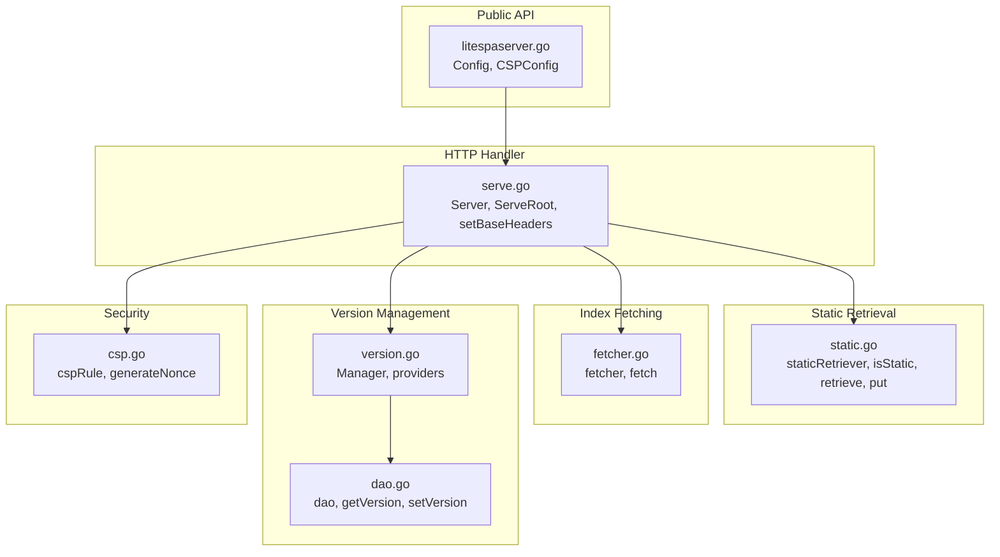
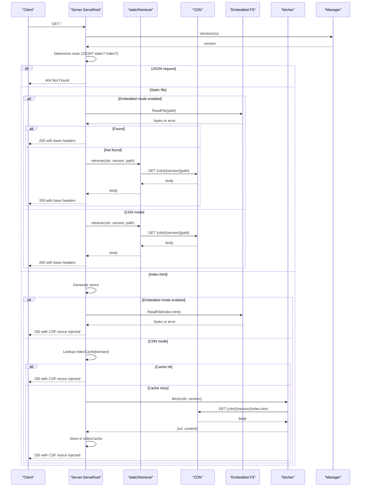
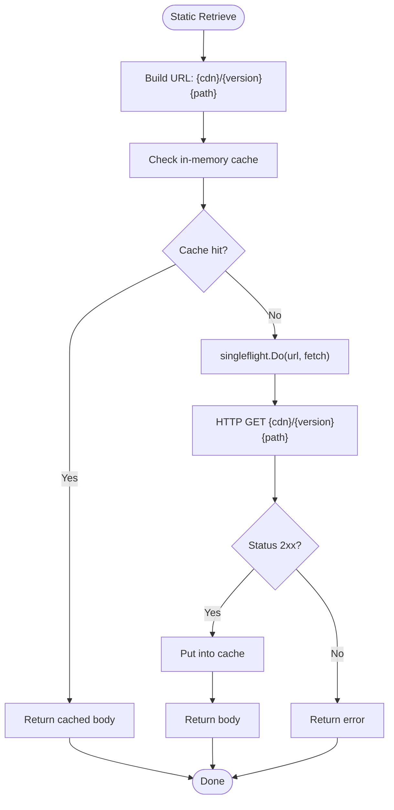
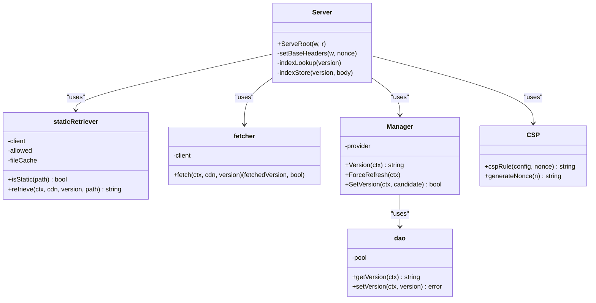

# Static File Serving

<cite>
**Referenced Files in This Document**
- [litespaserver.go](file://litespaserver/litespaserver.go)
- [serve.go](file://litespaserver/serve.go)
- [static.go](file://litespaserver/static.go)
- [fetcher.go](file://litespaserver/fetcher.go)
- [version.go](file://litespaserver/version.go)
- [csp.go](file://litespaserver/csp.go)
- [dao.go](file://litespaserver/dao.go)
- [serve_test.go](file://litespaserver/serve_test.go)
- [static_test.go](file://litespaserver/static_test.go)
- [index.html](file://litespaserver/testdata/embed/index.html)
- [unsubscribed.html](file://litespaserver/testdata/embed/unsubscribed.html)
</cite>

## Table of Contents
1. [Introduction](#introduction)
2. [Project Structure](#project-structure)
3. [Core Components](#core-components)
4. [Architecture Overview](#architecture-overview)
5. [Detailed Component Analysis](#detailed-component-analysis)
6. [Dependency Analysis](#dependency-analysis)
7. [Performance Considerations](#performance-considerations)
8. [Troubleshooting Guide](#troubleshooting-guide)
9. [Conclusion](#conclusion)
10. [Appendices](#appendices)

## Introduction
This document explains the static file serving capabilities of the Lite SPA Server. It covers the StaticPaths allow-list mechanism, file serving logic, caching strategies, integration with CDN proxy serving, file path resolution, and static file validation. It also documents the differences between embedded content serving and CDN-based serving, performance considerations, cache management, and practical guidance for configuration and debugging.

## Project Structure
The static file serving logic is centered around a small set of cohesive packages:
- Configuration and public API surface
- Request routing and response handling
- Static file retrieval and caching
- Index.html fetching and validation
- Version management and provider selection
- CSP generation and nonce injection
- DAO for persistent version storage

**Diagram sources**
- [litespaserver.go:10-57](file://litespaserver/litespaserver.go#L10-L57)
- [serve.go:29-228](file://litespaserver/serve.go#L29-L228)
- [static.go:17-117](file://litespaserver/static.go#L17-L117)
- [fetcher.go:12-70](file://litespaserver/fetcher.go#L12-L70)
- [version.go:18-199](file://litespaserver/version.go#L18-L199)
- [dao.go:15-56](file://litespaserver/dao.go#L15-L56)
- [csp.go:62-115](file://litespaserver/csp.go#L62-L115)

**Section sources**
- [litespaserver.go:10-57](file://litespaserver/litespaserver.go#L10-L57)
- [serve.go:29-228](file://litespaserver/serve.go#L29-L228)
- [static.go:17-117](file://litespaserver/static.go#L17-L117)
- [fetcher.go:12-70](file://litespaserver/fetcher.go#L12-L70)
- [version.go:18-199](file://litespaserver/version.go#L18-L199)
- [dao.go:15-56](file://litespaserver/dao.go#L15-L56)
- [csp.go:62-115](file://litespaserver/csp.go#L62-L115)

## Core Components
- StaticPaths allow-list: A list of static file paths that are permitted to be served via CDN proxy. Only paths present in this list are eligible for static serving.
- staticRetriever: Manages the allow-list, caches successful CDN responses, and deduplicates concurrent fetches for the same URL.
- Server.ServeRoot: Orchestrates request handling: rejects JSON requests, proxies static files from CDN or embedded FS, and serves index.html with per-request CSP nonce.
- fetcher: Validates that index.html originates from the configured CDN by checking the response body for the CDN prefix.
- Manager and providers: Resolve the live frontend version from either a static provider (development), a database-backed provider (production), or embedded content mode.
- CSP and nonce: Generates CSP headers with a per-request nonce and injects it into index.html.

**Section sources**
- [litespaserver.go:21-23](file://litespaserver/litespaserver.go#L21-L23)
- [static.go:27-44](file://litespaserver/static.go#L27-L44)
- [serve.go:93-188](file://litespaserver/serve.go#L93-L188)
- [fetcher.go:32-69](file://litespaserver/fetcher.go#L32-L69)
- [version.go:91-120](file://litespaserver/version.go#L91-L120)
- [csp.go:62-115](file://litespaserver/csp.go#L62-L115)

## Architecture Overview
The static file serving pipeline integrates CDN proxying, embedded FS serving, and caching. Requests are routed based on path extension and allow-list membership. Static files are served directly from the embedded filesystem when available; otherwise they are fetched from the CDN and cached. Index.html is fetched and validated against the CDN prefix, then cached per version.

**Diagram sources**
- [serve.go:93-188](file://litespaserver/serve.go#L93-L188)
- [static.go:52-95](file://litespaserver/static.go#L52-L95)
- [fetcher.go:32-69](file://litespaserver/fetcher.go#L32-L69)
- [version.go:138-146](file://litespaserver/version.go#L138-L146)

## Detailed Component Analysis

### StaticPaths Allow-list Mechanism
- Purpose: Restrict which static files can be served via CDN proxy. Only paths included in StaticPaths are eligible for static serving.
- Construction: The allow-list is built from the Config.StaticPaths slice during Server initialization.
- Validation: During request handling, the path extension and membership in the allow-list determine whether a static file is served.

Key behaviors:
- Paths must be absolute and normalized (leading slash).
- Non-empty extensions are used to detect static file candidates.
- Unknown or disallowed static paths return 404.

**Section sources**
- [litespaserver.go:21-23](file://litespaserver/litespaserver.go#L21-L23)
- [serve.go:109-136](file://litespaserver/serve.go#L109-L136)
- [static_test.go:11-22](file://litespaserver/static_test.go#L11-L22)

### Static File Serving Logic
- Embedded mode: When EmbeddedContent is configured and valid, static files are served directly from the filesystem. The path is derived by trimming the leading slash from the request path.
- CDN mode: When embedded mode is not active or the file is not present in the embedded FS, the staticRetriever fetches the file from the CDN using the URL pattern {cdn}/{version}{path}.
- Security headers: Static responses apply base security headers but do not include a CSP nonce.

Flow:
- Detect JSON requests and return 404.
- If path has an extension and is in the allow-list, serve static file.
- Otherwise, serve index.html with a fresh CSP nonce.

**Section sources**
- [serve.go:93-188](file://litespaserver/serve.go#L93-L188)
- [serve.go:109-131](file://litespaserver/serve.go#L109-L131)
- [serve.go:190-202](file://litespaserver/serve.go#L190-L202)

### Caching Strategies
- Static file cache: In-memory cache keyed by the full CDN URL. Capacity is bounded; eviction removes an arbitrary entry when capacity is reached. This prevents unbounded memory growth while reducing repeated CDN fetches.
- Index.html cache: Per-version cache of the rendered index.html content. Capacity is bounded; eviction removes an arbitrary entry when capacity is reached.
- Single-flight: Both static retrieval and index.html fetching use singleflight to collapse concurrent requests for the same URL or version into a single upstream call.

**Diagram sources**
- [static.go:52-95](file://litespaserver/static.go#L52-L95)
- [static.go:97-108](file://litespaserver/static.go#L97-L108)

**Section sources**
- [static.go:14-15](file://litespaserver/static.go#L14-L15)
- [static.go:97-108](file://litespaserver/static.go#L97-L108)
- [serve.go:204-221](file://litespaserver/serve.go#L204-L221)
- [serve.go:167-176](file://litespaserver/serve.go#L167-L176)

### CDN Proxy Serving and File Path Resolution
- URL construction: Static files are requested as {cdn}/{version}{path}. The version comes from the Manager.
- Path resolution: The request path is used directly as the static path, assuming it starts with a leading slash and matches the allow-list.
- Embedded fallback: If the embedded FS is configured and contains the requested static file, it is served directly without hitting the CDN.

Validation:
- Static retrieval returns an error on non-2xx responses.
- Index.html retrieval validates that the response body contains the configured CDN prefix.

**Section sources**
- [static.go:55-56](file://litespaserver/static.go#L55-L56)
- [serve.go:111-121](file://litespaserver/serve.go#L111-L121)
- [fetcher.go:36-69](file://litespaserver/fetcher.go#L36-L69)

### Static File Validation
- Static retrieval: Returns an error when the upstream response is non-2xx.
- Index.html validation: Ensures the response body contains the configured CDN prefix to guard against serving non-SPA error pages that still return 200.

**Section sources**
- [static.go:83-86](file://litespaserver/static.go#L83-L86)
- [fetcher.go:63-66](file://litespaserver/fetcher.go#L63-L66)

### Embedded Content Serving vs CDN-Based Serving
- Embedded mode:
  - Uses fs.FS to serve index.html and static files directly.
  - No CDN calls; avoids network latency and external dependencies.
  - Requires index.html at the root of the provided filesystem.
- CDN mode:
  - Proxies static files from the configured CDN.
  - Applies allow-list filtering and caching.
  - Validates index.html against the CDN prefix.

Fallback behavior:
- If embedded mode is enabled but a static file is not present in the embedded FS, the server falls back to CDN retrieval for that file.

**Section sources**
- [serve.go:110-131](file://litespaserver/serve.go#L110-L131)
- [serve.go:32-38](file://litespaserver/serve.go#L32-L38)
- [serve.go:61-75](file://litespaserver/serve.go#L61-L75)
- [serve_test.go:320-354](file://litespaserver/serve_test.go#L320-L354)

### CSP and Nonce Injection
- CSP headers: Applied to index.html responses with base security headers and optional per-request nonce appended to style-src.
- Nonce generation: Cryptographically secure random alphanumeric string.
- Nonce injection: Replaces the placeholder nonce="NONCE" in index.html with the generated nonce.

**Section sources**
- [serve.go:190-202](file://litespaserver/serve.go#L190-L202)
- [csp.go:62-90](file://litespaserver/csp.go#L62-L90)
- [csp.go:102-115](file://litespaserver/csp.go#L102-L115)
- [serve.go:223-227](file://litespaserver/serve.go#L223-L227)

### Version Management and Index Caching
- Provider selection: Static provider (development), DB-backed provider (production), or embedded provider (local development).
- Index caching: Per-version cache of rendered index.html to reduce CDN load and improve latency.
- Cache invalidation: Server.FlushCache clears the index cache; Manager.OnChange triggers listeners and cache flushes.

**Section sources**
- [version.go:91-120](file://litespaserver/version.go#L91-L120)
- [serve.go:85-91](file://litespaserver/serve.go#L85-L91)
- [serve.go:204-221](file://litespaserver/serve.go#L204-L221)

## Dependency Analysis
The static file serving stack exhibits low coupling and clear separation of concerns:
- Server depends on staticRetriever, fetcher, Manager, and CSP utilities.
- staticRetriever depends on http.Client and singleflight for concurrency control.
- Manager encapsulates version sourcing and validation.
- DAO provides persistence for the version key-value store.

**Diagram sources**
- [serve.go:29-43](file://litespaserver/serve.go#L29-L43)
- [static.go:19-25](file://litespaserver/static.go#L19-L25)
- [fetcher.go:13-15](file://litespaserver/fetcher.go#L13-L15)
- [version.go:80-89](file://litespaserver/version.go#L80-L89)
- [dao.go:24-26](file://litespaserver/dao.go#L24-L26)
- [csp.go:62-90](file://litespaserver/csp.go#L62-L90)

**Section sources**
- [serve.go:29-43](file://litespaserver/serve.go#L29-L43)
- [static.go:19-25](file://litespaserver/static.go#L19-L25)
- [fetcher.go:13-15](file://litespaserver/fetcher.go#L13-L15)
- [version.go:80-89](file://litespaserver/version.go#L80-L89)
- [dao.go:24-26](file://litespaserver/dao.go#L24-L26)
- [csp.go:62-90](file://litespaserver/csp.go#L62-L90)

## Performance Considerations
- Static file cache:
  - Capacity-bound cache reduces repeated CDN fetches.
  - Eviction policy removes an arbitrary entry when capacity is reached.
- Index.html cache:
  - Per-version caching reduces CDN load and improves response times.
  - Eviction policy ensures memory remains bounded.
- Single-flight:
  - Collapses concurrent requests for the same URL or version into a single upstream call.
- Embedded mode:
  - Eliminates network latency and external dependencies for local development.
- MIME type handling:
  - When serving from embedded FS, the server sets Content-Type based on the file extension to enable browser caching and compression.

[No sources needed since this section provides general guidance]

## Troubleshooting Guide
Common issues and debugging techniques:
- Static file returns 404:
  - Verify the path is in StaticPaths and has a non-empty extension.
  - Confirm the path is absolute and begins with a leading slash.
- Static file returns 502 Bad Gateway:
  - Indicates upstream CDN failure; check CDN availability and path correctness.
- Index.html not served:
  - Ensure the embedded FS contains index.html at the root when using embedded mode.
  - Validate that the CDN returns a page containing the configured CDN prefix.
- CSP nonce not applied:
  - Static responses do not include a nonce; only index.html responses include a nonce.
  - Verify that the request accepts text/html and is not JSON.
- Version changes not reflected:
  - Call Server.RefreshVersion or Manager.ForceRefresh to reload the version.
  - Ensure Manager.OnChange listeners are registered to trigger cache flushes.

**Section sources**
- [serve.go:109-136](file://litespaserver/serve.go#L109-L136)
- [serve.go:122-127](file://litespaserver/serve.go#L122-L127)
- [serve.go:61-75](file://litespaserver/serve.go#L61-L75)
- [serve.go:185-187](file://litespaserver/serve.go#L185-L187)
- [serve.go:77-80](file://litespaserver/serve.go#L77-L80)
- [serve.go:85-91](file://litespaserver/serve.go#L85-L91)

## Conclusion
The Lite SPA Server’s static file serving is designed for simplicity and safety:
- StaticPaths acts as a strict allow-list to prevent unauthorized CDN proxying.
- Embedded mode enables fast local development without CDN dependencies.
- Robust caching and single-flight mechanisms optimize performance and reduce upstream load.
- Index.html validation and CSP nonce injection ensure correctness and security.

[No sources needed since this section summarizes without analyzing specific files]

## Appendices

### Configuration Examples
- Configure StaticPaths to include specific static files (e.g., “/unsubscribed.html”).
- Enable EmbeddedContent to serve files directly from a filesystem.
- Set CDNPrefix and DefaultVersion for production deployments.
- Optionally lock CDNVersion for pinned releases.

**Section sources**
- [litespaserver.go:13-41](file://litespaserver/litespaserver.go#L13-L41)
- [serve_test.go:220-236](file://litespaserver/serve_test.go#L220-L236)

### Handling Different File Types
- Static files: Served via CDN proxy or embedded FS depending on configuration.
- Index.html: Always served with a fresh CSP nonce and base security headers.
- JSON requests: Explicitly rejected with 404.

**Section sources**
- [serve.go:93-188](file://litespaserver/serve.go#L93-L188)
- [serve_test.go:30-42](file://litespaserver/serve_test.go#L30-L42)

### Optimizing Static Asset Delivery
- Keep StaticPaths minimal to reduce CDN traffic.
- Use embedded mode for local development to avoid network overhead.
- Monitor cache hit rates and adjust capacities if needed.
- Ensure Content-Type headers are set appropriately for embedded files to enable browser caching.

**Section sources**
- [static.go:14-15](file://litespaserver/static.go#L14-L15)
- [serve.go:115-118](file://litespaserver/serve.go#L115-L118)

### Example Assets
- Embedded index.html demonstrates nonce placeholder replacement and CSP header injection.
- Embedded unsubscribed.html demonstrates static file serving from embedded FS.

**Section sources**
- [index.html:1-6](file://litespaserver/testdata/embed/index.html#L1-L6)
- [unsubscribed.html:1-2](file://litespaserver/testdata/embed/unsubscribed.html#L1-L2)