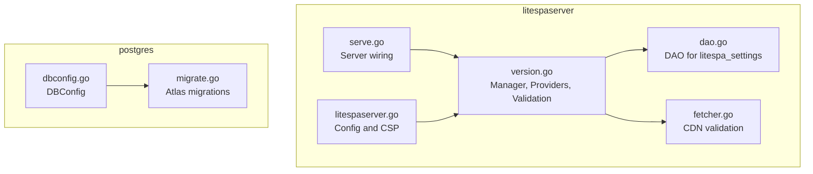
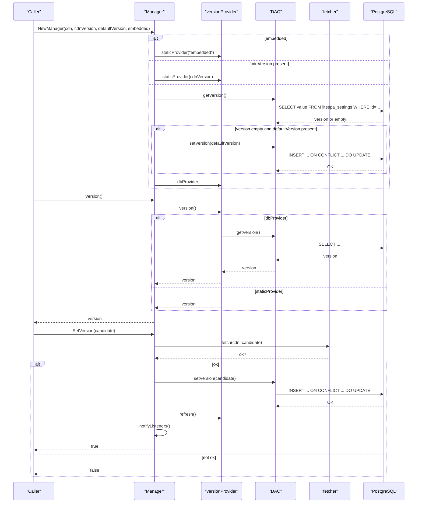
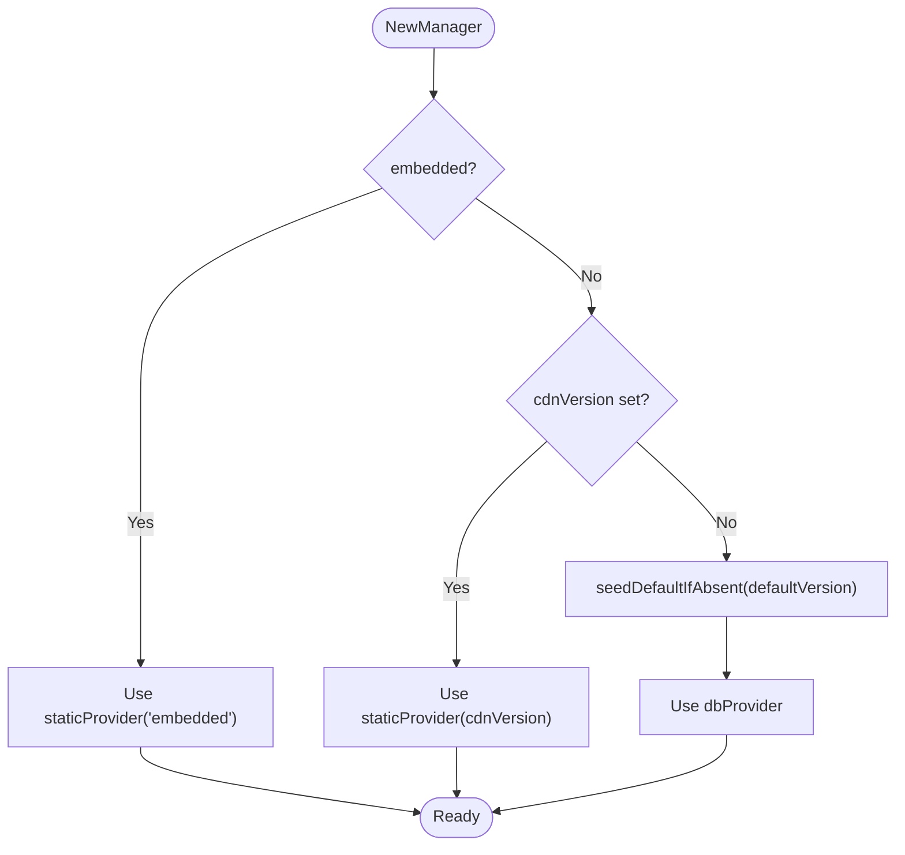
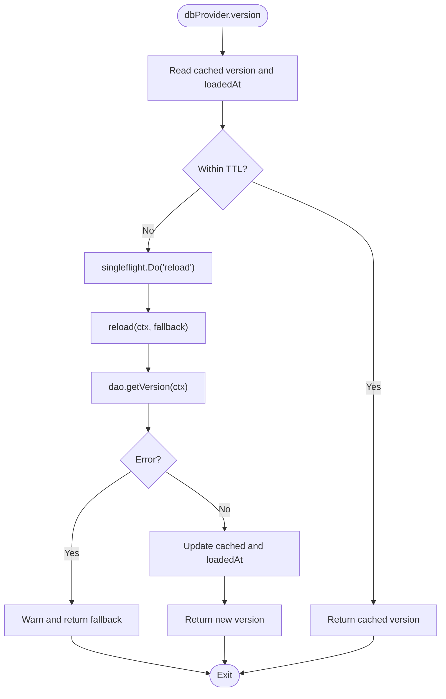
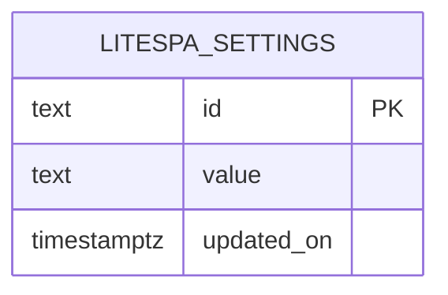
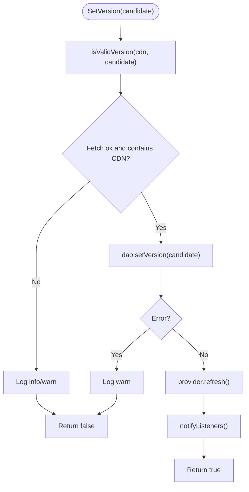
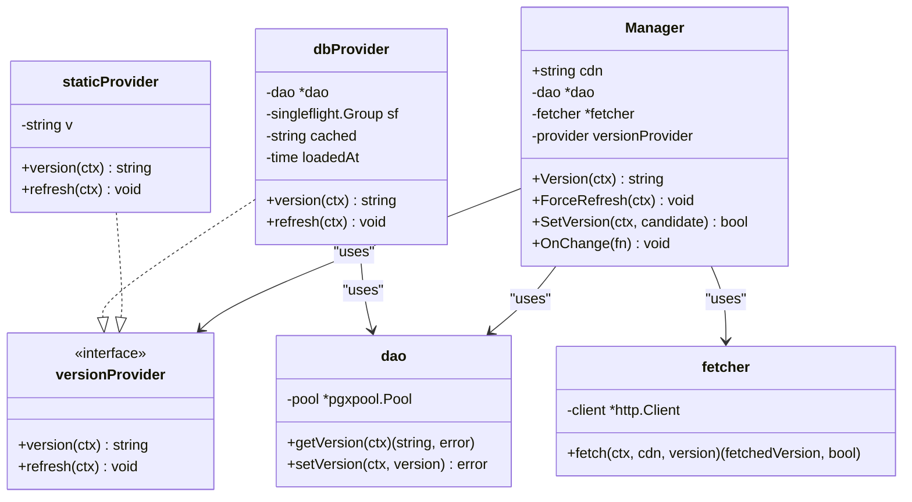

# Version Management

<cite>
**Referenced Files in This Document**
- [version.go](file://litespaserver/version.go)
- [dao.go](file://litespaserver/dao.go)
- [litespaserver.go](file://litespaserver/litespaserver.go)
- [serve.go](file://litespaserver/serve.go)
- [fetcher.go](file://litespaserver/fetcher.go)
- [dbconfig.go](file://postgres/dbconfig.go)
- [migrate.go](file://postgres/migrate.go)
</cite>

## Table of Contents
1. [Introduction](#introduction)
2. [Project Structure](#project-structure)
3. [Core Components](#core-components)
4. [Architecture Overview](#architecture-overview)
5. [Detailed Component Analysis](#detailed-component-analysis)
6. [Dependency Analysis](#dependency-analysis)
7. [Performance Considerations](#performance-considerations)
8. [Troubleshooting Guide](#troubleshooting-guide)
9. [Conclusion](#conclusion)
10. [Appendices](#appendices)

## Introduction
This document explains the version management system used to resolve and persist the live frontend version for a CDN-hosted single-page application. It covers:
- How DefaultVersion is seeded into the database
- Database-backed version storage in the litespa_settings table
- Version resolution logic and provider selection
- CDNVersion override behavior
- DAO layer implementation and database interaction patterns
- Error handling and fallback strategies
- Examples of configuration, database setup, and troubleshooting
- Role in deployment and rollback procedures

## Project Structure
The version management system spans two packages:
- litespaserver: version resolution, providers, DAO, and HTTP server integration
- postgres: database configuration and migration utilities

**Diagram sources**
- [version.go:1-199](file://litespaserver/version.go#L1-L199)
- [dao.go:1-56](file://litespaserver/dao.go#L1-L56)
- [litespaserver.go:1-57](file://litespaserver/litespaserver.go#L1-L57)
- [serve.go:1-120](file://litespaserver/serve.go#L1-L120)
- [fetcher.go:1-70](file://litespaserver/fetcher.go#L1-L70)
- [dbconfig.go:1-47](file://postgres/dbconfig.go#L1-L47)
- [migrate.go:1-321](file://postgres/migrate.go#L1-L321)

**Section sources**
- [version.go:1-199](file://litespaserver/version.go#L1-L199)
- [dao.go:1-56](file://litespaserver/dao.go#L1-L56)
- [litespaserver.go:1-57](file://litespaserver/litespaserver.go#L1-L57)
- [serve.go:1-120](file://litespaserver/serve.go#L1-L120)
- [fetcher.go:1-70](file://litespaserver/fetcher.go#L1-L70)
- [dbconfig.go:1-47](file://postgres/dbconfig.go#L1-L47)
- [migrate.go:1-321](file://postgres/migrate.go#L1-L321)

## Core Components
- Manager: Orchestrates version resolution, persistence, and change notifications. It selects a provider based on configuration and maintains listeners for change events.
- Providers:
  - staticProvider: Returns a fixed version from configuration.
  - dbProvider: Reads the version from the database with a TTL cache and singleflight de-duplication.
- DAO: Encapsulates database operations against the litespa_settings table.
- fetcher: Validates a candidate version by attempting to fetch index.html from the CDN and verifying its content.
- Config: Supplies CDN prefix, optional CDNVersion override, DefaultVersion, and EmbeddedContent mode.

**Section sources**
- [version.go:18-199](file://litespaserver/version.go#L18-L199)
- [dao.go:11-56](file://litespaserver/dao.go#L11-L56)
- [litespaserver.go:10-57](file://litespaserver/litespaserver.go#L10-L57)
- [fetcher.go:12-70](file://litespaserver/fetcher.go#L12-L70)

## Architecture Overview
The system resolves the live frontend version through a deterministic pipeline:
- Provider selection based on configuration
- Optional seeding of DefaultVersion into the database
- Validation against CDN before accepting a new version
- Persistence and cache refresh
- Listener notifications

**Diagram sources**
- [version.go:91-163](file://litespaserver/version.go#L91-L163)
- [dao.go:28-55](file://litespaserver/dao.go#L28-L55)
- [fetcher.go:32-69](file://litespaserver/fetcher.go#L32-L69)

## Detailed Component Analysis

### Manager and Provider Selection
- Embedded mode: Uses a static provider returning a fixed version, bypassing the database.
- CDNVersion override: Uses a static provider locked to the configured version, ignoring the database.
- Default seeding: When neither embedded nor CDNVersion is set, the Manager seeds DefaultVersion into the database if none exists, then uses a database-backed provider.

**Diagram sources**
- [version.go:91-120](file://litespaserver/version.go#L91-L120)
- [version.go:122-136](file://litespaserver/version.go#L122-L136)

**Section sources**
- [version.go:91-120](file://litespaserver/version.go#L91-L120)
- [version.go:122-136](file://litespaserver/version.go#L122-L136)

### Database-backed Provider (dbProvider)
- TTL caching: Serves cached version for a fixed duration before reload.
- Singleflight de-duplication: Ensures only one reload occurs during TTL expiry, collapsing concurrent requests.
- Fallback on reload failure: Continues serving the previous version if database access fails.

**Diagram sources**
- [version.go:40-78](file://litespaserver/version.go#L40-L78)
- [dao.go:28-43](file://litespaserver/dao.go#L28-L43)

**Section sources**
- [version.go:14-78](file://litespaserver/version.go#L14-L78)

### DAO Layer and Database Schema
- Table: litespa_settings with id, value, and updated_on.
- Operations:
  - getVersion: Selects the value for the frontend version key; returns empty when no row exists.
  - setVersion: Upserts the version, updating updated_on on conflict.

**Diagram sources**
- [dao.go:11-26](file://litespaserver/dao.go#L11-L26)

**Section sources**
- [dao.go:11-56](file://litespaserver/dao.go#L11-L56)

### Version Validation and CDN Override
- Candidate validation: The Manager checks that a candidate version is fetchable from the CDN and that the returned index.html contains the CDN prefix.
- CDNVersion override: When set, the Manager ignores the database and serves a static version.

**Diagram sources**
- [version.go:148-163](file://litespaserver/version.go#L148-L163)
- [version.go:188-198](file://litespaserver/version.go#L188-L198)
- [fetcher.go:32-69](file://litespaserver/fetcher.go#L32-L69)

**Section sources**
- [version.go:148-198](file://litespaserver/version.go#L148-L198)
- [fetcher.go:32-69](file://litespaserver/fetcher.go#L32-L69)

### Server Integration
- The server constructs a Manager with configuration and exposes it for external operations like SetVersion.
- On version change, the server flushes caches via the Manager’s listener notification.

**Section sources**
- [litespaserver.go:10-57](file://litespaserver/litespaserver.go#L10-L57)
- [serve.go:53](file://litespaserver/serve.go#L53)
- [serve.go:81-86](file://litespaserver/serve.go#L81-L86)
- [version.go:165-186](file://litespaserver/version.go#L165-L186)

## Dependency Analysis
- Manager depends on:
  - versionProvider (interface) implemented by staticProvider and dbProvider
  - DAO for database operations
  - fetcher for CDN validation
- DAO depends on a PostgreSQL connection pool
- Config defines runtime behavior and environment-specific values

**Diagram sources**
- [version.go:18-89](file://litespaserver/version.go#L18-L89)
- [dao.go:24-26](file://litespaserver/dao.go#L24-L26)
- [fetcher.go:12-24](file://litespaserver/fetcher.go#L12-L24)

**Section sources**
- [version.go:18-89](file://litespaserver/version.go#L18-L89)
- [dao.go:24-26](file://litespaserver/dao.go#L24-L26)
- [fetcher.go:12-24](file://litespaserver/fetcher.go#L12-L24)

## Performance Considerations
- TTL caching reduces database load by serving recent values for a fixed interval.
- Singleflight prevents thundering herd on reloads by collapsing concurrent requests into a single database query.
- CDN validation avoids persisting broken or unpublishing versions, reducing downstream failures.
- Upsert with conflict handling minimizes write contention.

[No sources needed since this section provides general guidance]

## Troubleshooting Guide
Common issues and resolutions:
- Version not found in database:
  - The Manager attempts to seed DefaultVersion when the table is empty. Verify DefaultVersion is set and the database is reachable.
- Database connectivity errors:
  - DAO returns errors on query failures; the dbProvider falls back to the cached version and logs a warning. Check connection parameters and pool health.
- Candidate version rejected:
  - The Manager validates the candidate by fetching index.html from the CDN and checking its content. Ensure the version is published and the CDN prefix matches.
- Change notifications not firing:
  - Ensure OnChange callbacks are registered and that SetVersion succeeds. Listeners are executed in a protected manner and panics are logged.

**Section sources**
- [version.go:122-136](file://litespaserver/version.go#L122-L136)
- [version.go:67-78](file://litespaserver/version.go#L67-L78)
- [version.go:148-163](file://litespaserver/version.go#L148-L163)
- [version.go:171-186](file://litespaserver/version.go#L171-L186)

## Conclusion
The version management system provides a robust, configurable mechanism to resolve and persist the live frontend version. It supports environment-specific defaults, CDN-driven validation, and safe fallbacks. The DAO layer cleanly abstracts database operations against a simple key-value table, while the Manager coordinates provider selection, caching, and change notifications.

[No sources needed since this section summarizes without analyzing specific files]

## Appendices

### Configuration Examples
- Basic configuration with DefaultVersion and CDN prefix:
  - Set CDNPrefix to the CDN base URL.
  - Set DefaultVersion to a stable tag or commit hash appropriate for the environment.
- Pinning a version:
  - Set CDNVersion to lock the served version and bypass the database.
- Embedded content mode:
  - Provide an fs.FS for EmbeddedContent to serve files locally without hitting the CDN or database.

**Section sources**
- [litespaserver.go:13-41](file://litespaserver/litespaserver.go#L13-L41)

### Database Setup
- Required table:
  - Create litespa_settings with id, value, and updated_on fields.
- Migration note:
  - The postgres package includes Atlas-based migrations; ensure the schema is initialized before using the DAO.

**Section sources**
- [dao.go:15-26](file://litespaserver/dao.go#L15-L26)
- [migrate.go:193-207](file://postgres/migrate.go#L193-L207)

### Deployment and Rollback Procedures
- Deployment:
  - Seed DefaultVersion during initial rollout; the Manager will persist it if the table is empty.
  - Use SetVersion to promote a new version after validating it via the CDN.
- Rollback:
  - Re-run SetVersion with the target version to roll back to a previously validated version.
  - If database access is unavailable, the dbProvider continues serving the last known good version until TTL expires.

**Section sources**
- [version.go:122-136](file://litespaserver/version.go#L122-L136)
- [version.go:148-163](file://litespaserver/version.go#L148-L163)
- [version.go:40-78](file://litespaserver/version.go#L40-L78)