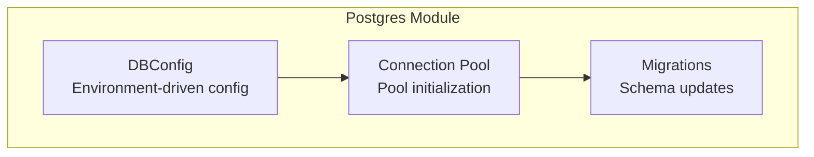
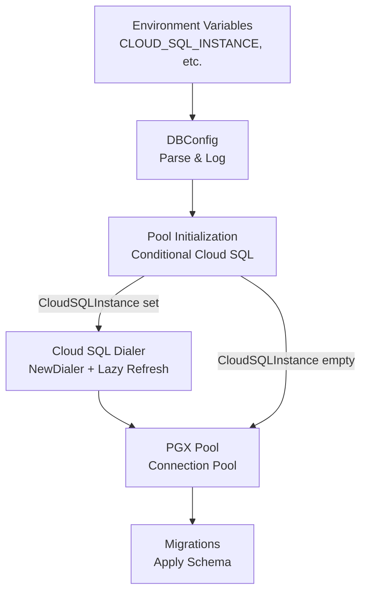
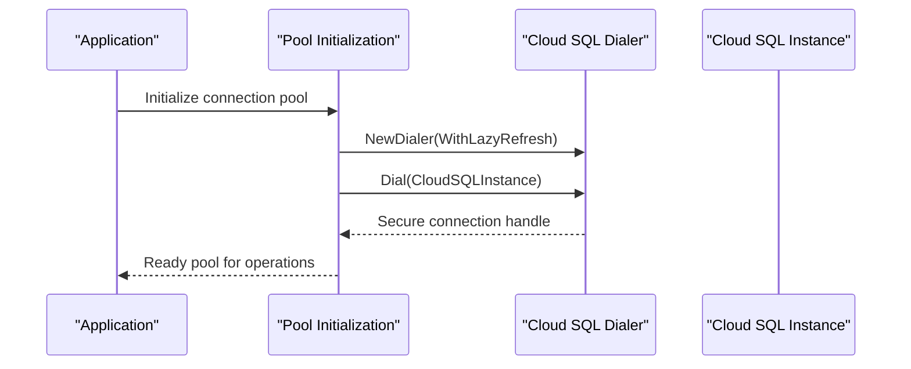
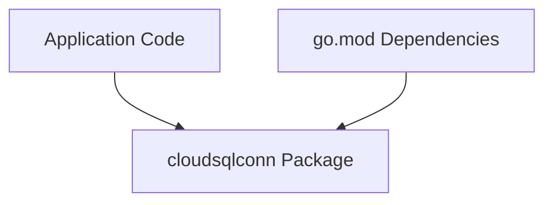

# Cloud SQL Support

<cite>
**Referenced Files in This Document**
- [go.mod](file://go.mod)
- [postgres/dbconfig.go](file://postgres/dbconfig.go)
- [postgres/pool.go](file://postgres/pool.go)
- [postgres/migrate.go](file://postgres/migrate.go)
</cite>

## Table of Contents
1. [Introduction](#introduction)
2. [Project Structure](#project-structure)
3. [Core Components](#core-components)
4. [Architecture Overview](#architecture-overview)
5. [Detailed Component Analysis](#detailed-component-analysis)
6. [Dependency Analysis](#dependency-analysis)
7. [Performance Considerations](#performance-considerations)
8. [Troubleshooting Guide](#troubleshooting-guide)
9. [Conclusion](#conclusion)

## Introduction
This document explains the Cloud SQL integration support implemented in the project. It focuses on the CloudSQLInstance configuration parameter, the integration with the cloudsqlconn package for secure database connections, authentication mechanisms, connection establishment, credential management, deployment considerations, IAM integration, security best practices, performance optimization, connection pooling, monitoring, and the relationship between local development and cloud deployment configurations.

## Project Structure
The Cloud SQL integration is primarily implemented in the postgres module:
- Configuration parsing and logging via environment variables
- Connection pooling with optional Cloud SQL dialer integration
- Migration utilities leveraging the same configuration

**Diagram sources**
- [postgres/dbconfig.go:1-80](file://postgres/dbconfig.go#L1-L80)
- [postgres/pool.go:1-120](file://postgres/pool.go#L1-L120)
- [postgres/migrate.go:1-120](file://postgres/migrate.go#L1-L120)

**Section sources**
- [postgres/dbconfig.go:1-80](file://postgres/dbconfig.go#L1-L80)
- [postgres/pool.go:1-120](file://postgres/pool.go#L1-L120)
- [postgres/migrate.go:1-120](file://postgres/migrate.go#L1-L120)

## Core Components
- CloudSQLInstance configuration parameter: A string field parsed from the CLOUD_SQL_INSTANCE environment variable and logged for observability.
- Connection pool initialization: Conditional logic to initialize a Cloud SQL dialer when CloudSQLInstance is set, otherwise falls back to standard PostgreSQL connections.
- Cloud SQL dialer integration: Uses cloudsqlconn.NewDialer with lazy refresh to obtain a Dial function for secure connections.
- Migration utilities: Leverage the same DBConfig to apply schema migrations against the configured target.

Key implementation references:
- Environment-driven configuration and logging: [postgres/dbconfig.go:1-80](file://postgres/dbconfig.go#L1-L80)
- Conditional Cloud SQL pool creation and dialer usage: [postgres/pool.go:1-120](file://postgres/pool.go#L1-L120)
- Migration integration with DBConfig: [postgres/migrate.go:1-120](file://postgres/migrate.go#L1-L120)

**Section sources**
- [postgres/dbconfig.go:1-80](file://postgres/dbconfig.go#L1-L80)
- [postgres/pool.go:1-120](file://postgres/pool.go#L1-L120)
- [postgres/migrate.go:1-120](file://postgres/migrate.go#L1-L120)

## Architecture Overview
The Cloud SQL integration follows a layered approach:
- Configuration layer: Reads environment variables and constructs a DBConfig object.
- Connection layer: Initializes a connection pool, optionally wrapping it with a Cloud SQL dialer when CloudSQLInstance is present.
- Operations layer: Executes migrations and other database operations using the configured pool.

**Diagram sources**
- [postgres/dbconfig.go:1-80](file://postgres/dbconfig.go#L1-L80)
- [postgres/pool.go:1-120](file://postgres/pool.go#L1-L120)
- [postgres/migrate.go:1-120](file://postgres/migrate.go#L1-L120)

## Detailed Component Analysis

### CloudSQLInstance Configuration Parameter
- Purpose: Identifies the target Cloud SQL instance for secure connections.
- Source: Parsed from the CLOUD_SQL_INSTANCE environment variable.
- Logging: Emits the Cloud SQL instance identifier during configuration logging for observability.
- Usage: Triggers Cloud SQL-specific connection logic when non-empty.

Implementation references:
- Configuration field and environment binding: [postgres/dbconfig.go:1-80](file://postgres/dbconfig.go#L1-L80)
- Logging of CloudSQLInstance value: [postgres/dbconfig.go:40-60](file://postgres/dbconfig.go#L40-L60)

**Section sources**
- [postgres/dbconfig.go:1-80](file://postgres/dbconfig.go#L1-L80)

### Cloud SQL Dialer Integration
- Dialer creation: Uses cloudsqlconn.NewDialer with lazy refresh to minimize overhead.
- Conditional activation: Only initialized when CloudSQLInstance is set.
- Dial function: Provides secure connections to the Cloud SQL instance using the configured instance identifier.

Implementation references:
- Import and dialer creation: [postgres/pool.go:1-80](file://postgres/pool.go#L1-L80)
- Conditional pool creation and dialer usage: [postgres/pool.go:25-80](file://postgres/pool.go#L25-L80)

**Diagram sources**
- [postgres/pool.go:1-80](file://postgres/pool.go#L1-L80)

**Section sources**
- [postgres/pool.go:1-80](file://postgres/pool.go#L1-L80)

### Authentication Mechanisms and Credential Management
- Authentication model: The integration leverages the cloudsqlconn package’s built-in authentication and credential resolution. This typically aligns with Google Cloud’s default credentials and IAM service account bindings.
- Credential lifecycle: The dialer supports lazy refresh, reducing repeated credential acquisition overhead.
- IAM integration: Access to the Cloud SQL instance is governed by IAM permissions associated with the runtime identity (service account or workload identity).

Implementation references:
- Dialer creation and lazy refresh: [postgres/pool.go:1-80](file://postgres/pool.go#L1-L80)

**Section sources**
- [postgres/pool.go:1-80](file://postgres/pool.go#L1-L80)

### Connection Establishment and Pooling
- Conditional logic: When CloudSQLInstance is set, a Cloud SQL dialer is created and used to establish connections; otherwise, standard PostgreSQL connections are used.
- Pool configuration: The pool is constructed using the resolved connection configuration and the dialer when applicable.
- Migration compatibility: Migrations operate over the same pool, ensuring consistent behavior across environments.

Implementation references:
- Conditional pool creation and dialer usage: [postgres/pool.go:25-80](file://postgres/pool.go#L25-L80)
- Migration integration: [postgres/migrate.go:1-120](file://postgres/migrate.go#L1-L120)

**Section sources**
- [postgres/pool.go:25-80](file://postgres/pool.go#L25-L80)
- [postgres/migrate.go:1-120](file://postgres/migrate.go#L1-L120)

### Deployment Considerations
- Local vs. cloud parity: The same configuration and pool initialization logic applies in both environments. Local development can use standard PostgreSQL connections, while cloud deployments can enable Cloud SQL by setting CloudSQLInstance.
- Environment configuration: Ensure CLOUD_SQL_INSTANCE is set appropriately for cloud environments and omitted or set to a local Postgres endpoint for local development.
- IAM permissions: Verify that the runtime identity has appropriate IAM bindings to connect to the Cloud SQL instance.

Implementation references:
- Environment-driven configuration: [postgres/dbconfig.go:1-80](file://postgres/dbconfig.go#L1-L80)
- Conditional pool behavior: [postgres/pool.go:25-80](file://postgres/pool.go#L25-L80)

**Section sources**
- [postgres/dbconfig.go:1-80](file://postgres/dbconfig.go#L1-L80)
- [postgres/pool.go:25-80](file://postgres/pool.go#L25-L80)

### Security Best Practices
- Principle of least privilege: Restrict IAM permissions to only what is necessary for database access.
- Credential rotation: Rely on the dialer’s lazy refresh to pick up rotated credentials automatically.
- Network isolation: Prefer private IP or authorized networks for Cloud SQL instances when feasible.
- Observability: Log CloudSQLInstance to aid in incident investigations and audit trails.

Implementation references:
- Logging of CloudSQLInstance: [postgres/dbconfig.go:40-60](file://postgres/dbconfig.go#L40-L60)
- Dialer lazy refresh: [postgres/pool.go:1-80](file://postgres/pool.go#L1-L80)

**Section sources**
- [postgres/dbconfig.go:40-60](file://postgres/dbconfig.go#L40-L60)
- [postgres/pool.go:1-80](file://postgres/pool.go#L1-L80)

### Practical Examples
- Enable Cloud SQL in cloud deployments:
  - Set CLOUD_SQL_INSTANCE to the target instance identifier.
  - Ensure the runtime identity has IAM access to the instance.
  - Initialize the pool; the dialer will be created automatically when CloudSQLInstance is set.
  - Apply migrations using the same configuration.
- Local development:
  - Omit or leave CLOUD_SQL_INSTANCE unset to use standard PostgreSQL connections.
  - Configure local Postgres credentials via standard environment variables.
- Troubleshooting:
  - Verify CloudSQLInstance value is logged during configuration.
  - Confirm dialer initialization occurs when CloudSQLInstance is set.
  - Check IAM permissions and network connectivity to the Cloud SQL instance.

Implementation references:
- Environment-driven configuration and logging: [postgres/dbconfig.go:1-80](file://postgres/dbconfig.go#L1-L80)
- Conditional pool and dialer usage: [postgres/pool.go:25-80](file://postgres/pool.go#L25-L80)
- Migration integration: [postgres/migrate.go:1-120](file://postgres/migrate.go#L1-L120)

**Section sources**
- [postgres/dbconfig.go:1-80](file://postgres/dbconfig.go#L1-L80)
- [postgres/pool.go:25-80](file://postgres/pool.go#L25-L80)
- [postgres/migrate.go:1-120](file://postgres/migrate.go#L1-L120)

## Dependency Analysis
The Cloud SQL integration depends on the cloudsqlconn package for secure connections. The project declares this dependency in go.mod.

**Diagram sources**
- [go.mod:1-20](file://go.mod#L1-L20)
- [postgres/pool.go:1-40](file://postgres/pool.go#L1-L40)

**Section sources**
- [go.mod:1-20](file://go.mod#L1-L20)
- [postgres/pool.go:1-40](file://postgres/pool.go#L1-L40)

## Performance Considerations
- Lazy refresh: Using WithLazyRefresh reduces unnecessary credential refreshes and improves connection performance under steady load.
- Connection reuse: The PGX pool manages connection lifecycle efficiently; ensure pool sizing aligns with workload characteristics.
- Monitoring: Track pool utilization, connection failures, and dialer refresh events to identify bottlenecks or misconfigurations.

Implementation references:
- Dialer creation with lazy refresh: [postgres/pool.go:1-80](file://postgres/pool.go#L1-L80)

**Section sources**
- [postgres/pool.go:1-80](file://postgres/pool.go#L1-L80)

## Troubleshooting Guide
Common issues and resolutions:
- CloudSQLInstance not set:
  - Behavior: Standard PostgreSQL connections are used.
  - Action: Ensure CLOUD_SQL_INSTANCE is set for Cloud SQL environments.
- Dialer initialization errors:
  - Behavior: Failure to create the Cloud SQL dialer or connect to the instance.
  - Action: Verify IAM permissions, instance identifier, and network access.
- Connection failures:
  - Behavior: Pool cannot establish connections.
  - Action: Check environment variables, IAM bindings, and firewall rules for the Cloud SQL instance.
- Logging verification:
  - Behavior: CloudSQLInstance value is logged during configuration.
  - Action: Confirm the logged value matches the intended instance identifier.

Implementation references:
- Environment-driven configuration and logging: [postgres/dbconfig.go:1-80](file://postgres/dbconfig.go#L1-L80)
- Conditional pool and dialer usage: [postgres/pool.go:25-80](file://postgres/pool.go#L25-L80)

**Section sources**
- [postgres/dbconfig.go:1-80](file://postgres/dbconfig.go#L1-L80)
- [postgres/pool.go:25-80](file://postgres/pool.go#L25-L80)

## Conclusion
The Cloud SQL integration provides a clean, environment-driven mechanism to connect securely to Google Cloud SQL instances. By setting CloudSQLInstance, the system automatically initializes a Cloud SQL dialer with lazy refresh, enabling secure connections managed by the cloudsqlconn package. The same configuration and pool initialization logic supports both local development and cloud deployments, with IAM permissions governing access. Following the outlined best practices and troubleshooting steps ensures reliable, secure, and performant database connectivity.