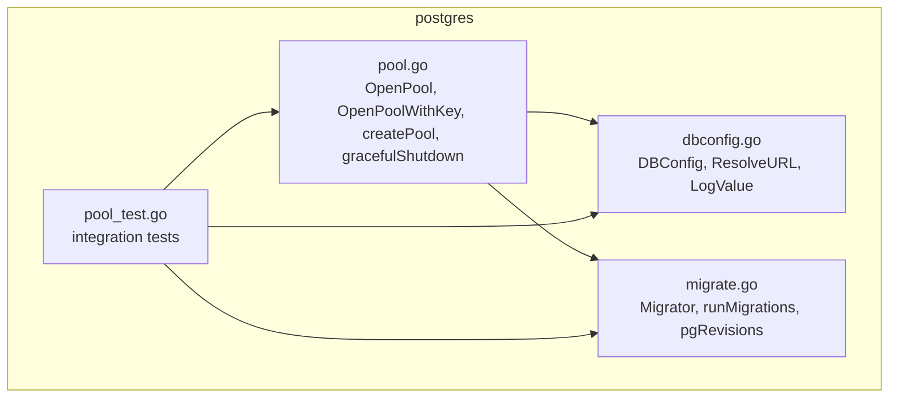
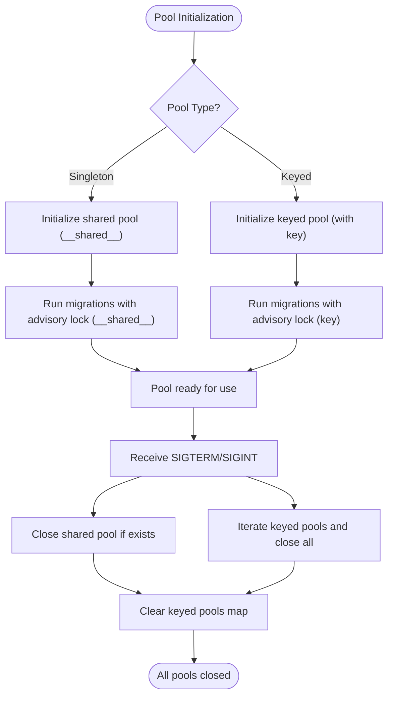
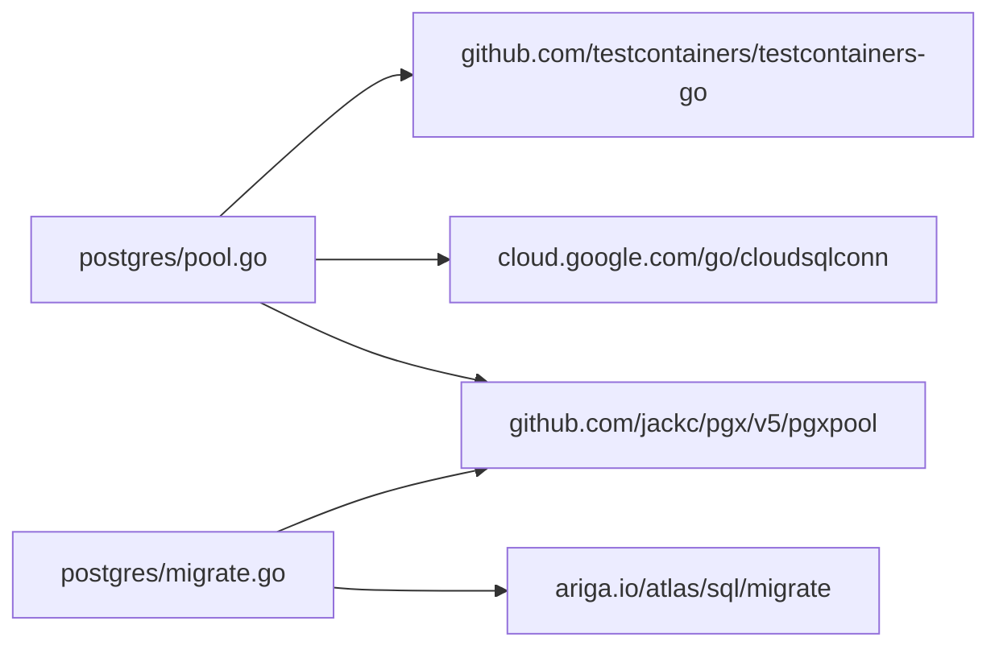

# Connection Pooling

<cite>
**Referenced Files in This Document**
- [pool.go](file://postgres/pool.go)
- [pool_test.go](file://postgres/pool_test.go)
- [dbconfig.go](file://postgres/dbconfig.go)
- [migrate.go](file://postgres/migrate.go)
- [go.mod](file://go.mod)
</cite>

## Update Summary
**Changes Made**
- Added documentation for the new OpenPoolWithKey function and keyed connection pooling support
- Updated core components section to include keyed pool management
- Enhanced architecture overview to show both singleton and keyed pool patterns
- Added new section covering keyed instance connection management
- Updated graceful shutdown section to handle both shared and keyed pools
- Added practical examples for keyed pool usage patterns

## Table of Contents
1. [Introduction](#introduction)
2. [Project Structure](#project-structure)
3. [Core Components](#core-components)
4. [Architecture Overview](#architecture-overview)
5. [Detailed Component Analysis](#detailed-component-analysis)
6. [Keyed Instance Connection Management](#keyed-instance-connection-management)
7. [Dependency Analysis](#dependency-analysis)
8. [Performance Considerations](#performance-considerations)
9. [Troubleshooting Guide](#troubleshooting-guide)
10. [Conclusion](#conclusion)
11. [Appendices](#appendices)

## Introduction
This document explains the Connection Pooling component used to manage PostgreSQL connections in the project. It focuses on the OpenPool function for singleton pools, the new OpenPoolWithKey function for keyed instance management, pool initialization, connection configuration, migration integration, graceful shutdown, and operational best practices. It also covers connection lifecycle, health checks, error handling, and guidance for performance tuning and monitoring.

## Project Structure
The connection pooling logic resides under the postgres package and integrates with a migration subsystem and configuration utilities. The system now supports both singleton and keyed connection pooling patterns.



**Diagram sources**
- [pool.go:20-42](file://postgres/pool.go#L20-L42)
- [dbconfig.go:10-33](file://postgres/dbconfig.go#L10-L33)
- [migrate.go:23-43](file://postgres/migrate.go#L23-L43)
- [pool_test.go:148-189](file://postgres/pool_test.go#L148-L189)

**Section sources**
- [pool.go:1-193](file://postgres/pool.go#L1-L193)
- [dbconfig.go:1-47](file://postgres/dbconfig.go#L1-L47)
- [migrate.go:1-321](file://postgres/migrate.go#L1-L321)
- [pool_test.go:1-193](file://postgres/pool_test.go#L1-L193)

## Core Components
- OpenPool: Creates a process-wide singleton connection pool, runs migrations, and registers a graceful shutdown handler.
- OpenPoolWithKey: Creates or retrieves keyed connection pools for isolated database connections, maintaining backward compatibility.
- Connect: Establishes a pool from a URL, optionally spinning up a test container for local development.
- DBConfig: Holds connection parameters and resolves a database URL template.
- Migrator/runMigrations: Applies schema migrations against the pool with advisory locking and revision tracking.
- pgRevisions: Persists migration state to a dedicated table.

Key behaviors:
- Singleton pattern via a once-only initializer ensures a single shared pool per process.
- Keyed pool pattern uses thread-safe map with RWMutex for concurrent access to multiple isolated pools.
- Optional Cloud SQL connectivity via a dialer.
- Migration execution during pool creation with advisory locks to prevent concurrent replicas from racing.
- Graceful shutdown on SIGTERM/SIGINT for both shared and keyed pools.

**Updated** Added OpenPoolWithKey function for multi-instance connection management with unique keys

**Section sources**
- [pool.go:33-42](file://postgres/pool.go#L33-L42)
- [pool.go:44-67](file://postgres/pool.go#L44-L67)
- [pool.go:20-27](file://postgres/pool.go#L20-L27)
- [pool.go:86-105](file://postgres/pool.go#L86-L105)
- [dbconfig.go:10-33](file://postgres/dbconfig.go#L10-L33)
- [migrate.go:23-131](file://postgres/migrate.go#L23-L131)
- [migrate.go:181-314](file://postgres/migrate.go#L181-L314)

## Architecture Overview
The connection pool system now supports both singleton and keyed connection patterns. The singleton pool serves traditional applications, while keyed pools enable isolated connections for multi-tenant scenarios, separate environments, or different database contexts.

```mermaid
sequenceDiagram
participant App as "Application"
participant Shared as "OpenPool"
participant Keyed as "OpenPoolWithKey"
participant Create as "createPool"
participant Conn as "Connect/openCloudSQL"
participant Mig as "runMigrations"
participant Sig as "gracefulShutdown"
App->>Shared : "OpenPool(ctx, DBConfig, Migrator)"
Shared->>Shared : "poolOnce.Do(...)"
Shared->>Create : "createPool(ctx, dbcfg, migrator, __shared__)"
Create->>Conn : "Connect or openCloudSQL"
Conn-->>Create : "*pgxpool.Pool"
Create->>Mig : "runMigrations(ctx, pool, migrator, key)"
Mig-->>Create : "ok or error"
Create-->>Shared : "*pgxpool.Pool"
Shared-->>App : "*pgxpool.Pool"
App->>Keyed : "OpenPoolWithKey(ctx, DBConfig, Migrator, key)"
Keyed->>Keyed : "Check keyedPools[key]"
alt "Pool exists"
Keyed-->>App : "Return existing pool"
else "Pool not found"
Keyed->>Create : "createPool(ctx, dbcfg, migrator, key)"
Create->>Mig : "runMigrations(ctx, pool, migrator, key)"
Mig-->>Create : "ok or error"
Create-->>Keyed : "*pgxpool.Pool"
Keyed->>Keyed : "Store in keyedPools map"
Keyed-->>App : "*pgxpool.Pool"
end
Sig->>Sig : "goroutine handles SIGTERM/SIGINT"
Sig->>Sig : "Close sharedPool if exists"
Sig->>Sig : "Iterate keyedPools and close all"
```

**Diagram sources**
- [pool.go:37-41](file://postgres/pool.go#L37-L41)
- [pool.go:46-67](file://postgres/pool.go#L46-L67)
- [pool.go:69-84](file://postgres/pool.go#L69-L84)
- [pool.go:89-105](file://postgres/pool.go#L89-L105)

## Detailed Component Analysis

### OpenPool Function
Purpose:
- Ensures a single shared pool per process.
- Chooses Cloud SQL or direct connection based on configuration.
- Runs migrations and registers graceful shutdown.

Behavior highlights:
- Uses a once-only initializer to avoid reinitialization.
- Supports Cloud SQL via a dialer and direct Postgres URL.
- Executes migrations against the pool before returning it.
- Starts a goroutine to listen for SIGTERM/SIGINT and close the pool.

Operational notes:
- The returned pool must be closed by the application at shutdown.
- Migration failure prevents pool return.

**Section sources**
- [pool.go:33-42](file://postgres/pool.go#L33-L42)
- [pool.go:37-41](file://postgres/pool.go#L37-L41)

### OpenPoolWithKey Function
Purpose:
- Manages multiple isolated connection pools using unique keys.
- Maintains backward compatibility with OpenPool.
- Provides thread-safe access to keyed pools.

Behavior highlights:
- Returns shared pool when key is empty (backward compatibility).
- Uses read-lock first for fast path lookup.
- Implements double-checked locking pattern for thread safety.
- Creates new pools on demand and caches them for reuse.
- Each keyed pool maintains its own migration state.

Keyed pool management:
- Thread-safe map with RWMutex for concurrent access.
- Double-checked locking prevents race conditions.
- Pools are stored with their unique keys as identifiers.
- Memory management ensures proper cleanup during shutdown.

**New** Added comprehensive keyed instance connection management support

**Section sources**
- [pool.go:44-67](file://postgres/pool.go#L44-L67)
- [pool.go:20-27](file://postgres/pool.go#L20-L27)

### createPool Function
Purpose:
- Internal helper that creates pools for both singleton and keyed instances.
- Handles Cloud SQL and direct connection paths.
- Executes migrations with key-aware advisory locking.

Behavior highlights:
- Orchestrates the complete pool creation process.
- Supports both Cloud SQL dialer and direct Postgres URLs.
- Runs migrations with proper error handling.
- Returns fully initialized pools ready for use.

**Section sources**
- [pool.go:69-84](file://postgres/pool.go#L69-L84)

### Connect Function
Purpose:
- Creates a pool from a database URL.
- Supports a special URL prefix to spin up a test container locally.

Behavior highlights:
- Detects a test-container URL prefix and provisions a Postgres container with defaults.
- Resolves mapped host/port to build a connection URL.
- Returns a pool suitable for direct use; caller must close it.

Health checks:
- Tests show Ping succeeds after successful Connect.
- After Close, Ping fails as expected.

**Section sources**
- [pool.go:130-192](file://postgres/pool.go#L130-L192)
- [pool_test.go:74-88](file://postgres/pool_test.go#L74-L88)
- [pool_test.go:90-116](file://postgres/pool_test.go#L90-L116)
- [pool_test.go:118-136](file://postgres/pool_test.go#L118-L136)

### DBConfig and URL Resolution
Purpose:
- Encapsulates connection parameters and resolves a URL template.
- Provides a safe log value that redacts passwords.

Behavior highlights:
- Environment-driven fields with defaults.
- URL template substitution supports placeholders for credentials and database name.
- Logging redacts sensitive fields.

**Section sources**
- [dbconfig.go:10-33](file://postgres/dbconfig.go#L10-L33)
- [dbconfig.go:35-46](file://postgres/dbconfig.go#L35-L46)

### Migrator and runMigrations
Purpose:
- Applies pending migrations using Atlas.
- Serializes migrations across replicas using an advisory lock.
- Tracks migration state in a dedicated table.

Behavior highlights:
- Converts the pool to a sql.DB for Atlas.
- Acquires an advisory lock with a bounded wait.
- Initializes a revisions table if missing.
- Supports baseline mode via a caller-supplied predicate.
- Logs migration outcomes and durations.

**Section sources**
- [migrate.go:23-43](file://postgres/migrate.go#L23-L43)
- [migrate.go:45-131](file://postgres/migrate.go#L45-L131)
- [migrate.go:155-179](file://postgres/migrate.go#L155-L179)
- [migrate.go:181-314](file://postgres/migrate.go#L181-L314)

### Graceful Shutdown
Purpose:
- Listens for SIGTERM/SIGINT and closes both shared and keyed pools.

Behavior highlights:
- Starts as a goroutine from OpenPool.
- Closes the shared singleton pool if it exists.
- Iterates through all keyed pools and closes them.
- Clears the keyed pools map to prevent memory leaks.
- Logs receipt of the signal and closure actions.

**Updated** Enhanced to handle both shared and keyed pool cleanup

**Section sources**
- [pool.go:86-105](file://postgres/pool.go#L86-L105)

### Cloud SQL Connection Path
Purpose:
- Establishes a pool via a Cloud SQL dialer when configured.

Behavior highlights:
- Creates a dialer with lazy refresh.
- Parses a minimal DSN and sets a custom DialFunc to use the Cloud SQL instance.
- Builds a pool with the configured dialer.

**Section sources**
- [pool.go:107-128](file://postgres/pool.go#L107-L128)

### Connection Lifecycle Management
Lifecycle stages:
- Creation: OpenPool initializes the singleton pool and OpenPoolWithKey manages keyed pools.
- Usage: Application retrieves pools (singleton or keyed) and executes queries.
- Health: Ping is used in tests to validate liveness.
- Shutdown: SIGTERM/SIGINT triggers gracefulClose for both pool types; application should also call Close when appropriate.



**Diagram sources**
- [pool.go:37-41](file://postgres/pool.go#L37-L41)
- [pool.go:46-67](file://postgres/pool.go#L46-L67)
- [pool.go:89-105](file://postgres/pool.go#L89-L105)

## Keyed Instance Connection Management

### Overview
The keyed connection pooling feature enables multiple isolated database connections within the same process, each identified by a unique key. This pattern is useful for multi-tenant applications, separate environments (development/staging/production), or different database contexts.

### Implementation Details
- Thread-safe pool storage using `map[string]*pgxpool.Pool` with `sync.RWMutex`
- Double-checked locking pattern for efficient concurrent access
- Automatic pool creation and caching for new keys
- Individual migration state management per keyed pool
- Backward compatibility with empty key values

### Usage Patterns
- **Multi-tenant isolation**: Use tenant ID as key for completely isolated connections
- **Environment separation**: Use environment names as keys for dev/stage/prod isolation
- **Database context switching**: Use logical context names as keys for different database schemas
- **Testing scenarios**: Use test names or IDs as keys for isolated test databases

### Thread Safety
The keyed pool system implements robust thread safety:
- Read locks for fast path lookups
- Write locks only when creating new pools
- Double-checked locking prevents race conditions
- Proper synchronization around pool creation and storage

**New** Comprehensive documentation for the new keyed instance connection management feature

**Section sources**
- [pool.go:20-27](file://postgres/pool.go#L20-L27)
- [pool.go:44-67](file://postgres/pool.go#L44-L67)
- [pool.go:89-105](file://postgres/pool.go#L89-L105)

## Dependency Analysis
External libraries used:
- pgx/v5 for Postgres connectivity and pooling.
- cloud.google.com/go/cloudsqlconn for Cloud SQL dialing.
- testcontainers-go for local testing.
- ariga.io/atlas for schema migrations.



**Diagram sources**
- [pool.go:3-18](file://postgres/pool.go#L3-L18)
- [migrate.go:3-18](file://postgres/migrate.go#L3-L18)
- [go.mod:5-12](file://go.mod#L5-L12)

**Section sources**
- [go.mod:5-12](file://go.mod#L5-L12)
- [pool.go:3-18](file://postgres/pool.go#L3-L18)
- [migrate.go:3-18](file://postgres/migrate.go#L3-L18)

## Performance Considerations
- Pool sizing: The implementation delegates pool configuration to pgxpool. Tune pool parameters (e.g., max idle and max open connections, lifetime, and idle timeouts) by adjusting the underlying pool configuration. Since the code constructs the pool directly, consider passing a pre-configured pool configuration to align with workload characteristics.
- Connection reuse: Reuse the singleton pool across the application to minimize overhead.
- Keyed pool optimization: For keyed pools, consider pool size limits per key based on expected concurrency patterns.
- Thread safety overhead: The keyed pool system adds minimal overhead through RWMutex operations.
- Memory management: Monitor keyed pool growth and implement cleanup strategies for dynamic key generation scenarios.
- Health checks: Use Ping to verify liveness before heavy operations.
- Monitoring: Expose pool stats via pgxpool's built-in metrics and integrate with your metrics stack.
- Concurrency: Ensure application-level concurrency respects pool limits to avoid saturation.
- Network: For Cloud SQL, ensure the dialer is configured appropriately and consider latency and retry policies.

**Updated** Added considerations for keyed pool performance and memory management

## Troubleshooting Guide
Common issues and strategies:
- Migration failures: Failures during runMigrations will prevent pool return. Review migration logs and fix issues before restarting.
- Advisory lock contention: If migrations stall, check for long-held locks or conflicting replicas.
- Test container connectivity: When using the test container URL prefix, ensure Docker is available and the container is reachable.
- Graceful shutdown: Verify that SIGTERM/SIGINT is received and that both shared and keyed pools are closed. Confirm logs indicate the shutdown signal was processed.
- Health checks: Use Ping to detect connection problems early.
- Keyed pool issues: Monitor keyed pools map for memory leaks and ensure proper cleanup when keys are no longer needed.
- Thread safety concerns: Verify that concurrent access patterns don't cause race conditions with the keyed pool system.
- Key selection strategy: Choose meaningful keys that won't cause pool explosion in dynamic environments.

**Updated** Added troubleshooting guidance for keyed pool scenarios

**Section sources**
- [migrate.go:49-131](file://postgres/migrate.go#L49-L131)
- [migrate.go:155-179](file://postgres/migrate.go#L155-L179)
- [pool_test.go:74-88](file://postgres/pool_test.go#L74-L88)
- [pool_test.go:118-136](file://postgres/pool_test.go#L118-L136)
- [pool.go:86-105](file://postgres/pool.go#L86-L105)

## Conclusion
The connection pooling component provides a robust, flexible system with both singleton and keyed connection pooling patterns. The enhanced implementation supports multi-instance connection management while maintaining backward compatibility, offering integrated migrations and graceful shutdown for both shared and isolated pools. It supports both direct Postgres and Cloud SQL connections, offers test-friendly container provisioning, and ensures safe lifecycle management across different deployment scenarios. Adopt the recommended practices for sizing, reuse, and monitoring to achieve reliable and efficient database connectivity in various architectural patterns.

**Updated** Enhanced conclusion to reflect the new keyed instance capabilities

## Appendices

### Practical Examples

- Pool configuration and usage
  - Construct DBConfig from environment variables and resolve the URL.
  - Call OpenPool to initialize the singleton pool and run migrations.
  - Use OpenPoolWithKey for keyed pools when isolation is required.
  - Use the returned pool for all database operations.
  - Close the pool on application shutdown or when done with tests.

- Connection usage patterns
  - Retrieve the singleton pool once and reuse it across components.
  - For multi-tenant scenarios, use unique keys per tenant with OpenPoolWithKey.
  - Perform health checks using Ping before critical operations.
  - Ensure Close is called to release resources.

- Integration with application lifecycle
  - Initialize the pool at application startup.
  - Register graceful shutdown to close the pool on SIGTERM/SIGINT.
  - For tests, use the test container URL prefix and close the pool afterward.
  - Implement proper keyed pool cleanup when keys are no longer needed.

- Keyed pool usage examples
  - Multi-tenant applications: `OpenPoolWithKey(ctx, dbcfg, migrator, tenantID)`
  - Environment separation: `OpenPoolWithKey(ctx, dbcfg, migrator, envName)`
  - Database context switching: `OpenPoolWithKey(ctx, dbcfg, migrator, contextName)`

**Updated** Added practical examples for keyed pool usage patterns

**Section sources**
- [dbconfig.go:10-33](file://postgres/dbconfig.go#L10-L33)
- [pool.go:33-42](file://postgres/pool.go#L33-L42)
- [pool.go:44-67](file://postgres/pool.go#L44-L67)
- [pool_test.go:74-88](file://postgres/pool_test.go#L74-L88)
- [pool_test.go:118-136](file://postgres/pool_test.go#L118-L136)

### Best Practices
- Pool sizing: Align pool limits with expected concurrency and database capacity.
- Connection reuse: Prefer the singleton pool to reduce connection churn.
- Keyed pool management: Implement proper key naming strategies to avoid pool explosion.
- Failure handling: Wrap operations with retries and circuit-breaking where appropriate.
- Monitoring: Track pool utilization, wait times, and migration execution metrics.
- Security: Avoid logging sensitive configuration; DBConfig redacts passwords in logs.
- Memory management: Monitor keyed pool growth and implement cleanup strategies.
- Thread safety: Leverage the built-in thread safety of the keyed pool system.
- Graceful shutdown: Ensure proper cleanup of both shared and keyed pools during shutdown.

**Updated** Added best practices for keyed pool management and thread safety