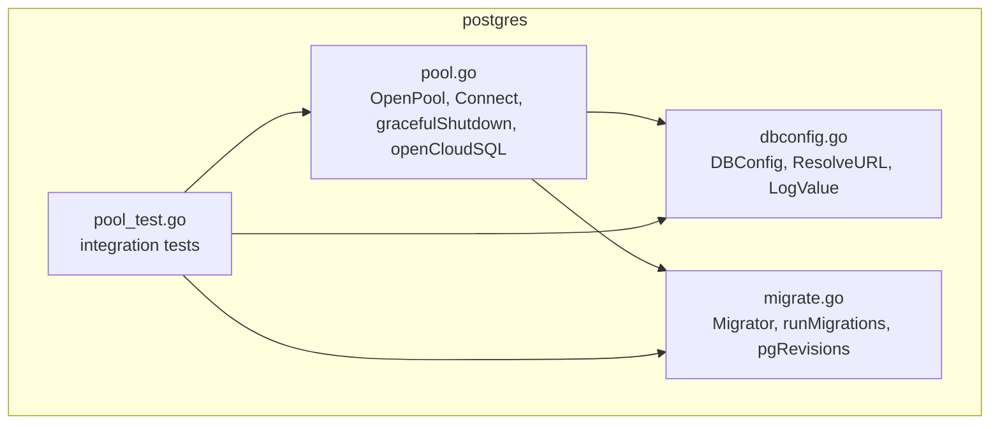
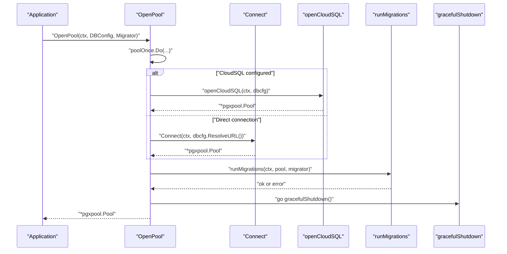
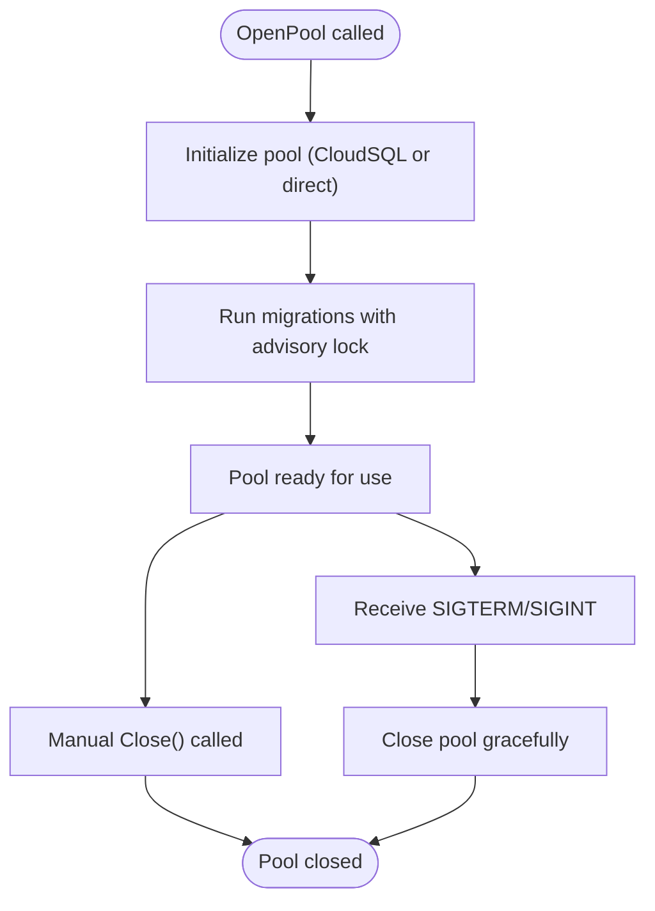
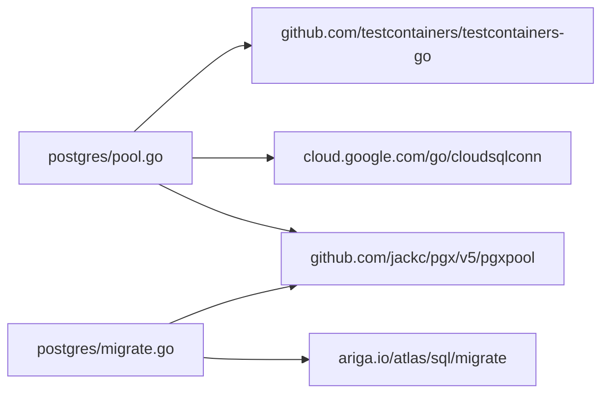

# Connection Pooling

<cite>
**Referenced Files in This Document**
- [pool.go](file://postgres/pool.go)
- [pool_test.go](file://postgres/pool_test.go)
- [dbconfig.go](file://postgres/dbconfig.go)
- [migrate.go](file://postgres/migrate.go)
- [go.mod](file://go.mod)
</cite>

## Table of Contents
1. [Introduction](#introduction)
2. [Project Structure](#project-structure)
3. [Core Components](#core-components)
4. [Architecture Overview](#architecture-overview)
5. [Detailed Component Analysis](#detailed-component-analysis)
6. [Dependency Analysis](#dependency-analysis)
7. [Performance Considerations](#performance-considerations)
8. [Troubleshooting Guide](#troubleshooting-guide)
9. [Conclusion](#conclusion)
10. [Appendices](#appendices)

## Introduction
This document explains the Connection Pooling component used to manage PostgreSQL connections in the project. It focuses on the OpenPool function, pool initialization, connection configuration, migration integration, graceful shutdown, and operational best practices. It also covers connection lifecycle, health checks, error handling, and guidance for performance tuning and monitoring.

## Project Structure
The connection pooling logic resides under the postgres package and integrates with a migration subsystem and configuration utilities.

**Diagram sources**
- [pool.go:26-46](file://postgres/pool.go#L26-L46)
- [dbconfig.go:10-33](file://postgres/dbconfig.go#L10-L33)
- [migrate.go:23-43](file://postgres/migrate.go#L23-L43)
- [pool_test.go:148-189](file://postgres/pool_test.go#L148-L189)

**Section sources**
- [pool.go:1-147](file://postgres/pool.go#L1-L147)
- [dbconfig.go:1-47](file://postgres/dbconfig.go#L1-L47)
- [migrate.go:1-321](file://postgres/migrate.go#L1-L321)
- [pool_test.go:1-193](file://postgres/pool_test.go#L1-L193)

## Core Components
- OpenPool: Creates a process-wide singleton connection pool, runs migrations, and registers a graceful shutdown handler.
- Connect: Establishes a pool from a URL, optionally spinning up a test container for local development.
- DBConfig: Holds connection parameters and resolves a database URL template.
- Migrator/runMigrations: Applies schema migrations against the pool with advisory locking and revision tracking.
- pgRevisions: Persists migration state to a dedicated table.

Key behaviors:
- Singleton pattern via a once-only initializer ensures a single shared pool per process.
- Optional Cloud SQL connectivity via a dialer.
- Migration execution during pool creation with advisory locks to prevent concurrent replicas from racing.
- Graceful shutdown on SIGTERM/SIGINT.

**Section sources**
- [pool.go:26-46](file://postgres/pool.go#L26-L46)
- [pool.go:84-146](file://postgres/pool.go#L84-L146)
- [dbconfig.go:10-33](file://postgres/dbconfig.go#L10-L33)
- [migrate.go:23-131](file://postgres/migrate.go#L23-L131)
- [migrate.go:181-314](file://postgres/migrate.go#L181-L314)

## Architecture Overview
The connection pool is initialized once and reused across the application. On initialization, the system either connects directly to a database or to Cloud SQL, runs migrations, and starts a goroutine to handle OS signals for graceful shutdown.

**Diagram sources**
- [pool.go:30-45](file://postgres/pool.go#L30-L45)
- [pool.go:61-82](file://postgres/pool.go#L61-L82)
- [pool.go:88-146](file://postgres/pool.go#L88-L146)
- [migrate.go:49-131](file://postgres/migrate.go#L49-L131)

## Detailed Component Analysis

### OpenPool Function
Purpose:
- Ensures a single shared pool per process.
- Chooses Cloud SQL or direct connection based on configuration.
- Runs migrations and registers graceful shutdown.

Behavior highlights:
- Uses a once-only initializer to avoid reinitialization.
- Supports Cloud SQL via a dialer and direct Postgres URL.
- Executes migrations against the pool before returning it.
- Starts a goroutine to listen for SIGTERM/SIGINT and close the pool.

Operational notes:
- The returned pool must be closed by the application at shutdown.
- Migration failure prevents pool return.

**Section sources**
- [pool.go:26-46](file://postgres/pool.go#L26-L46)
- [pool.go:30-45](file://postgres/pool.go#L30-L45)

### Connect Function
Purpose:
- Creates a pool from a database URL.
- Supports a special URL prefix to spin up a test container locally.

Behavior highlights:
- Detects a test-container URL prefix and provisions a Postgres container with defaults.
- Resolves mapped host/port to build a connection URL.
- Returns a pool suitable for direct use; caller must close it.

Health checks:
- Tests show Ping succeeds after successful Connect.
- After Close, Ping fails as expected.

**Section sources**
- [pool.go:84-146](file://postgres/pool.go#L84-L146)
- [pool_test.go:74-88](file://postgres/pool_test.go#L74-L88)
- [pool_test.go:90-116](file://postgres/pool_test.go#L90-L116)
- [pool_test.go:118-136](file://postgres/pool_test.go#L118-L136)

### DBConfig and URL Resolution
Purpose:
- Encapsulates connection parameters and resolves a URL template.
- Provides a safe log value that redacts passwords.

Behavior highlights:
- Environment-driven fields with defaults.
- URL template substitution supports placeholders for credentials and database name.
- Logging redacts sensitive fields.

**Section sources**
- [dbconfig.go:10-33](file://postgres/dbconfig.go#L10-L33)
- [dbconfig.go:35-46](file://postgres/dbconfig.go#L35-L46)

### Migrator and runMigrations
Purpose:
- Applies pending migrations using Atlas.
- Serializes migrations across replicas using an advisory lock.
- Tracks migration state in a dedicated table.

Behavior highlights:
- Converts the pool to a sql.DB for Atlas.
- Acquires an advisory lock with a bounded wait.
- Initializes a revisions table if missing.
- Supports baseline mode via a caller-supplied predicate.
- Logs migration outcomes and durations.

**Section sources**
- [migrate.go:23-43](file://postgres/migrate.go#L23-L43)
- [migrate.go:45-131](file://postgres/migrate.go#L45-L131)
- [migrate.go:155-179](file://postgres/migrate.go#L155-L179)
- [migrate.go:181-314](file://postgres/migrate.go#L181-L314)

### Graceful Shutdown
Purpose:
- Listens for SIGTERM/SIGINT and closes the shared pool.

Behavior highlights:
- Starts as a goroutine from OpenPool.
- Logs receipt of the signal and closes the pool.

**Section sources**
- [pool.go:48-59](file://postgres/pool.go#L48-L59)

### Cloud SQL Connection Path
Purpose:
- Establishes a pool via a Cloud SQL dialer when configured.

Behavior highlights:
- Creates a dialer with lazy refresh.
- Parses a minimal DSN and sets a custom DialFunc to use the Cloud SQL instance.
- Builds a pool with the configured dialer.

**Section sources**
- [pool.go:61-82](file://postgres/pool.go#L61-L82)

### Connection Lifecycle Management
Lifecycle stages:
- Creation: OpenPool initializes the pool and runs migrations.
- Usage: Application retrieves the singleton pool and executes queries.
- Health: Ping is used in tests to validate liveness.
- Shutdown: SIGTERM/SIGINT triggers gracefulClose; application should also call Close when appropriate.

**Diagram sources**
- [pool.go:30-45](file://postgres/pool.go#L30-L45)
- [migrate.go:49-131](file://postgres/migrate.go#L49-L131)
- [pool.go:48-59](file://postgres/pool.go#L48-L59)

## Dependency Analysis
External libraries used:
- pgx/v5 for Postgres connectivity and pooling.
- cloud.google.com/go/cloudsqlconn for Cloud SQL dialing.
- testcontainers-go for local testing.
- ariga.io/atlas for schema migrations.

**Diagram sources**
- [pool.go:3-18](file://postgres/pool.go#L3-L18)
- [migrate.go:3-18](file://postgres/migrate.go#L3-L18)
- [go.mod:5-12](file://go.mod#L5-L12)

**Section sources**
- [go.mod:5-12](file://go.mod#L5-L12)
- [pool.go:3-18](file://postgres/pool.go#L3-L18)
- [migrate.go:3-18](file://postgres/migrate.go#L3-L18)

## Performance Considerations
- Pool sizing: The implementation delegates pool configuration to pgxpool. Tune pool parameters (e.g., max idle and max open connections, lifetime, and idle timeouts) by adjusting the underlying pool configuration. Since the code constructs the pool directly, consider passing a pre-configured pool configuration to align with workload characteristics.
- Connection reuse: Reuse the singleton pool across the application to minimize overhead.
- Health checks: Use Ping to verify liveness before heavy operations.
- Monitoring: Expose pool stats via pgxpool’s built-in metrics and integrate with your metrics stack.
- Concurrency: Ensure application-level concurrency respects pool limits to avoid saturation.
- Network: For Cloud SQL, ensure the dialer is configured appropriately and consider latency and retry policies.

[No sources needed since this section provides general guidance]

## Troubleshooting Guide
Common issues and strategies:
- Migration failures: Failures during runMigrations will prevent pool return. Review migration logs and fix issues before restarting.
- Advisory lock contention: If migrations stall, check for long-held locks or conflicting replicas.
- Test container connectivity: When using the test container URL prefix, ensure Docker is available and the container is reachable.
- Graceful shutdown: Verify that SIGTERM/SIGINT is received and that the pool is closed. Confirm logs indicate the shutdown signal was processed.
- Health checks: Use Ping to detect connection problems early.

**Section sources**
- [migrate.go:49-131](file://postgres/migrate.go#L49-L131)
- [migrate.go:155-179](file://postgres/migrate.go#L155-L179)
- [pool_test.go:74-88](file://postgres/pool_test.go#L74-L88)
- [pool_test.go:118-136](file://postgres/pool_test.go#L118-L136)
- [pool.go:48-59](file://postgres/pool.go#L48-L59)

## Conclusion
The connection pooling component provides a robust, singleton pool with integrated migrations and graceful shutdown. It supports both direct Postgres and Cloud SQL connections, offers test-friendly container provisioning, and ensures safe lifecycle management. Adopt the recommended practices for sizing, reuse, and monitoring to achieve reliable and efficient database connectivity.

[No sources needed since this section summarizes without analyzing specific files]

## Appendices

### Practical Examples

- Pool configuration and usage
  - Construct DBConfig from environment variables and resolve the URL.
  - Call OpenPool to initialize the singleton pool and run migrations.
  - Use the returned pool for all database operations.
  - Close the pool on application shutdown or when done with tests.

- Connection usage patterns
  - Retrieve the singleton pool once and reuse it across components.
  - Perform health checks using Ping before critical operations.
  - Ensure Close is called to release resources.

- Integration with application lifecycle
  - Initialize the pool at application startup.
  - Register graceful shutdown to close the pool on SIGTERM/SIGINT.
  - For tests, use the test container URL prefix and close the pool afterward.

**Section sources**
- [dbconfig.go:10-33](file://postgres/dbconfig.go#L10-L33)
- [pool.go:26-46](file://postgres/pool.go#L26-L46)
- [pool.go:84-146](file://postgres/pool.go#L84-L146)
- [pool_test.go:74-88](file://postgres/pool_test.go#L74-L88)
- [pool_test.go:118-136](file://postgres/pool_test.go#L118-L136)

### Best Practices
- Pool sizing: Align pool limits with expected concurrency and database capacity.
- Connection reuse: Prefer the singleton pool to reduce connection churn.
- Failure handling: Wrap operations with retries and circuit-breaking where appropriate.
- Monitoring: Track pool utilization, wait times, and migration execution metrics.
- Security: Avoid logging sensitive configuration; DBConfig redacts passwords in logs.

[No sources needed since this section provides general guidance]