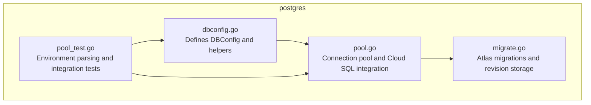
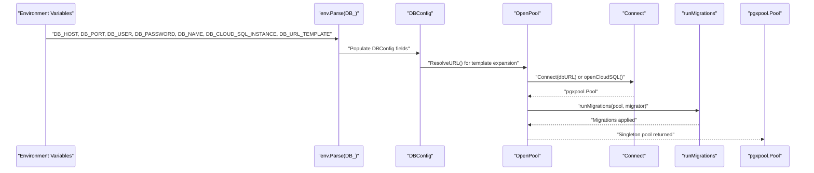
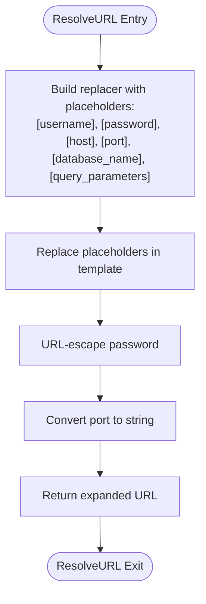
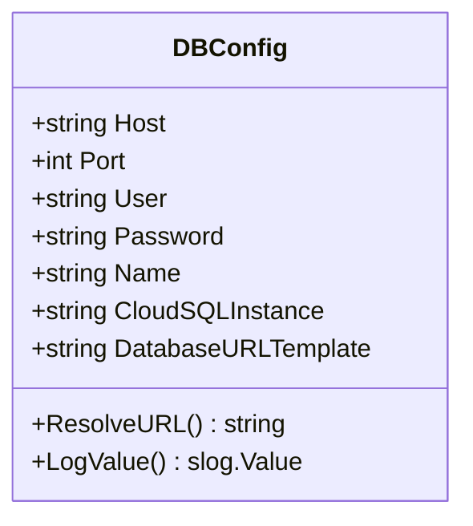
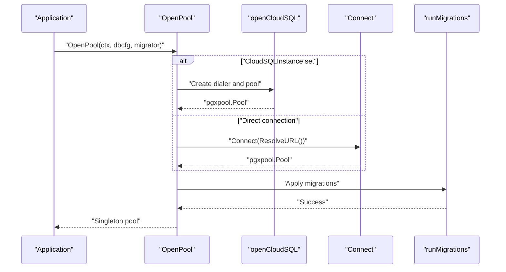
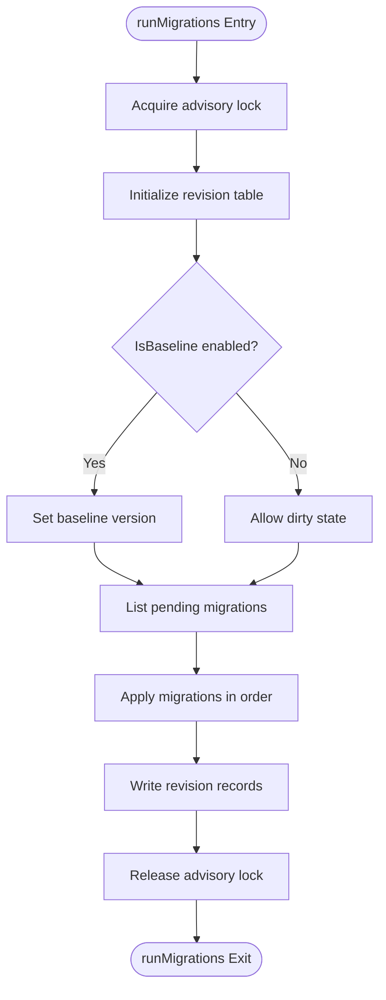
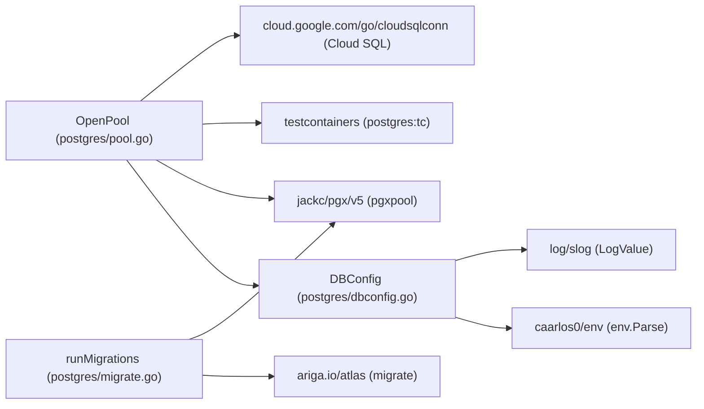

# Database Configuration

<cite>
**Referenced Files in This Document**
- [dbconfig.go](file://postgres/dbconfig.go)
- [pool.go](file://postgres/pool.go)
- [pool_test.go](file://postgres/pool_test.go)
- [migrate.go](file://postgres/migrate.go)
- [go.mod](file://go.mod)
</cite>

## Table of Contents
1. [Introduction](#introduction)
2. [Project Structure](#project-structure)
3. [Core Components](#core-components)
4. [Architecture Overview](#architecture-overview)
5. [Detailed Component Analysis](#detailed-component-analysis)
6. [Dependency Analysis](#dependency-analysis)
7. [Performance Considerations](#performance-considerations)
8. [Troubleshooting Guide](#troubleshooting-guide)
9. [Conclusion](#conclusion)

## Introduction
This document explains the Database Configuration component used to configure PostgreSQL connections in the project. It focuses on the DBConfig structure, environment variable-based configuration, URL template expansion, secure logging, and integration patterns for local development, testing, and production deployments.

## Project Structure
The database configuration and connection logic live under the postgres package. The key files are:
- postgres/dbconfig.go: Defines DBConfig and its environment-driven configuration, URL template resolution, and secure logging.
- postgres/pool.go: Manages a process-wide connection pool, including Cloud SQL integration and graceful shutdown.
- postgres/migrate.go: Provides migration orchestration using Atlas with advisory locking and revision persistence.
- postgres/pool_test.go: Demonstrates environment parsing and integration tests for connection and migrations.

**Diagram sources**
- [dbconfig.go:10-46](file://postgres/dbconfig.go#L10-L46)
- [pool.go:26-82](file://postgres/pool.go#L26-L82)
- [migrate.go:23-131](file://postgres/migrate.go#L23-L131)
- [pool_test.go:138-146](file://postgres/pool_test.go#L138-L146)

**Section sources**
- [dbconfig.go:10-46](file://postgres/dbconfig.go#L10-L46)
- [pool.go:26-82](file://postgres/pool.go#L26-L82)
- [migrate.go:23-131](file://postgres/migrate.go#L23-L131)
- [pool_test.go:138-146](file://postgres/pool_test.go#L138-L146)

## Core Components
- DBConfig: Holds database connection parameters and provides URL template expansion and secure logging.
- Environment Variable Parsing: Uses a library to parse DBConfig from environment variables with a DB_ prefix.
- URL Template Expansion: Resolves placeholders in a configurable template using credentials and connection details.
- Secure Logging: Redacts passwords in structured logs.
- Connection Pool: Singleton pool creation with optional Cloud SQL integration and graceful shutdown.
- Migrations: Atlas-based migrations with advisory locks and revision tracking.

**Section sources**
- [dbconfig.go:10-46](file://postgres/dbconfig.go#L10-L46)
- [pool.go:26-82](file://postgres/pool.go#L26-L82)
- [migrate.go:23-131](file://postgres/migrate.go#L23-L131)
- [pool_test.go:138-146](file://postgres/pool_test.go#L138-L146)

## Architecture Overview
The DBConfig drives connection establishment and migration execution. Environment variables populate DBConfig, which is then used to either connect directly to a PostgreSQL instance or to Google Cloud SQL. The pool is created once and reused, with migrations applied automatically during pool initialization.

**Diagram sources**
- [dbconfig.go:22-33](file://postgres/dbconfig.go#L22-L33)
- [pool.go:30-46](file://postgres/pool.go#L30-L46)
- [pool.go:84-146](file://postgres/pool.go#L84-L146)
- [migrate.go:49-131](file://postgres/migrate.go#L49-L131)

## Detailed Component Analysis

### DBConfig Structure and Environment Variables
DBConfig defines the connection parameters and how they are populated from environment variables. The environment variable naming convention uses a DB_ prefix. Default values are provided for several fields.

- Host: Environment variable DB_HOST with default localhost.
- Port: Environment variable DB_PORT with default 5432.
- User: Environment variable DB_USER.
- Password: Environment variable DB_PASSWORD.
- Name: Environment variable DB_NAME.
- CloudSQLInstance: Environment variable DB_CLOUD_SQL_INSTANCE.
- DatabaseURLTemplate: Environment variable DB_URL_TEMPLATE with a default template suitable for local development and test containers.

These defaults enable quick startup in local environments while allowing overrides for production and CI.

**Section sources**
- [dbconfig.go:12-20](file://postgres/dbconfig.go#L12-L20)

### URL Template Expansion with ResolveURL
The ResolveURL method expands a configurable template by replacing placeholders with actual values from DBConfig. It URL-escapes the password and converts the port to a string. The template supports placeholders for username, password, host, port, and database name, plus a placeholder for query parameters.

**Diagram sources**
- [dbconfig.go:22-33](file://postgres/dbconfig.go#L22-L33)

**Section sources**
- [dbconfig.go:22-33](file://postgres/dbconfig.go#L22-L33)

### Secure Logging with LogValue
The LogValue implementation integrates with structured logging to redact sensitive information. It emits host, port, user, name, Cloud SQL instance, and the URL template, but replaces the password with a redacted marker.

**Diagram sources**
- [dbconfig.go:12-46](file://postgres/dbconfig.go#L12-L46)

**Section sources**
- [dbconfig.go:35-46](file://postgres/dbconfig.go#L35-L46)

### Environment Variable Parsing and Tests
Integration tests demonstrate parsing DBConfig from environment variables using a library with a DB_ prefix. This pattern is essential for loading configuration in CI and production environments.

- Tests show how to parse DBConfig from environment variables with DB_ prefix.
- Tests verify that migrations run after pool creation and that the pool is a singleton.

**Section sources**
- [pool_test.go:138-146](file://postgres/pool_test.go#L138-L146)
- [pool_test.go:148-189](file://postgres/pool_test.go#L148-L189)

### Connection Pool and Cloud SQL Integration
OpenPool initializes a process-wide singleton connection pool. It supports:
- Direct PostgreSQL connections using a URL derived from DBConfig.
- Google Cloud SQL connections using a dialer and a DSN constructed from DBConfig credentials.
- Automatic migrations via Atlas when the pool is created.
- Graceful shutdown on SIGTERM/SIGINT signals.

**Diagram sources**
- [pool.go:30-46](file://postgres/pool.go#L30-L46)
- [pool.go:61-82](file://postgres/pool.go#L61-L82)
- [pool.go:84-146](file://postgres/pool.go#L84-L146)
- [migrate.go:49-131](file://postgres/migrate.go#L49-L131)

**Section sources**
- [pool.go:26-82](file://postgres/pool.go#L26-L82)
- [pool.go:84-146](file://postgres/pool.go#L84-L146)
- [migrate.go:49-131](file://postgres/migrate.go#L49-L131)

### Migration Orchestration with Atlas
Migrations are handled by Atlas with:
- Advisory lock acquisition to prevent concurrent replicas from migrating simultaneously.
- A revision table to track applied migrations.
- Optional baseline mode controlled by a caller-supplied predicate.

**Diagram sources**
- [migrate.go:49-131](file://postgres/migrate.go#L49-L131)
- [migrate.go:182-314](file://postgres/migrate.go#L182-L314)

**Section sources**
- [migrate.go:23-131](file://postgres/migrate.go#L23-L131)
- [migrate.go:182-314](file://postgres/migrate.go#L182-L314)

## Dependency Analysis
The database configuration relies on external libraries for environment parsing, PostgreSQL connectivity, Cloud SQL dialing, and Atlas migrations.

**Diagram sources**
- [dbconfig.go:3-8](file://postgres/dbconfig.go#L3-L8)
- [pool.go:3-18](file://postgres/pool.go#L3-L18)
- [migrate.go:3-18](file://postgres/migrate.go#L3-L18)
- [go.mod:5-12](file://go.mod#L5-L12)

**Section sources**
- [go.mod:5-12](file://go.mod#L5-L12)

## Performance Considerations
- Singleton Pool: OpenPool ensures a single shared pool per process, reducing overhead and connection churn.
- Advisory Locking: Migrations use an advisory lock to serialize across replicas, preventing contention and race conditions.
- Lazy Refresh: Cloud SQL dialer uses lazy refresh to minimize connection setup latency.
- Test Containers: The postgres:tc URL scheme provisions ephemeral databases for testing, simplifying environment setup.

[No sources needed since this section provides general guidance]

## Troubleshooting Guide
- Environment Variables Not Loaded: Ensure environment variables use the DB_ prefix and that the parser is invoked with the correct prefix option.
- URL Template Issues: Verify the template contains all required placeholders and that ResolveURL is used to expand the URL before connecting.
- Cloud SQL Connection Failures: Confirm the Cloud SQL instance name is set and that the dialer can reach the instance.
- Migration Conflicts: Check advisory lock acquisition and revision table state; ensure migrations are idempotent and handle baseline scenarios.
- Graceful Shutdown: Verify that SIGTERM/SIGINT handlers are registered and that pools are closed on shutdown.

**Section sources**
- [pool_test.go:138-146](file://postgres/pool_test.go#L138-L146)
- [pool.go:30-46](file://postgres/pool.go#L30-L46)
- [migrate.go:49-131](file://postgres/migrate.go#L49-L131)

## Conclusion
The Database Configuration component provides a robust, environment-driven way to configure PostgreSQL connections, with support for local development, test containers, and production Cloud SQL deployments. It emphasizes secure logging, reliable migrations, and efficient connection pooling, enabling safe and scalable database operations across diverse environments.