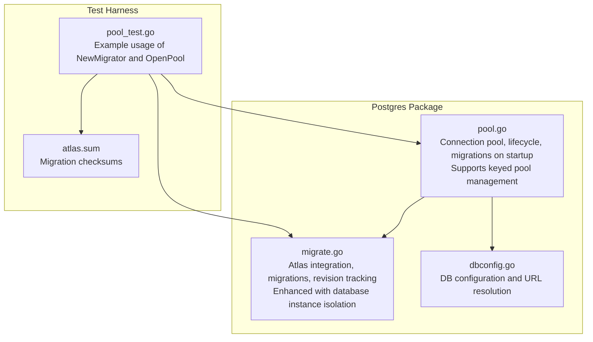
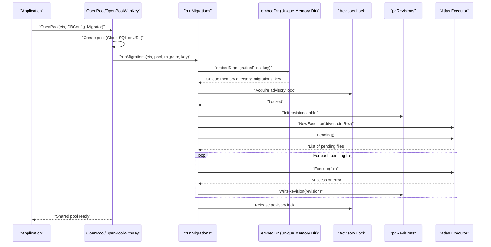
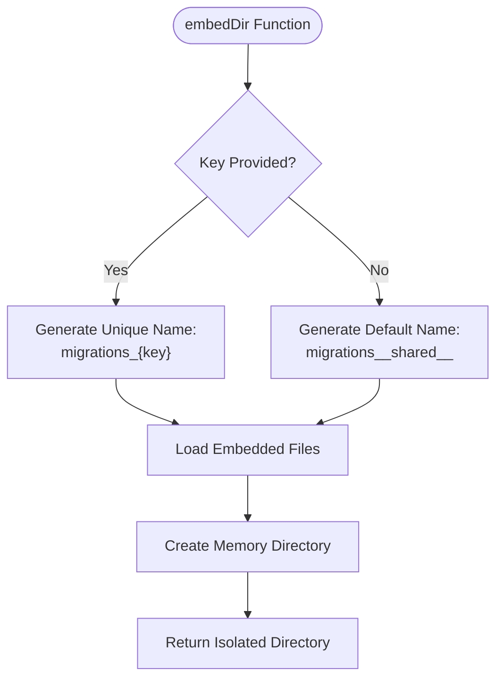
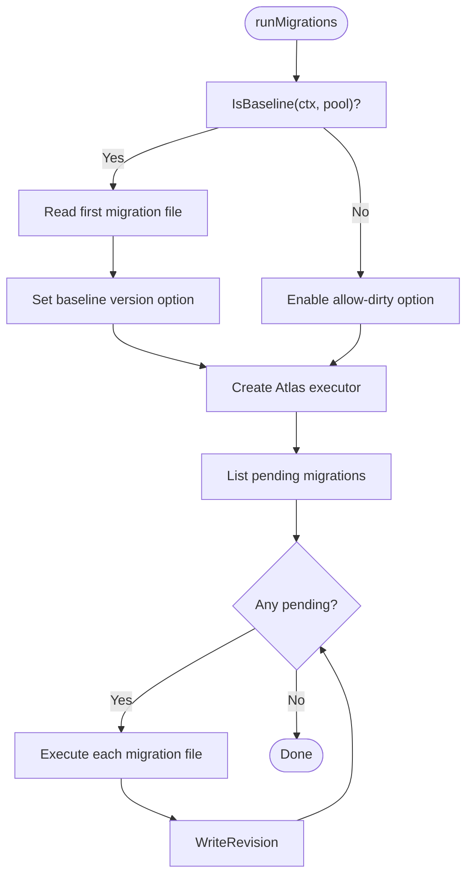
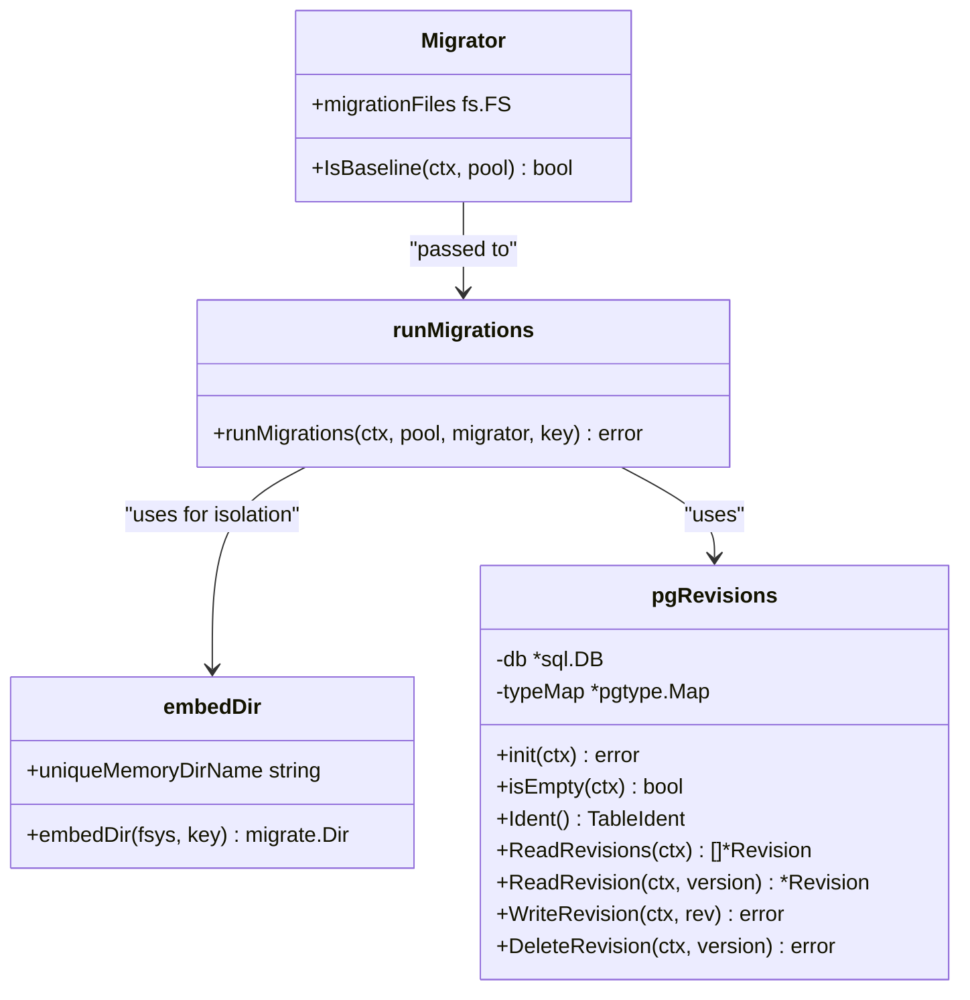
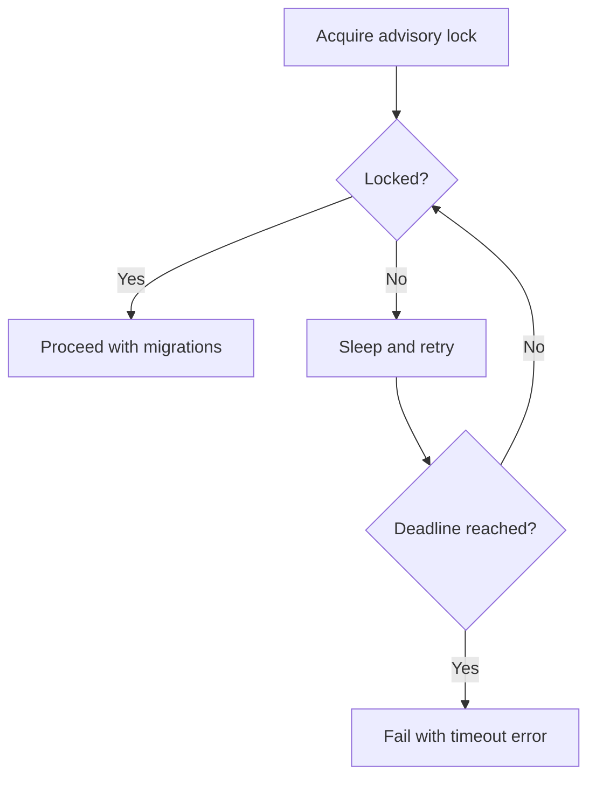
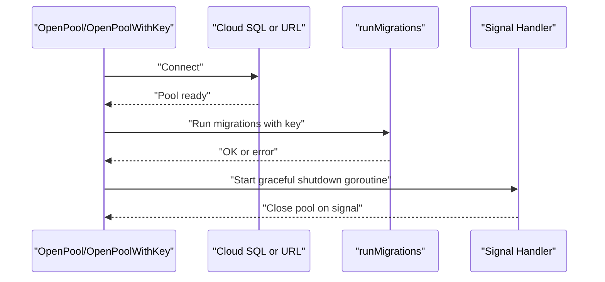
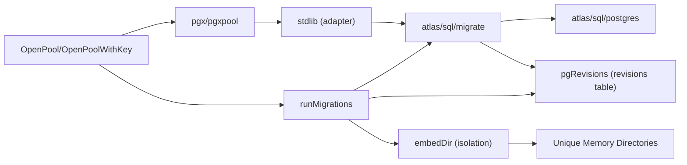

# Migration Management

<cite>
**Referenced Files in This Document**
- [migrate.go](file://postgres/migrate.go)
- [pool.go](file://postgres/pool.go)
- [dbconfig.go](file://postgres/dbconfig.go)
- [pool_test.go](file://postgres/pool_test.go)
- [atlas.sum](file://postgres/testdata/migrations/atlas.sum)
</cite>

## Update Summary
**Changes Made**
- Updated database instance isolation section to reflect enhanced memory directory naming strategy
- Added documentation for unique memory directory generation incorporating key parameters
- Enhanced troubleshooting guide with isolation conflict prevention
- Updated practical examples to demonstrate key-based pool management

## Table of Contents
1. [Introduction](#introduction)
2. [Project Structure](#project-structure)
3. [Core Components](#core-components)
4. [Architecture Overview](#architecture-overview)
5. [Detailed Component Analysis](#detailed-component-analysis)
6. [Dependency Analysis](#dependency-analysis)
7. [Performance Considerations](#performance-considerations)
8. [Troubleshooting Guide](#troubleshooting-guide)
9. [Conclusion](#conclusion)
10. [Appendices](#appendices)

## Introduction
This document explains the Migration Management component that integrates Atlas to manage PostgreSQL schema evolution. It covers how migrations are organized, applied, and tracked; how the system interacts with the connection pool and database configuration; and how to operate migrations safely across environments from development to production. The system now features enhanced database instance isolation through unique memory directory naming to prevent conflicts between different database instances.

## Project Structure
The migration subsystem resides in the postgres package and consists of:
- Migration orchestration and Atlas integration
- PostgreSQL connection pooling and lifecycle
- Database configuration abstraction
- Test harness demonstrating migration usage

**Diagram sources**
- [migrate.go](file://postgres/migrate.go)
- [pool.go](file://postgres/pool.go)
- [dbconfig.go](file://postgres/dbconfig.go)
- [pool_test.go](file://postgres/pool_test.go)
- [atlas.sum](file://postgres/testdata/migrations/atlas.sum)

**Section sources**
- [migrate.go](file://postgres/migrate.go)
- [pool.go](file://postgres/pool.go)
- [dbconfig.go](file://postgres/dbconfig.go)
- [pool_test.go](file://postgres/pool_test.go)
- [atlas.sum](file://postgres/testdata/migrations/atlas.sum)

## Core Components
- Migrator: Encapsulates the migration file source and optional baseline predicate. It is passed to the pool initialization routine to decide whether to baseline or allow dirty runs.
- runMigrations: Applies pending migrations using Atlas, ensures safe concurrency with a PostgreSQL advisory lock, and tracks state in a dedicated revisions table. **Enhanced with key-based memory directory isolation**.
- embedDir: Loads embedded migration files into unique in-memory directories based on key parameters to prevent conflicts between database instances.
- pgRevisions: Implements Atlas's RevisionReadWriter to persist migration metadata (version, timestamps, hashes, partial hashes, errors).
- OpenPool: Establishes the shared connection pool, optionally connects to Cloud SQL, runs migrations on first use, and registers graceful shutdown.
- OpenPoolWithKey: **New** - Creates keyed connection pools with unique identifiers for database instance isolation.
- DBConfig: Provides structured database configuration with environment-driven defaults and a URL resolver.

**Section sources**
- [migrate.go:23-43](file://postgres/migrate.go#L23-L43)
- [migrate.go:45-135](file://postgres/migrate.go#L45-L135)
- [migrate.go:137-158](file://postgres/migrate.go#L137-L158)
- [pool.go:33-67](file://postgres/pool.go#L33-L67)
- [dbconfig.go:10-47](file://postgres/dbconfig.go#L10-L47)

## Architecture Overview
The migration lifecycle is tightly coupled with the connection pool. On first use, OpenPool constructs a pool, runs migrations via runMigrations, and registers a graceful shutdown handler. **Enhanced with database instance isolation through unique memory directories**. runMigrations sets up an Atlas driver, reads embedded migration files into isolated memory directories, acquires a PostgreSQL advisory lock, initializes the revisions table, and executes pending migrations.

**Diagram sources**
- [pool.go:33-84](file://postgres/pool.go#L33-L84)
- [migrate.go:45-135](file://postgres/migrate.go#L45-L135)
- [migrate.go:137-158](file://postgres/migrate.go#L137-L158)

## Detailed Component Analysis

### Database Instance Isolation and Memory Directory Management
**Enhanced** The system now provides robust database instance isolation through unique memory directory naming. The embedDir function generates distinct in-memory directories for each database instance using the key parameter, preventing migration file conflicts between different instances.

- **Unique Memory Directory Generation**: `migrate.OpenMemDir(fmt.Sprintf("migrations_%s", key))` creates isolated memory directories per database instance
- **Key-Based Isolation**: Different keys (including "__shared__" for singleton pools) ensure separate migration contexts
- **Conflict Prevention**: Eliminates race conditions and file conflicts when multiple database instances share the same embedded migration files

**Diagram sources**
- [migrate.go:137-158](file://postgres/migrate.go#L137-L158)

**Section sources**
- [migrate.go:137-158](file://postgres/migrate.go#L137-L158)
- [pool.go:44-67](file://postgres/pool.go#L44-L67)

### Migrator and Baseline Strategy
- Migrator carries an fs.FS of migration files and an optional IsBaseline predicate. When present, runMigrations can set a baseline version to mark the first migration as applied without executing its SQL.
- Baseline mode is useful when bringing an existing database under Atlas control without replaying historical DDL.

**Diagram sources**
- [migrate.go:77-96](file://postgres/migrate.go#L77-L96)
- [migrate.go:98-135](file://postgres/migrate.go#L98-L135)

**Section sources**
- [migrate.go:23-43](file://postgres/migrate.go#L23-L43)
- [migrate.go:77-96](file://postgres/migrate.go#L77-L96)
- [migrate.go:98-135](file://postgres/migrate.go#L98-L135)

### Atlas Driver, Directory Loading, and Revisions Tracking
- Atlas driver is opened against a stdlib connection derived from the pgx pool.
- **Enhanced** Migration files are loaded from an embedded filesystem into unique in-memory Atlas directories based on key parameters.
- pgRevisions implements the Atlas RevisionReadWriter interface to persist migration state, including version, description, timestamps, execution metrics, error details, and hashes.

**Diagram sources**
- [migrate.go:23-43](file://postgres/migrate.go#L23-L43)
- [migrate.go:137-158](file://postgres/migrate.go#L137-L158)
- [migrate.go:186-326](file://postgres/migrate.go#L186-L326)
- [migrate.go:45-135](file://postgres/migrate.go#L45-L135)

**Section sources**
- [migrate.go:54-65](file://postgres/migrate.go#L54-L65)
- [migrate.go:137-158](file://postgres/migrate.go#L137-L158)
- [migrate.go:186-326](file://postgres/migrate.go#L186-L326)

### Advisory Lock and Concurrency Control
- A PostgreSQL advisory lock is acquired before applying migrations to prevent concurrent replicas from racing.
- The lock acquisition retries with bounded backoff until a deadline, logging wait events.

**Diagram sources**
- [migrate.go:160-178](file://postgres/migrate.go#L160-L178)

**Section sources**
- [migrate.go:160-178](file://postgres/migrate.go#L160-L178)

### Connection Pool Lifecycle and Keyed Pool Management
**Enhanced** The system now supports both singleton and keyed connection pools for better database instance isolation.

- **Singleton Pool**: OpenPool creates a shared pool with "__shared__" key, reused across the application
- **Keyed Pools**: OpenPoolWithKey manages separate pools for different database instances using unique keys
- **Graceful Shutdown**: Both pool types register graceful shutdown handlers

**Diagram sources**
- [pool.go:33-84](file://postgres/pool.go#L33-L84)

**Section sources**
- [pool.go:33-67](file://postgres/pool.go#L33-L67)
- [pool.go:86-105](file://postgres/pool.go#L86-L105)

### Database Configuration and URL Resolution
- DBConfig encapsulates host, port, user, password, database name, and Cloud SQL instance.
- ResolveURL expands a template placeholder to produce a connection URL, with password properly escaped.
- LogValue redacts sensitive fields for logging.

**Section sources**
- [dbconfig.go:10-47](file://postgres/dbconfig.go#L10-L47)

### Migration File Organization and Version Control
- Migration files are provided via an fs.FS and loaded into unique in-memory Atlas directories at runtime.
- **Enhanced** The embedDir function generates unique memory directory names incorporating key parameters to prevent conflicts between different database instances.
- The test harness demonstrates constructing a Migrator with an embedded filesystem and using it during pool initialization.
- The presence of atlas.sum indicates Atlas-managed migrations with integrity checks.

**Section sources**
- [migrate.go:137-158](file://postgres/migrate.go#L137-L158)
- [pool_test.go:19-30](file://postgres/pool_test.go#L19-L30)
- [atlas.sum](file://postgres/testdata/migrations/atlas.sum)

## Dependency Analysis
- External libraries:
  - Atlas migrate and postgres driver for schema migration execution
  - pgx and pgxpool for connection management
  - stdlib adapter to bridge pgx and Atlas
  - Cloud SQL dialer for GCP connectivity
  - Testcontainers for local database provisioning in tests

**Diagram sources**
- [migrate.go:3-18](file://postgres/migrate.go#L3-L18)
- [pool.go:3-18](file://postgres/pool.go#L3-L18)

**Section sources**
- [migrate.go:3-18](file://postgres/migrate.go#L3-L18)
- [pool.go:3-18](file://postgres/pool.go#L3-L18)

## Performance Considerations
- Advisory lock contention: Keep migrations short and avoid long-running transactions inside migration scripts to minimize lock wait time.
- Batch execution: Atlas applies pending migrations sequentially; order is determined by file versions. Keep individual migration steps focused to reduce per-migration execution time.
- Revision table writes: Each migration writes a revision row; ensure adequate indexing and monitor write latency on busy systems.
- Connection reuse: The shared pool reduces connection overhead; migrations run against the same pool used by the application.
- **Enhanced** Memory directory isolation: Unique in-memory directories eliminate file system conflicts and improve performance in multi-instance scenarios.

## Troubleshooting Guide
Common issues and resolutions:
- Migration fails with "no pending migrations": Indicates the system is up-to-date or the revisions table is inconsistent. Verify the revisions table and pending list.
- Advisory lock timeout: Indicates another replica is running migrations. Investigate concurrent deployments or stuck processes.
- Dirty database: When IsBaseline is not used and the database is not clean, Atlas may refuse to run migrations. Use baseline mode for existing databases under Atlas control.
- Revision tracking anomalies: Check the revisions table for missing or corrupted rows; ensure the table exists and is writable.
- Cloud SQL connectivity: Confirm credentials and instance name; verify the dialer configuration and network access.
- **Enhanced** Memory directory conflicts: If encountering migration file conflicts between instances, verify that unique keys are being passed to OpenPoolWithKey and that embedDir is generating unique directory names.

Operational checks:
- Validate that the revisions table exists and is initialized.
- Confirm that migrations are applied in order and that each revision reflects success or failure details.
- Monitor logs for advisory lock waits and migration durations.
- **Enhanced** Verify unique memory directory creation for each database instance.

**Section sources**
- [migrate.go:103-106](file://postgres/migrate.go#L103-L106)
- [migrate.go:160-178](file://postgres/migrate.go#L160-L178)
- [migrate.go:214-217](file://postgres/migrate.go#L214-L217)
- [migrate.go:267-289](file://postgres/migrate.go#L267-L289)

## Conclusion
The Migration Management component integrates Atlas with a robust PostgreSQL connection pool and advisory locking to ensure safe, repeatable schema evolution. **Enhanced with database instance isolation through unique memory directory naming**, the system prevents conflicts between different database instances while maintaining reliable deployments across environments. By organizing migrations as an embedded filesystem, tracking state in a dedicated revisions table, and enforcing concurrency controls, it supports reliable deployments across environments. Following the recommended practices and using the provided patterns will help maintain a predictable and auditable migration lifecycle.

## Appendices

### Practical Setup and Execution Examples
- Construct a Migrator with an embedded filesystem containing Atlas migrations.
- Initialize the connection pool with OpenPool for singleton usage or OpenPoolWithKey for keyed instance management.
- For Cloud SQL, supply the instance name in DBConfig; otherwise use a standard database URL.
- Use the test harness pattern to validate migrations locally with Testcontainers.
- **Enhanced** Pass unique keys to OpenPoolWithKey to enable database instance isolation.

**Section sources**
- [pool_test.go:19-30](file://postgres/pool_test.go#L19-L30)
- [pool.go:33-67](file://postgres/pool.go#L33-L67)
- [dbconfig.go:12-33](file://postgres/dbconfig.go#L12-L33)

### Migration Lifecycle: Development to Production
- Development: Use Testcontainers via the special URL scheme to provision a temporary database for testing migrations.
- Staging: Run migrations against a staging pool created with OpenPool; ensure baseline mode is used for existing databases.
- Production: Ensure only one replica applies migrations by leveraging the advisory lock; monitor logs and revision table for auditability.
- **Enhanced** Multi-instance production: Use OpenPoolWithKey with unique keys for different database instances to prevent migration conflicts.

**Section sources**
- [pool.go:69-84](file://postgres/pool.go#L69-L84)
- [migrate.go:160-178](file://postgres/migrate.go#L160-L178)

### Rollback Procedures and Conflict Resolution
- Atlas executor does not provide automatic rollback; design reversible migrations or use Atlas schema inspection to plan manual rollbacks.
- If a migration fails mid-execution, the revision row captures error details; fix the issue and rerun migrations.
- For conflicts across replicas, rely on the advisory lock to serialize migrations; avoid manual intervention while migrations are running.
- **Enhanced** For database instance conflicts, ensure unique keys are used and verify that embedDir creates distinct memory directories for each instance.

**Section sources**
- [migrate.go:113-135](file://postgres/migrate.go#L113-L135)
- [migrate.go:267-289](file://postgres/migrate.go#L267-L289)

### Best Practices and Testing Strategies
- Keep migrations small, reversible, and idempotent where possible.
- Use baseline mode for existing databases to avoid replaying historical DDL.
- Validate migrations against a Testcontainer before promoting to higher environments.
- Monitor migration duration and failures via logs and the revisions table.
- **Enhanced** Use OpenPoolWithKey with descriptive keys for different environments (development, staging, production) to ensure proper isolation.

**Section sources**
- [migrate.go:77-96](file://postgres/migrate.go#L77-L96)
- [migrate.go:98-135](file://postgres/migrate.go#L98-L135)
- [pool.go:69-84](file://postgres/pool.go#L69-L84)

### Data Transformation and Schema Evolution Approaches
- Prefer declarative schema definitions and incremental migrations.
- Use partial hashes and revision metadata to track partial application and detect drift.
- Separate destructive operations (e.g., dropping columns) into distinct migrations with safeguards.
- **Enhanced** Implement database instance isolation by using unique keys for different database instances to prevent migration conflicts.

**Section sources**
- [migrate.go:233-252](file://postgres/migrate.go#L233-L252)
- [migrate.go:291-319](file://postgres/migrate.go#L291-L319)