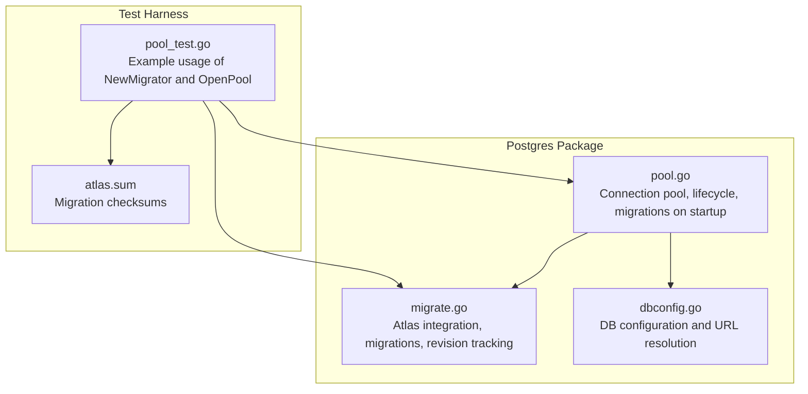
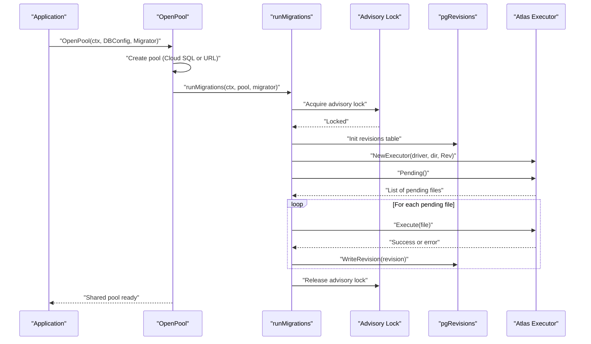
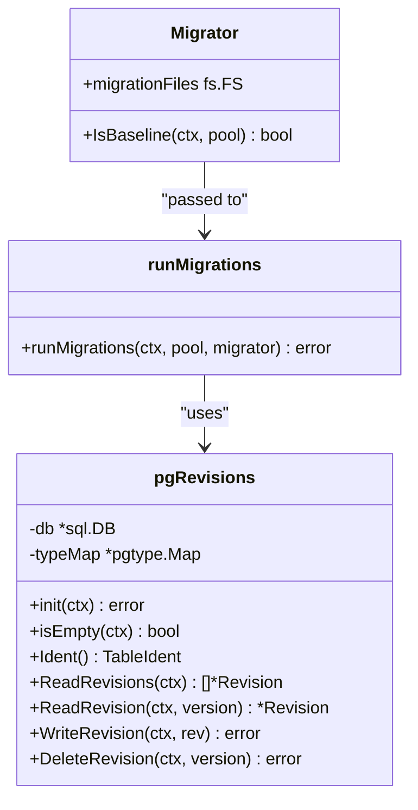
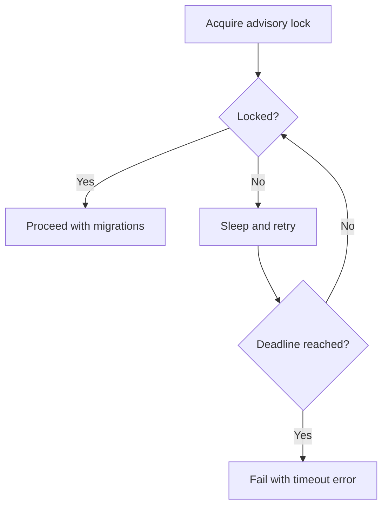
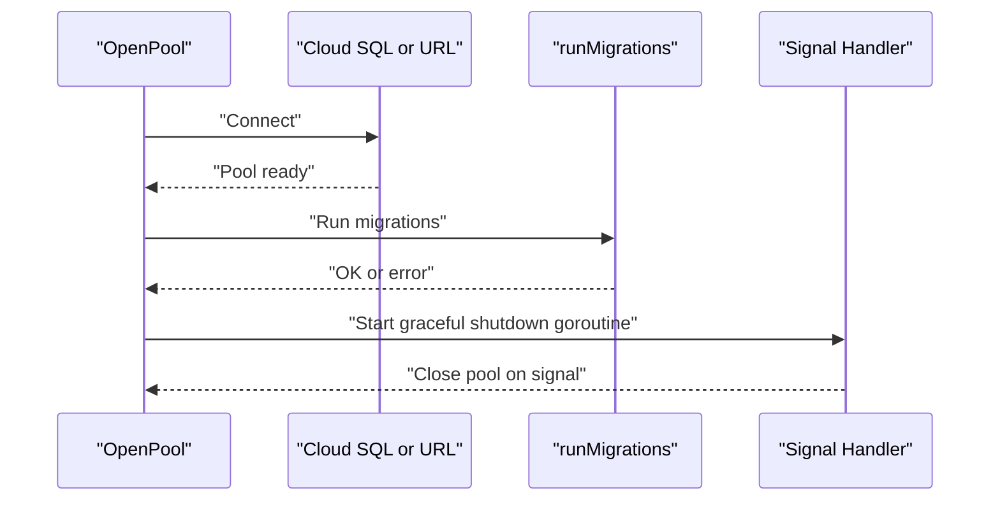
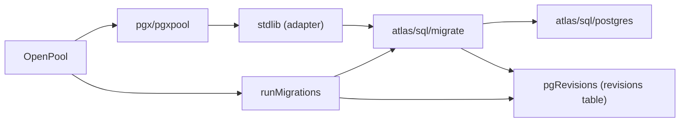

# Migration Management

<cite>
**Referenced Files in This Document**
- [migrate.go](file://postgres/migrate.go)
- [pool.go](file://postgres/pool.go)
- [dbconfig.go](file://postgres/dbconfig.go)
- [pool_test.go](file://postgres/pool_test.go)
- [atlas.sum](file://postgres/testdata/migrations/atlas.sum)
</cite>

## Table of Contents
1. [Introduction](#introduction)
2. [Project Structure](#project-structure)
3. [Core Components](#core-components)
4. [Architecture Overview](#architecture-overview)
5. [Detailed Component Analysis](#detailed-component-analysis)
6. [Dependency Analysis](#dependency-analysis)
7. [Performance Considerations](#performance-considerations)
8. [Troubleshooting Guide](#troubleshooting-guide)
9. [Conclusion](#conclusion)
10. [Appendices](#appendices)

## Introduction
This document explains the Migration Management component that integrates Atlas to manage PostgreSQL schema evolution. It covers how migrations are organized, applied, and tracked; how the system interacts with the connection pool and database configuration; and how to operate migrations safely across environments from development to production. Practical guidance is included for setup, execution, rollback, conflict resolution, and CI/CD integration.

## Project Structure
The migration subsystem resides in the postgres package and consists of:
- Migration orchestration and Atlas integration
- PostgreSQL connection pooling and lifecycle
- Database configuration abstraction
- Test harness demonstrating migration usage

**Diagram sources**
- [migrate.go](file://postgres/migrate.go)
- [pool.go](file://postgres/pool.go)
- [dbconfig.go](file://postgres/dbconfig.go)
- [pool_test.go](file://postgres/pool_test.go)
- [atlas.sum](file://postgres/testdata/migrations/atlas.sum)

**Section sources**
- [migrate.go](file://postgres/migrate.go)
- [pool.go](file://postgres/pool.go)
- [dbconfig.go](file://postgres/dbconfig.go)
- [pool_test.go](file://postgres/pool_test.go)
- [atlas.sum](file://postgres/testdata/migrations/atlas.sum)

## Core Components
- Migrator: Encapsulates the migration file source and optional baseline predicate. It is passed to the pool initialization routine to decide whether to baseline or allow dirty runs.
- runMigrations: Applies pending migrations using Atlas, ensures safe concurrency with a PostgreSQL advisory lock, and tracks state in a dedicated revisions table.
- pgRevisions: Implements Atlas’s RevisionReadWriter to persist migration metadata (version, timestamps, hashes, partial hashes, errors).
- OpenPool: Establishes the shared connection pool, optionally connects to Cloud SQL, runs migrations on first use, and registers graceful shutdown.
- DBConfig: Provides structured database configuration with environment-driven defaults and a URL resolver.

**Section sources**
- [migrate.go:23-43](file://postgres/migrate.go#L23-L43)
- [migrate.go:45-131](file://postgres/migrate.go#L45-L131)
- [migrate.go:181-321](file://postgres/migrate.go#L181-L321)
- [pool.go:26-46](file://postgres/pool.go#L26-L46)
- [dbconfig.go:10-47](file://postgres/dbconfig.go#L10-L47)

## Architecture Overview
The migration lifecycle is tightly coupled with the connection pool. On first use, OpenPool constructs a pool, runs migrations via runMigrations, and registers a graceful shutdown handler. runMigrations sets up an Atlas driver, reads embedded migration files, acquires a PostgreSQL advisory lock, initializes the revisions table, and executes pending migrations.

**Diagram sources**
- [pool.go:30-45](file://postgres/pool.go#L30-L45)
- [migrate.go:49-131](file://postgres/migrate.go#L49-L131)
- [migrate.go:181-321](file://postgres/migrate.go#L181-L321)

## Detailed Component Analysis

### Migrator and Baseline Strategy
- Migrator carries an fs.FS of migration files and an optional IsBaseline predicate. When present, runMigrations can set a baseline version to mark the first migration as applied without executing its SQL.
- Baseline mode is useful when bringing an existing database under Atlas control without replaying historical DDL.

**Diagram sources**
- [migrate.go:76-97](file://postgres/migrate.go#L76-L97)
- [migrate.go:99-129](file://postgres/migrate.go#L99-L129)

**Section sources**
- [migrate.go:23-43](file://postgres/migrate.go#L23-L43)
- [migrate.go:76-97](file://postgres/migrate.go#L76-L97)
- [migrate.go:99-129](file://postgres/migrate.go#L99-L129)

### Atlas Driver, Directory Loading, and Revisions Tracking
- Atlas driver is opened against a stdlib connection derived from the pgx pool.
- Migration files are loaded from an embedded filesystem into an in-memory Atlas directory.
- pgRevisions implements the Atlas RevisionReadWriter interface to persist migration state, including version, description, timestamps, execution metrics, error details, and hashes.

**Diagram sources**
- [migrate.go:23-43](file://postgres/migrate.go#L23-L43)
- [migrate.go:181-321](file://postgres/migrate.go#L181-L321)
- [migrate.go:45-131](file://postgres/migrate.go#L45-L131)

**Section sources**
- [migrate.go:50-61](file://postgres/migrate.go#L50-L61)
- [migrate.go:133-153](file://postgres/migrate.go#L133-L153)
- [migrate.go:181-321](file://postgres/migrate.go#L181-L321)

### Advisory Lock and Concurrency Control
- A PostgreSQL advisory lock is acquired before applying migrations to prevent concurrent replicas from racing.
- The lock acquisition retries with bounded backoff until a deadline, logging wait events.

**Diagram sources**
- [migrate.go:155-179](file://postgres/migrate.go#L155-L179)

**Section sources**
- [migrate.go:155-179](file://postgres/migrate.go#L155-L179)

### Connection Pool Lifecycle and Graceful Shutdown
- OpenPool creates a shared pool, optionally via Cloud SQL dialer, then runs migrations synchronously on first use.
- A goroutine listens for SIGTERM/SIGINT and closes the pool gracefully.

**Diagram sources**
- [pool.go:30-59](file://postgres/pool.go#L30-L59)

**Section sources**
- [pool.go:26-46](file://postgres/pool.go#L26-L46)
- [pool.go:48-59](file://postgres/pool.go#L48-L59)

### Database Configuration and URL Resolution
- DBConfig encapsulates host, port, user, password, database name, and Cloud SQL instance.
- ResolveURL expands a template placeholder to produce a connection URL, with password properly escaped.
- LogValue redacts sensitive fields for logging.

**Section sources**
- [dbconfig.go:10-47](file://postgres/dbconfig.go#L10-L47)

### Migration File Organization and Version Control
- Migration files are provided via an fs.FS and loaded into an in-memory Atlas directory at runtime.
- The test harness demonstrates constructing a Migrator with an embedded filesystem and using it during pool initialization.
- The presence of atlas.sum indicates Atlas-managed migrations with integrity checks.

**Section sources**
- [migrate.go:133-153](file://postgres/migrate.go#L133-L153)
- [pool_test.go:28](file://postgres/pool_test.go#L28)
- [atlas.sum](file://postgres/testdata/migrations/atlas.sum)

## Dependency Analysis
- External libraries:
  - Atlas migrate and postgres driver for schema migration execution
  - pgx and pgxpool for connection management
  - stdlib adapter to bridge pgx and Atlas
  - Cloud SQL dialer for GCP connectivity
  - Testcontainers for local database provisioning in tests

**Diagram sources**
- [migrate.go:3-18](file://postgres/migrate.go#L3-L18)
- [pool.go:3-18](file://postgres/pool.go#L3-L18)

**Section sources**
- [migrate.go:3-18](file://postgres/migrate.go#L3-L18)
- [pool.go:3-18](file://postgres/pool.go#L3-L18)

## Performance Considerations
- Advisory lock contention: Keep migrations short and avoid long-running transactions inside migration scripts to minimize lock wait time.
- Batch execution: Atlas applies pending migrations sequentially; order is determined by file versions. Keep individual migration steps focused to reduce per-migration execution time.
- Revision table writes: Each migration writes a revision row; ensure adequate indexing and monitor write latency on busy systems.
- Connection reuse: The shared pool reduces connection overhead; migrations run against the same pool used by the application.

[No sources needed since this section provides general guidance]

## Troubleshooting Guide
Common issues and resolutions:
- Migration fails with “no pending migrations”: Indicates the system is up-to-date or the revisions table is inconsistent. Verify the revisions table and pending list.
- Advisory lock timeout: Indicates another replica is running migrations. Investigate concurrent deployments or stuck processes.
- Dirty database: When IsBaseline is not used and the database is not clean, Atlas may refuse to run migrations. Use baseline mode for existing databases under Atlas control.
- Revision tracking anomalies: Check the revisions table for missing or corrupted rows; ensure the table exists and is writable.
- Cloud SQL connectivity: Confirm credentials and instance name; verify the dialer configuration and network access.

Operational checks:
- Validate that the revisions table exists and is initialized.
- Confirm that migrations are applied in order and that each revision reflects success or failure details.
- Monitor logs for advisory lock waits and migration durations.

**Section sources**
- [migrate.go:99-106](file://postgres/migrate.go#L99-L106)
- [migrate.go:155-179](file://postgres/migrate.go#L155-L179)
- [migrate.go:209-212](file://postgres/migrate.go#L209-L212)
- [migrate.go:262-284](file://postgres/migrate.go#L262-L284)

## Conclusion
The Migration Management component integrates Atlas with a robust PostgreSQL connection pool and advisory locking to ensure safe, repeatable schema evolution. By organizing migrations as an embedded filesystem, tracking state in a dedicated revisions table, and enforcing concurrency controls, it supports reliable deployments across environments. Following the recommended practices and using the provided patterns will help maintain a predictable and auditable migration lifecycle.

[No sources needed since this section summarizes without analyzing specific files]

## Appendices

### Practical Setup and Execution Examples
- Construct a Migrator with an embedded filesystem containing Atlas migrations.
- Initialize the connection pool with OpenPool, passing the Migrator to run migrations on first use.
- For Cloud SQL, supply the instance name in DBConfig; otherwise use a standard database URL.
- Use the test harness pattern to validate migrations locally with Testcontainers.

**Section sources**
- [pool_test.go:28](file://postgres/pool_test.go#L28)
- [pool.go:30-45](file://postgres/pool.go#L30-L45)
- [dbconfig.go:12-33](file://postgres/dbconfig.go#L12-L33)

### Migration Lifecycle: Development to Production
- Development: Use Testcontainers via the special URL scheme to provision a temporary database for testing migrations.
- Staging: Run migrations against a staging pool created with OpenPool; ensure baseline mode is used for existing databases.
- Production: Ensure only one replica applies migrations by leveraging the advisory lock; monitor logs and revision table for auditability.

**Section sources**
- [pool.go:84-146](file://postgres/pool.go#L84-L146)
- [migrate.go:155-179](file://postgres/migrate.go#L155-L179)

### Rollback Procedures and Conflict Resolution
- Atlas executor does not provide automatic rollback; design reversible migrations or use Atlas schema inspection to plan manual rollbacks.
- If a migration fails mid-execution, the revision row captures error details; fix the issue and rerun migrations.
- For conflicts across replicas, rely on the advisory lock to serialize migrations; avoid manual intervention while migrations are running.

**Section sources**
- [migrate.go:113-122](file://postgres/migrate.go#L113-L122)
- [migrate.go:262-284](file://postgres/migrate.go#L262-L284)

### Best Practices and Testing Strategies
- Keep migrations small, reversible, and idempotent where possible.
- Use baseline mode for existing databases to avoid replaying historical DDL.
- Validate migrations against a Testcontainer before promoting to higher environments.
- Monitor migration duration and failures via logs and the revisions table.

**Section sources**
- [migrate.go:76-97](file://postgres/migrate.go#L76-L97)
- [migrate.go:108-129](file://postgres/migrate.go#L108-L129)
- [pool.go:84-146](file://postgres/pool.go#L84-L146)

### Data Transformation and Schema Evolution Approaches
- Prefer declarative schema definitions and incremental migrations.
- Use partial hashes and revision metadata to track partial application and detect drift.
- Separate destructive operations (e.g., dropping columns) into distinct migrations with safeguards.

**Section sources**
- [migrate.go:228-247](file://postgres/migrate.go#L228-L247)
- [migrate.go:295-314](file://postgres/migrate.go#L295-L314)