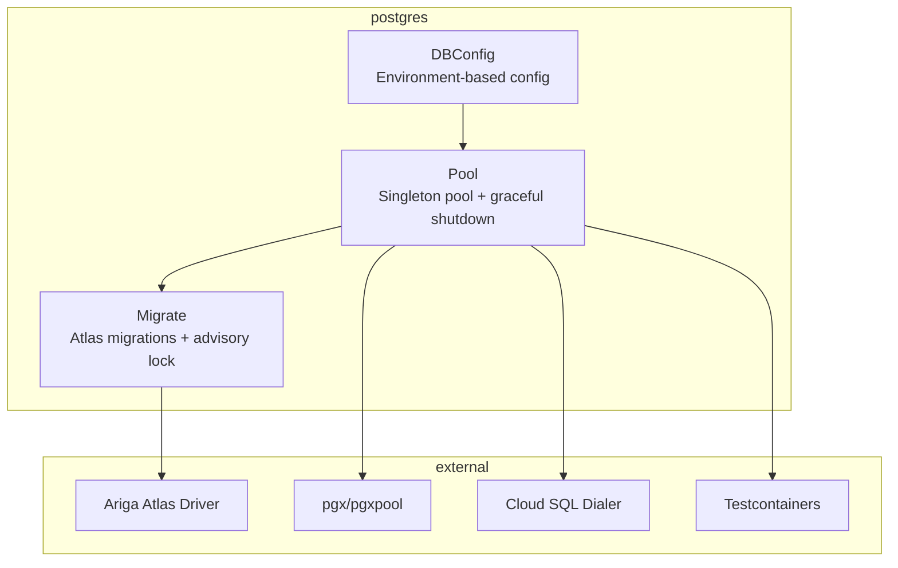
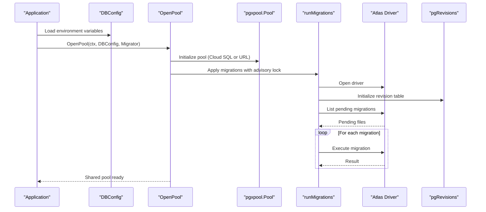
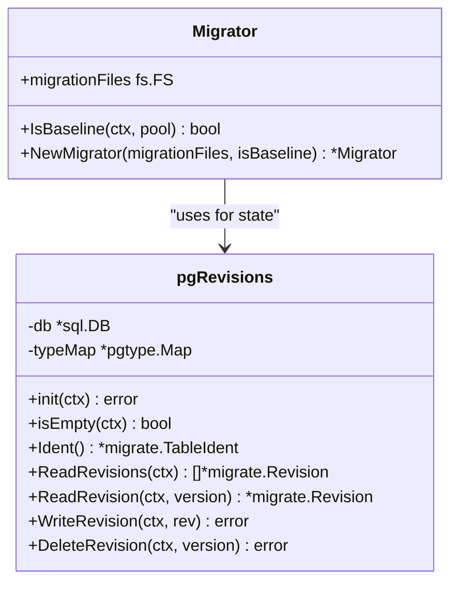
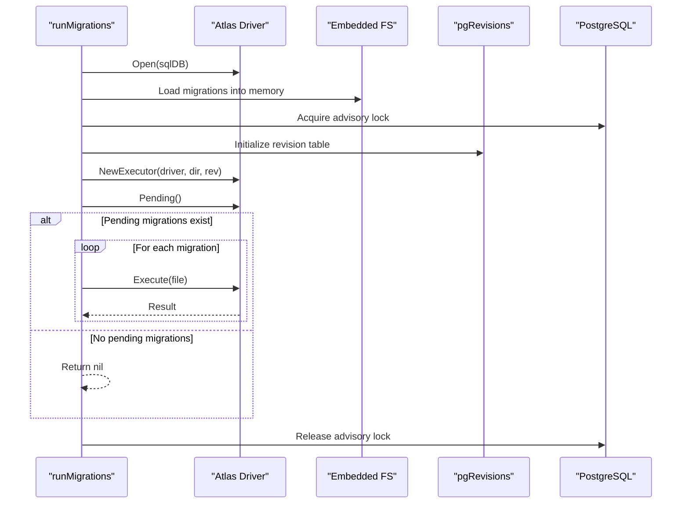
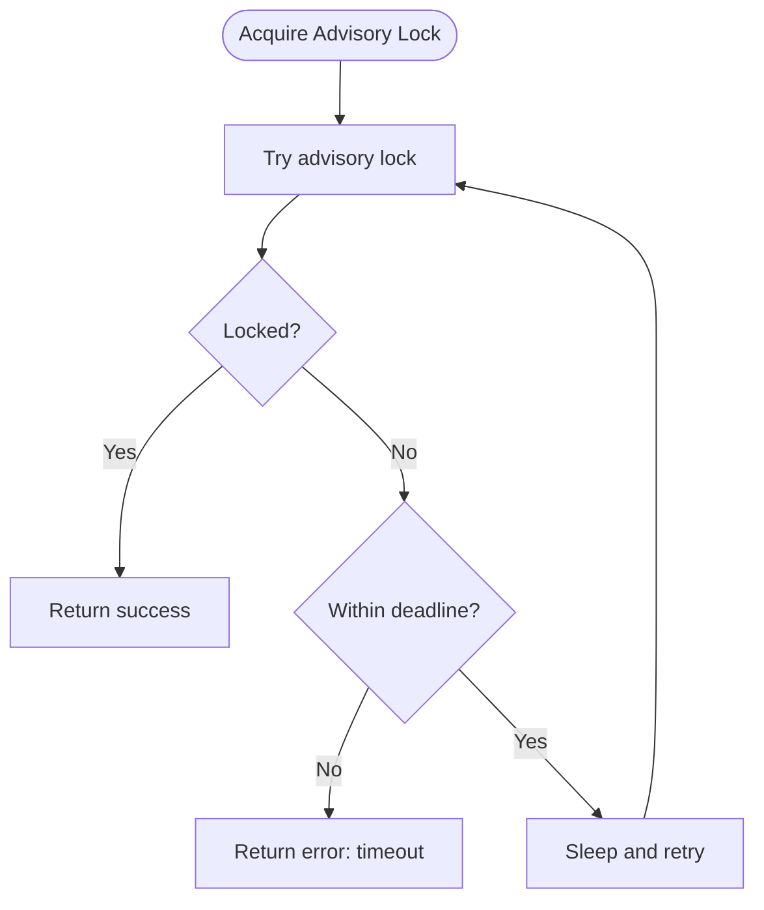
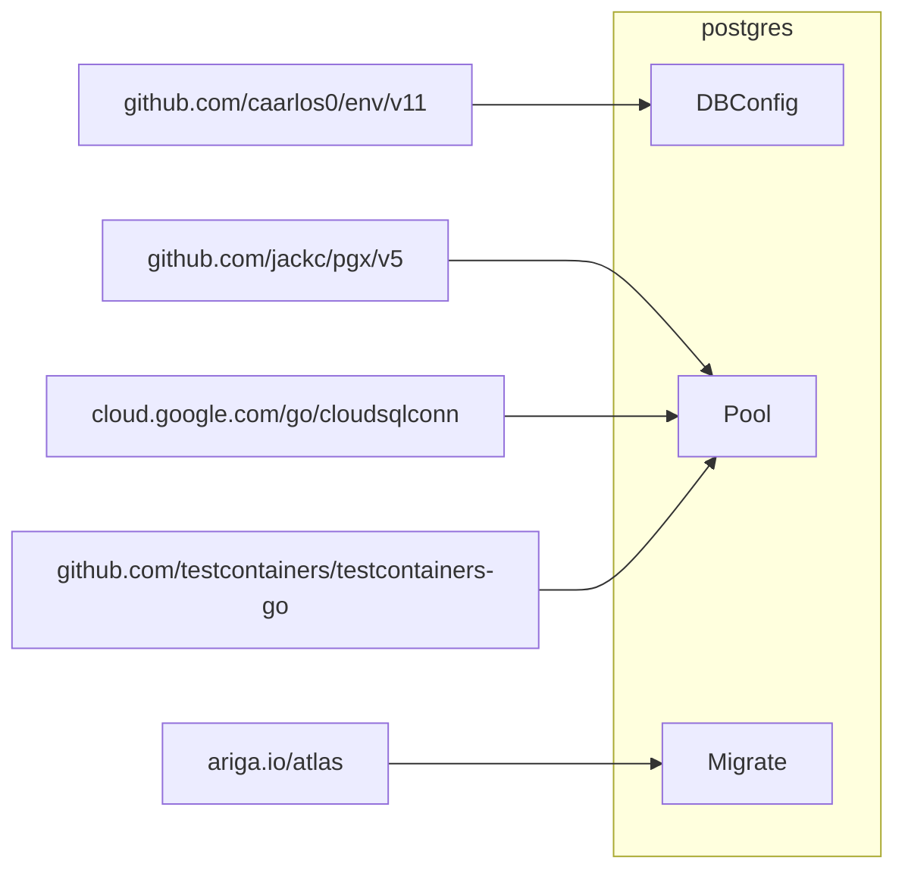

# PostgreSQL Utilities Module

<cite>
**Referenced Files in This Document**
- [dbconfig.go](file://postgres/dbconfig.go)
- [pool.go](file://postgres/pool.go)
- [migrate.go](file://postgres/migrate.go)
- [pool_test.go](file://postgres/pool_test.go)
- [go.mod](file://go.mod)
- [slog_handler.go](file://utils/slog_handler.go)
</cite>

## Table of Contents
1. [Introduction](#introduction)
2. [Project Structure](#project-structure)
3. [Core Components](#core-components)
4. [Architecture Overview](#architecture-overview)
5. [Detailed Component Analysis](#detailed-component-analysis)
6. [Dependency Analysis](#dependency-analysis)
7. [Performance Considerations](#performance-considerations)
8. [Troubleshooting Guide](#troubleshooting-guide)
9. [Conclusion](#conclusion)
10. [Appendices](#appendices)

## Introduction
This document provides comprehensive documentation for the PostgreSQL Utilities module. It explains database configuration management, connection pooling with graceful shutdown, and migration execution using Atlas. It covers the DBConfig structure, environment-based configuration, connection URL templates, and Cloud SQL integration. It also documents pool initialization, connection limits, timeout settings, and migration strategies. Practical examples demonstrate database setup, migration execution, connection management, and production deployment patterns. Finally, it addresses performance tuning, monitoring, and troubleshooting database connectivity issues.

## Project Structure
The PostgreSQL Utilities module resides under the postgres directory and consists of three primary packages:
- Configuration management: DBConfig and URL template resolution
- Connection pooling: Singleton pool creation, graceful shutdown, and Cloud SQL integration
- Migration execution: Atlas-based migrations with advisory locking and revision tracking

**Diagram sources**
- [dbconfig.go:10-46](file://postgres/dbconfig.go#L10-L46)
- [pool.go:26-82](file://postgres/pool.go#L26-L82)
- [migrate.go:23-131](file://postgres/migrate.go#L23-L131)

**Section sources**
- [dbconfig.go:10-46](file://postgres/dbconfig.go#L10-L46)
- [pool.go:26-82](file://postgres/pool.go#L26-L82)
- [migrate.go:23-131](file://postgres/migrate.go#L23-L131)

## Core Components
- DBConfig: Holds database connection parameters and resolves a connection URL from a template. It supports environment-based configuration and redacts sensitive fields in logs.
- Pool: Provides a process-wide singleton connection pool with graceful shutdown and optional Cloud SQL integration. It can also spin up a Testcontainer for local development.
- Migrate: Executes Atlas migrations against a PostgreSQL database, using an advisory lock to prevent concurrent replicas from racing and maintaining a revision table for migration state.

**Section sources**
- [dbconfig.go:10-46](file://postgres/dbconfig.go#L10-L46)
- [pool.go:26-82](file://postgres/pool.go#L26-L82)
- [migrate.go:23-131](file://postgres/migrate.go#L23-L131)

## Architecture Overview
The module orchestrates configuration, connection, and migration phases. DBConfig supplies credentials and URL templates. Pool initializes a singleton pgxpool, optionally integrating with Cloud SQL or spinning up a Testcontainer. Migrations are applied atomically using Atlas with an advisory lock and a dedicated revision table.

**Diagram sources**
- [pool.go:30-46](file://postgres/pool.go#L30-L46)
- [migrate.go:49-131](file://postgres/migrate.go#L49-L131)

## Detailed Component Analysis

### DBConfig: Environment-Based Configuration and URL Template Resolution
DBConfig encapsulates database connection parameters and supports environment-based configuration with a "DB_" prefix. It exposes:
- Host, Port, User, Password, Name, CloudSQLInstance, and DatabaseURLTemplate
- ResolveURL: Expands a URL template using the struct’s fields, escaping the password for safe inclusion
- LogValue: Implements slog.LogValuer and redacts the password in logs

Environment variables and defaults:
- HOST: defaults to localhost
- PORT: defaults to 5432
- USER: required
- PASSWORD: required
- NAME: required
- CLOUD_SQL_INSTANCE: optional for Cloud SQL integration
- URL_TEMPLATE: defaults to a template suitable for Testcontainers

URL template placeholders:
- [username], [password], [host], [port], [database_name], [query_parameters]

Security note:
- The password is escaped when resolving URLs to avoid injection issues.

Practical usage:
- Populate DBConfig from environment variables using a library that reads "DB_" prefixed keys
- Call ResolveURL to produce a connection string for non-Cloud SQL deployments
- For Cloud SQL, pass the instance connection name to enable Cloud SQL dialing

**Section sources**
- [dbconfig.go:10-46](file://postgres/dbconfig.go#L10-L46)

### Pool: Singleton Connection Pool with Graceful Shutdown and Cloud SQL Integration
The pool package provides:
- OpenPool: Creates a process-wide singleton pgxpool.Pool. On first call, it either connects directly or uses Cloud SQL dialer depending on the presence of CloudSQLInstance. It runs migrations via a provided Migrator and registers a graceful shutdown handler.
- gracefulShutdown: Waits for SIGTERM or SIGINT and closes the shared pool.
- openCloudSQL: Initializes a Cloud SQL dialer and configures pgxpool to use it for connections.
- Connect: Creates a pgxpool.Pool from a URL. If the URL starts with "postgres:tc:", it provisions a Testcontainer automatically and returns a connection to it.

Connection URL handling:
- Direct URL: Uses pgxpool.New with the provided URL
- Testcontainer URL: Detects "postgres:tc[:tag]" and spins up a Postgres container with default credentials and database name, then constructs a connection string

Cloud SQL integration:
- Requires CloudSQLInstance to be set
- Uses cloudsqlconn.Dialer with lazy refresh
- Configures pgxpool.DialFunc to use the dialer for establishing connections

Graceful shutdown:
- Registers a signal handler for SIGTERM/SIGINT
- Closes the shared pool upon receiving a signal

Production considerations:
- Ensure CloudSQLInstance is empty for non-GCP deployments
- Provide a robust Migrator to handle migrations during pool initialization
- Close pools explicitly in tests and long-running processes

**Section sources**
- [pool.go:26-82](file://postgres/pool.go#L26-L82)
- [pool.go:84-146](file://postgres/pool.go#L84-L146)

### Migrate: Atlas-Based Migrations with Advisory Locking and Revision Tracking
The migration package executes Atlas migrations against a PostgreSQL database:
- Migrator: Bundles a filesystem containing migration files and an optional baseline predicate
- NewMigrator: Creates a Migrator with the provided migration filesystem and baseline function
- runMigrations: Applies pending migrations, serializing execution across replicas using a PostgreSQL advisory lock, and maintains a revision table for migration state

Advisory locking:
- Uses a fixed advisory lock key to serialize migrations across replicas
- Polls with a bounded wait time and logs progress

Revision tracking:
- pgRevisions implements a PostgreSQL-backed RevisionReadWriter
- Maintains a table with fields for version, description, type, applied counts, timestamps, execution time, error details, hashes, and operator version
- Supports initialization, reading, writing, and deletion of revisions

Migration execution:
- Converts the embedded migration filesystem into an in-memory directory for Atlas
- Lists pending migrations and applies them sequentially
- Logs duration and errors for each migration
- Supports baseline mode when the caller’s predicate indicates a baseline run

**Section sources**
- [migrate.go:23-131](file://postgres/migrate.go#L23-L131)
- [migrate.go:181-314](file://postgres/migrate.go#L181-L314)

### Class Diagram: Migration Components

**Diagram sources**
- [migrate.go:26-43](file://postgres/migrate.go#L26-L43)
- [migrate.go:182-289](file://postgres/migrate.go#L182-L289)

### Sequence Diagram: Migration Execution Flow

**Diagram sources**
- [migrate.go:49-131](file://postgres/migrate.go#L49-L131)

### Flowchart: Advisory Lock Acquisition

**Diagram sources**
- [migrate.go:155-173](file://postgres/migrate.go#L155-L173)

## Dependency Analysis
External dependencies used by the module:
- Ariga Atlas: SQL migration toolkit for PostgreSQL
- Cloud SQL Dialer: Google Cloud SQL connection helper
- pgx/pgxpool: PostgreSQL driver and connection pool
- Testcontainers: Local Postgres container provisioning for testing
- caarlos0/env: Environment variable parsing with struct tags

**Diagram sources**
- [go.mod:5-12](file://go.mod#L5-L12)
- [dbconfig.go:3-8](file://postgres/dbconfig.go#L3-L8)
- [pool.go:14-17](file://postgres/pool.go#L14-L17)
- [migrate.go:12-17](file://postgres/migrate.go#L12-L17)

**Section sources**
- [go.mod:5-12](file://go.mod#L5-L12)
- [dbconfig.go:3-8](file://postgres/dbconfig.go#L3-L8)
- [pool.go:14-17](file://postgres/pool.go#L14-L17)
- [migrate.go:12-17](file://postgres/migrate.go#L12-L17)

## Performance Considerations
- Connection pool sizing: Configure pool limits and timeouts according to workload characteristics. While the pool initialization does not expose explicit parameters here, adjust them at the application level when using the returned pool.
- Advisory lock contention: The advisory lock prevents concurrent migrations across replicas. Ensure migrations are idempotent and efficient to minimize contention.
- Testcontainer overhead: Using "postgres:tc:" URLs spins up containers for testing. Avoid in production and rely on real databases.
- Logging: Use structured logging to capture migration durations and errors for performance monitoring.

[No sources needed since this section provides general guidance]

## Troubleshooting Guide
Common issues and resolutions:
- Connection failures:
  - Verify environment variables and URL template correctness
  - For Cloud SQL, ensure the instance connection name is set and the dialer can reach the instance
  - Confirm that the database is reachable and credentials are valid
- Migration failures:
  - Check advisory lock acquisition logs and timeouts
  - Review migration logs for specific errors and durations
  - Ensure the revision table exists and is writable
- Graceful shutdown:
  - Confirm that SIGTERM/SIGINT signals are received and the pool is closed
  - Verify that long-running operations are context-aware and cancelable
- Testcontainer issues:
  - Ensure Docker is available and Testcontainers can start a Postgres container
  - Validate that the container is reachable and the database is initialized

Operational tips:
- Monitor pool health with Ping and observe connection metrics
- Use structured logs to track migration progress and errors
- For production, avoid "postgres:tc:" URLs and use direct or Cloud SQL connections

**Section sources**
- [pool.go:48-59](file://postgres/pool.go#L48-L59)
- [migrate.go:155-173](file://postgres/migrate.go#L155-L173)
- [pool_test.go:138-146](file://postgres/pool_test.go#L138-L146)

## Conclusion
The PostgreSQL Utilities module provides a robust foundation for managing PostgreSQL connections and migrations. It supports environment-based configuration, seamless Cloud SQL integration, and Atlas-driven migrations with advisory locking. The singleton pool ensures efficient resource usage and graceful shutdown behavior. By following the provided patterns and best practices, teams can deploy reliable database connectivity and migration workflows in production environments.

[No sources needed since this section summarizes without analyzing specific files]

## Appendices

### Practical Setup Examples
- Environment-based configuration:
  - Set DB_HOST, DB_PORT, DB_USER, DB_PASSWORD, DB_NAME, and optionally DB_CLOUD_SQL_INSTANCE
  - Use DB_URL_TEMPLATE to customize connection URL format
- Direct connection:
  - Provide a standard postgres:// URL; OpenPool will initialize the pool and run migrations
- Cloud SQL:
  - Set DB_CLOUD_SQL_INSTANCE and leave URL template unchanged; OpenPool will use the Cloud SQL dialer
- Testcontainer usage:
  - Use a URL starting with "postgres:tc:" to spin up a local Postgres container for development and testing

**Section sources**
- [dbconfig.go:10-46](file://postgres/dbconfig.go#L10-L46)
- [pool.go:84-146](file://postgres/pool.go#L84-L146)
- [pool.go:30-46](file://postgres/pool.go#L30-L46)

### Production Deployment Patterns
- Use environment variables for configuration and keep secrets out of code
- Prefer direct connections for on-premises deployments and Cloud SQL for GCP-hosted databases
- Ensure migrations are idempotent and include rollback plans
- Monitor pool health and migration execution with structured logs
- Implement graceful shutdown to avoid abrupt connection drops

**Section sources**
- [pool.go:26-82](file://postgres/pool.go#L26-L82)
- [migrate.go:49-131](file://postgres/migrate.go#L49-L131)

### Monitoring and Observability
- Use structured logging to capture migration events, durations, and errors
- Integrate with external logging systems and configure handlers appropriately
- Track pool metrics and connection health in production environments

**Section sources**
- [migrate.go:108-130](file://postgres/migrate.go#L108-L130)
- [slog_handler.go:8-42](file://utils/slog_handler.go#L8-L42)