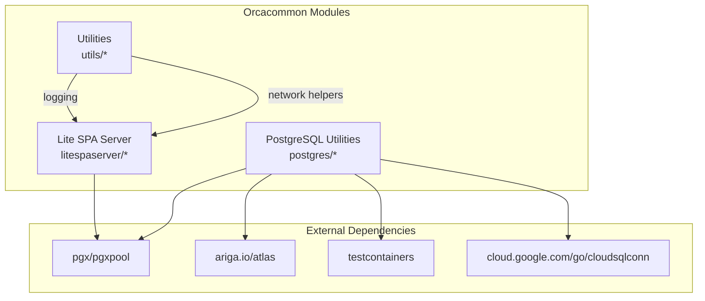
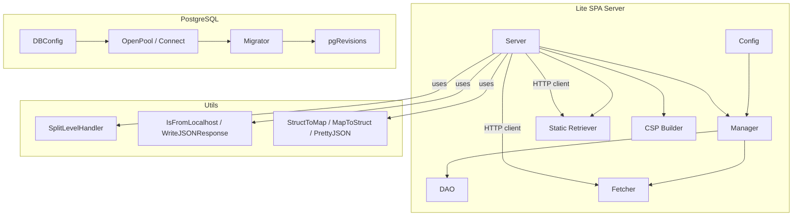
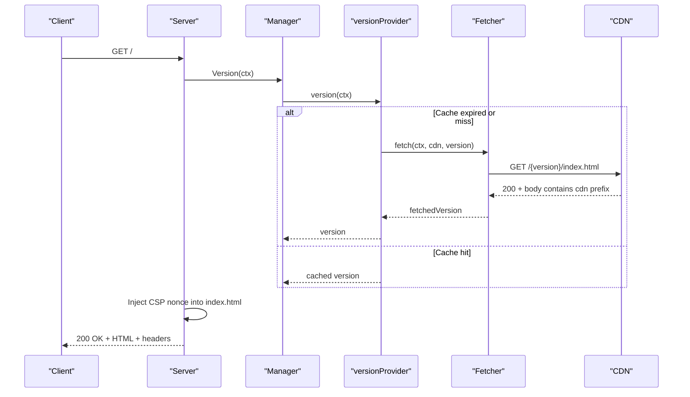
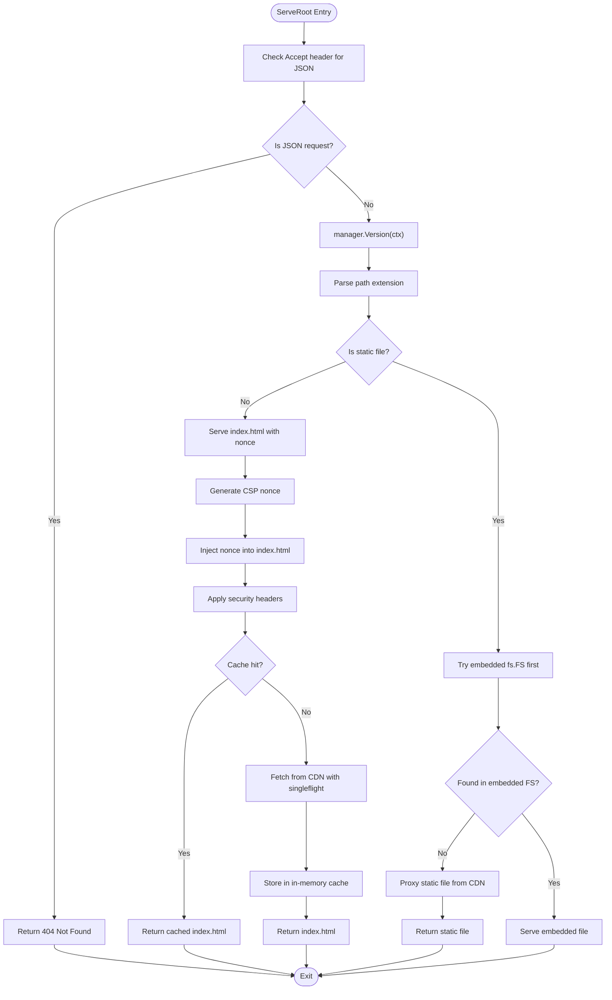
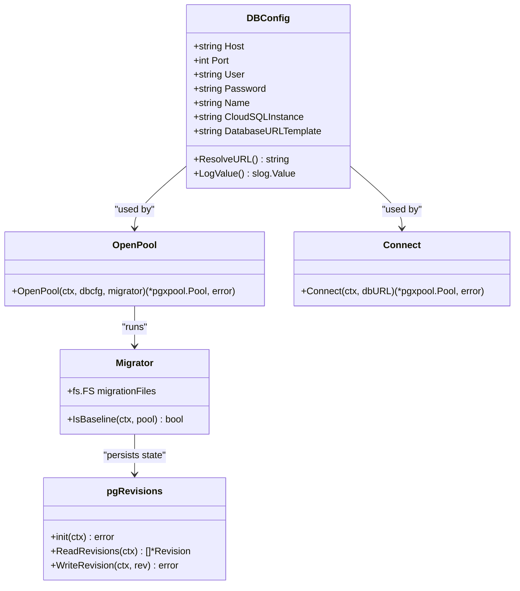
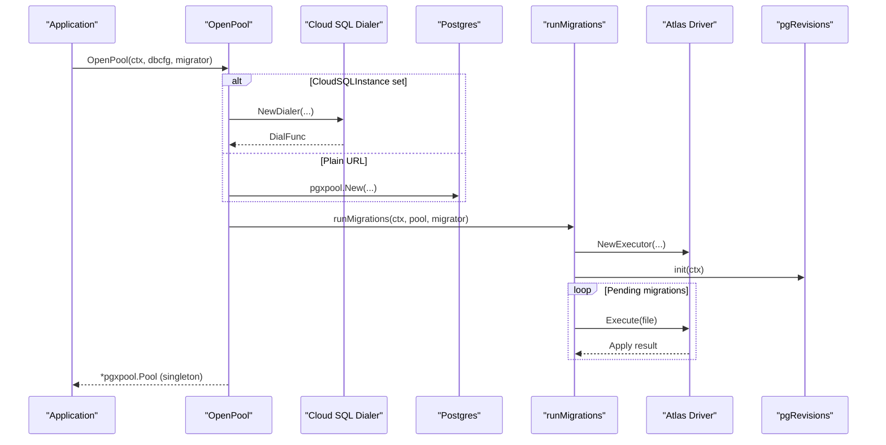
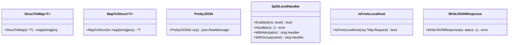
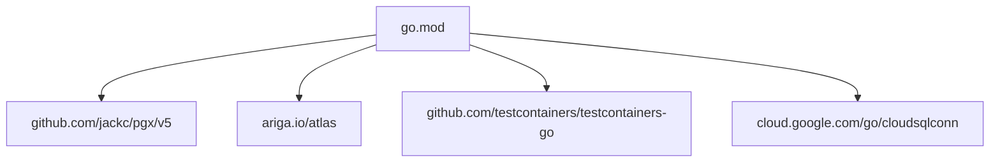

# Project Overview

<cite>
**Referenced Files in This Document**
- [go.mod](file://go.mod)
- [litespaserver.go](file://litespaserver/litespaserver.go)
- [serve.go](file://litespaserver/serve.go)
- [version.go](file://litespaserver/version.go)
- [dao.go](file://litespaserver/dao.go)
- [fetcher.go](file://litespaserver/fetcher.go)
- [static.go](file://litespaserver/static.go)
- [csp.go](file://litespaserver/csp.go)
- [dbconfig.go](file://postgres/dbconfig.go)
- [pool.go](file://postgres/pool.go)
- [migrate.go](file://postgres/migrate.go)
- [convert.go](file://utils/convert.go)
- [network.go](file://utils/network.go)
- [slog_handler.go](file://utils/slog_handler.go)
</cite>

## Table of Contents
1. [Introduction](#introduction)
2. [Project Structure](#project-structure)
3. [Core Components](#core-components)
4. [Architecture Overview](#architecture-overview)
5. [Detailed Component Analysis](#detailed-component-analysis)
6. [Dependency Analysis](#dependency-analysis)
7. [Performance Considerations](#performance-considerations)
8. [Troubleshooting Guide](#troubleshooting-guide)
9. [Conclusion](#conclusion)

## Introduction
Orcacommon is a Go-based library designed to accelerate the development of web applications by providing reusable, production-ready utilities. Its primary goal is to reduce boilerplate and complexity around three core areas: serving a CDN-hosted Single Page Application (SPA), managing PostgreSQL databases with safe migrations and connection pooling, and offering practical utility functions for common tasks. The library emphasizes modularity, environment-agnostic configuration, and robust defaults that can be tailored to your application’s needs.

Target audience:
- Backend developers building Go web services with SPA frontends
- Teams needing reliable database lifecycle management and connection handling
- Engineers who want pragmatic helpers for logging, networking, and data conversion

Key benefits:
- Reusable, tested modules that integrate cleanly with existing Go projects
- Secure defaults for SPA delivery with dynamic CSP nonces and strict headers
- Safe, concurrent-aware database operations with Atlas migrations and graceful shutdown
- Practical utilities for logging, conversions, and network checks

Use cases:
- SaaS platforms serving a frontend hosted on a CDN while maintaining centralized version control
- Microservices requiring a singleton, lazily initialized database pool with automatic migrations
- Applications needing structured logging split by severity and JSON helpers for HTTP responses

Technology stack overview:
- Go runtime and standard library
- PostgreSQL via pgx and pgxpool
- Atlas for declarative migrations
- Testcontainers for ephemeral Postgres during integration tests
- Optional Google Cloud SQL dialer for managed database connectivity

Architectural philosophy:
- Modular design: separate concerns across SPA serving, database management, and utilities
- Environment-agnostic configuration with explicit resolution at the application boundary
- Robustness: retries, singleflight collapsing, caches, and graceful shutdown
- Security-first defaults: CSP, strict headers, and nonce injection

How this library fits modern Go web development:
- Provides drop-in modules that align with Go’s “do one thing well” ethos
- Supports modern SPA architectures with CDN-hosted assets and dynamic versioning
- Offers a safe, production-grade pattern for database initialization and migrations
- Supplies lightweight, composable utilities that avoid heavy frameworks

## Project Structure
The repository is organized into three main modules plus shared utilities:
- litespaserver: A generic, environment-agnostic server for CDN-hosted SPAs with dynamic CSP nonces and version management
- postgres: Database configuration, connection pooling, migrations, and revision tracking
- utils: Logging handlers, network helpers, and generic conversion utilities
- go.mod: Declares the Go version and external dependencies



**Diagram sources**
- [go.mod:5-12](file://go.mod#L5-L12)
- [litespaserver.go:1-57](file://litespaserver/litespaserver.go#L1-L57)
- [pool.go:14-18](file://postgres/pool.go#L14-L18)
- [migrate.go:12-18](file://postgres/migrate.go#L12-L18)

**Section sources**
- [go.mod:1-96](file://go.mod#L1-L96)

## Core Components
This section introduces the three main modules and their responsibilities.

- Lite SPA Server
  - Purpose: Serve a CDN-hosted SPA with dynamic CSP nonces, strict security headers, and version-aware routing
  - Key capabilities: Dynamic index.html injection, static file proxying, embedded content support, version caching and refresh, and singleflight collapsing for CDN fetches
  - Typical usage: Mount a handler that delegates to the server’s root route; configure CDN prefix, static paths, CSP, and optional embedded content

- PostgreSQL Utilities
  - Purpose: Provide a singleton, lazily initialized connection pool, optional Cloud SQL integration, and Atlas-driven migrations
  - Key capabilities: URL parsing and templating, graceful shutdown on signals, testcontainer-based ephemeral Postgres, and advisory-lock protected migrations
  - Typical usage: Initialize a DBConfig from environment, call OpenPool with a Migrator, and use the returned pool for queries

- Utility Functions
  - Purpose: Offer common helpers for logging, networking, and data conversion
  - Key capabilities: Struct-to-map and map-to-struct conversions, pretty JSON formatting, splitting slog logs by level, and detecting localhost requests
  - Typical usage: Use conversion helpers for API payloads, write JSON responses, or route logs to stdout/stderr based on severity

**Section sources**
- [litespaserver.go:1-57](file://litespaserver/litespaserver.go#L1-L57)
- [serve.go:29-188](file://litespaserver/serve.go#L29-L188)
- [dbconfig.go:10-46](file://postgres/dbconfig.go#L10-L46)
- [pool.go:26-46](file://postgres/pool.go#L26-L46)
- [migrate.go:23-43](file://postgres/migrate.go#L23-L43)
- [convert.go:5-45](file://utils/convert.go#L5-L45)
- [network.go:10-26](file://utils/network.go#L10-L26)
- [slog_handler.go:8-41](file://utils/slog_handler.go#L8-L41)

## Architecture Overview
The library follows a modular architecture where each module encapsulates a distinct concern. The Lite SPA Server depends on the PostgreSQL utilities for version persistence and on HTTP clients for CDN access. The PostgreSQL utilities depend on Atlas for migrations and optionally on Cloud SQL dialers. The Utilities module is independent and consumed by other modules as needed.



**Diagram sources**
- [litespaserver.go:10-56](file://litespaserver/litespaserver.go#L10-L56)
- [version.go:80-120](file://litespaserver/version.go#L80-L120)
- [serve.go:29-91](file://litespaserver/serve.go#L29-L91)
- [dao.go:15-55](file://litespaserver/dao.go#L15-L55)
- [fetcher.go:12-69](file://litespaserver/fetcher.go#L12-L69)
- [static.go:17-94](file://litespaserver/static.go#L17-L94)
- [csp.go:62-90](file://litespaserver/csp.go#L62-L90)
- [dbconfig.go:10-46](file://postgres/dbconfig.go#L10-L46)
- [pool.go:26-46](file://postgres/pool.go#L26-L46)
- [migrate.go:23-43](file://postgres/migrate.go#L23-L43)
- [slog_handler.go:8-41](file://utils/slog_handler.go#L8-L41)
- [network.go:10-26](file://utils/network.go#L10-L26)
- [convert.go:5-45](file://utils/convert.go#L5-L45)

## Detailed Component Analysis

### Lite SPA Server Module
The Lite SPA Server module provides a reusable, environment-agnostic way to serve a CDN-hosted SPA. It supports:
- Dynamic CSP nonce injection into index.html
- Strict security headers and cache-control policies
- Version-aware routing with database-backed or pinned versions
- Embedded content mode for local development
- Singleflight collapsing for CDN fetches and DB reloads
- Bounded in-memory caches for index.html and static files

```mermaid
classDiagram
class Config {
+string CDNPrefix
+string CDNVersion
+[]string StaticPaths
+string DefaultVersion
+CSPConfig CSP
+fs.FS EmbeddedContent
}
class CSPConfig {
+[]string FontSrcs
+[]string ScriptSrcs
+[]string ConnectSrcs
+[]string StyleSrcs
+[]string ManifestSrcs
+bool Disable
+bool DisableAppendNonce
}
class Manager {
-string cdn
-dao dao
-fetcher fetcher
-versionProvider provider
+Version(ctx) string
+ForceRefresh(ctx) void
+SetVersion(ctx, candidate) bool
+OnChange(fn) void
}
class Server {
-string cdn
-fs.FS embedded
-CSPConfig csp
-Manager manager
-staticRetriever static
-fetcher fetcher
+NewServer(ctx, pool, cfg) *Server
+ServeRoot(w, r) void
+FlushCache() void
}
class dao {
-pgxpool.Pool pool
+getVersion(ctx) string
+setVersion(ctx, version) error
}
class fetcher {
-http.Client client
+fetch(ctx, cdn, version) (fetchedVersion, bool)
}
class staticRetriever {
-http.Client client
-map[string]struct{} allowed
+isStatic(path) bool
+retrieve(ctx, cdn, version, path) (string, error)
}
Config --> Manager : "provides"
Manager --> dao : "uses"
Manager --> fetcher : "uses"
Server --> Manager : "owns"
Server --> staticRetriever : "uses"
Server --> CSPConfig : "uses"
Server --> fetcher : "uses"
Manager --> CSPConfig : "validates"
```

**Diagram sources**
- [litespaserver.go:10-56](file://litespaserver/litespaserver.go#L10-L56)
- [version.go:80-120](file://litespaserver/version.go#L80-L120)
- [serve.go:29-91](file://litespaserver/serve.go#L29-L91)
- [dao.go:15-55](file://litespaserver/dao.go#L15-L55)
- [fetcher.go:12-69](file://litespaserver/fetcher.go#L12-L69)
- [static.go:17-94](file://litespaserver/static.go#L17-L94)
- [csp.go:62-90](file://litespaserver/csp.go#L62-L90)



**Diagram sources**
- [serve.go:96-188](file://litespaserver/serve.go#L96-L188)
- [version.go:138-146](file://litespaserver/version.go#L138-L146)
- [fetcher.go:32-69](file://litespaserver/fetcher.go#L32-L69)



**Diagram sources**
- [serve.go:96-188](file://litespaserver/serve.go#L96-L188)
- [static.go:52-94](file://litespaserver/static.go#L52-L94)
- [version.go:138-146](file://litespaserver/version.go#L138-L146)

**Section sources**
- [litespaserver.go:1-57](file://litespaserver/litespaserver.go#L1-L57)
- [serve.go:29-188](file://litespaserver/serve.go#L29-L188)
- [version.go:18-199](file://litespaserver/version.go#L18-L199)
- [dao.go:15-55](file://litespaserver/dao.go#L15-L55)
- [fetcher.go:12-69](file://litespaserver/fetcher.go#L12-L69)
- [static.go:17-117](file://litespaserver/static.go#L17-L117)
- [csp.go:62-115](file://litespaserver/csp.go#L62-L115)

### PostgreSQL Utilities Module
The PostgreSQL utilities module centralizes database configuration, connection pooling, and migrations:
- DBConfig: Reads credentials and templates from environment variables and redacts secrets in logs
- OpenPool: Singleton connection pool creation with optional Cloud SQL dialer and graceful shutdown
- Connect: Supports direct URLs and a special testcontainer prefix for ephemeral Postgres
- Migrator: Declarative migrations via Atlas with advisory locking and revision tracking



**Diagram sources**
- [dbconfig.go:10-46](file://postgres/dbconfig.go#L10-L46)
- [pool.go:26-46](file://postgres/pool.go#L26-L46)
- [pool.go:84-146](file://postgres/pool.go#L84-L146)
- [migrate.go:23-43](file://postgres/migrate.go#L23-L43)
- [migrate.go:181-314](file://postgres/migrate.go#L181-L314)



**Diagram sources**
- [pool.go:30-46](file://postgres/pool.go#L30-L46)
- [pool.go:61-82](file://postgres/pool.go#L61-L82)
- [migrate.go:49-131](file://postgres/migrate.go#L49-L131)
- [migrate.go:181-314](file://postgres/migrate.go#L181-L314)

**Section sources**
- [dbconfig.go:10-46](file://postgres/dbconfig.go#L10-L46)
- [pool.go:26-147](file://postgres/pool.go#L26-L147)
- [migrate.go:23-321](file://postgres/migrate.go#L23-L321)

### Utilities Module
The utilities module offers lightweight helpers:
- StructToMap and MapToStruct: Convert between pointers to structs and maps using JSON serialization
- PrettyJSON: Produce indented JSON for logging or diagnostics
- SplitLevelHandler: Route log records to stdout for info/warn and stderr for error/critical
- IsFromLocalhost: Detect if an HTTP request originates from localhost
- WriteJSONResponse: Helper to encode and write JSON responses with proper headers



**Diagram sources**
- [convert.go:5-45](file://utils/convert.go#L5-L45)
- [slog_handler.go:8-41](file://utils/slog_handler.go#L8-L41)
- [network.go:10-26](file://utils/network.go#L10-L26)

**Section sources**
- [convert.go:5-45](file://utils/convert.go#L5-L45)
- [network.go:10-26](file://utils/network.go#L10-L26)
- [slog_handler.go:8-41](file://utils/slog_handler.go#L8-L41)

## Dependency Analysis
External dependencies are declared in the module metadata. The Lite SPA Server relies on HTTP clients and pgx pools for CDN access and version storage. The PostgreSQL utilities rely on pgx, Atlas, Testcontainers, and optional Google Cloud SQL dialers. The Utilities module is independent and used across other modules.



**Diagram sources**
- [go.mod:5-12](file://go.mod#L5-L12)

**Section sources**
- [go.mod:1-96](file://go.mod#L1-L96)

## Performance Considerations
- Lite SPA Server
  - Uses bounded in-memory caches for index.html and static files to reduce CDN load and latency
  - Employs singleflight to collapse concurrent requests for the same version or URL
  - Applies strict cache-control headers to prevent client-side caching of dynamic content
- PostgreSQL Utilities
  - Singleton pool reduces connection overhead and simplifies lifecycle management
  - Advisory locks serialize migrations across replicas to avoid contention
  - Testcontainer support enables fast, isolated integration tests without persistent infrastructure
- Utilities
  - Efficient JSON marshaling/unmarshaling for conversions
  - Minimal allocations in logging handlers and network checks

[No sources needed since this section provides general guidance]

## Troubleshooting Guide
- Lite SPA Server
  - If index.html is not served, verify the CDN URL and that the response body contains the expected CDN prefix; the server rejects responses that do not match expectations
  - If static files fail to proxy, check the CDN availability and ensure the requested path is in the allow-list
  - For embedded mode, confirm that the fs.FS contains index.html at the root; otherwise, the server logs a warning and falls back to CDN mode
- PostgreSQL Utilities
  - If migrations fail, check the advisory lock acquisition and review Atlas logs for the failing migration
  - For Cloud SQL, ensure the dialer is initialized and the instance connection string is correct
  - When using testcontainer URLs, verify the image tag and that the container is reachable
- Utilities
  - For logging, ensure the SplitLevelHandler is configured to route errors to stderr and info/warn to stdout
  - For JSON responses, confirm the content-type header is set to application/json

**Section sources**
- [serve.go:122-127](file://litespaserver/serve.go#L122-L127)
- [serve.go:149-158](file://litespaserver/serve.go#L149-L158)
- [fetcher.go:32-69](file://litespaserver/fetcher.go#L32-L69)
- [pool.go:61-82](file://postgres/pool.go#L61-L82)
- [migrate.go:155-179](file://postgres/migrate.go#L155-L179)
- [slog_handler.go:8-41](file://utils/slog_handler.go#L8-L41)

## Conclusion
Orcacommon delivers a focused set of reusable modules for Go web applications:
- Lite SPA Server streamlines serving CDN-hosted SPAs with strong security defaults and flexible versioning
- PostgreSQL Utilities provides a robust, production-grade foundation for database connectivity and migrations
- Utilities offer practical helpers that keep your application lean and consistent

Together, these modules embody a modular, environment-agnostic design that integrates cleanly with modern Go web stacks, enabling teams to move faster while maintaining reliability and security.

[No sources needed since this section summarizes without analyzing specific files]