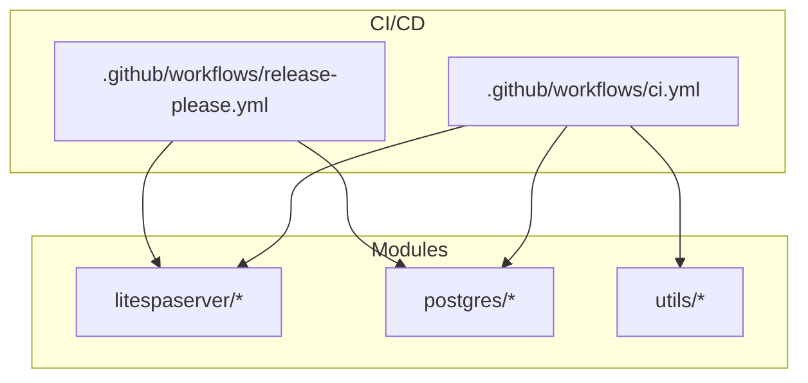
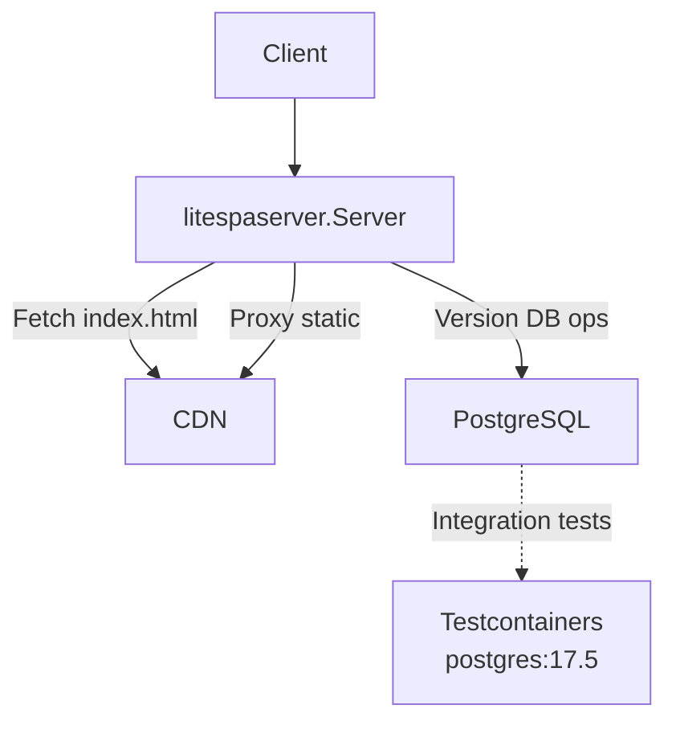
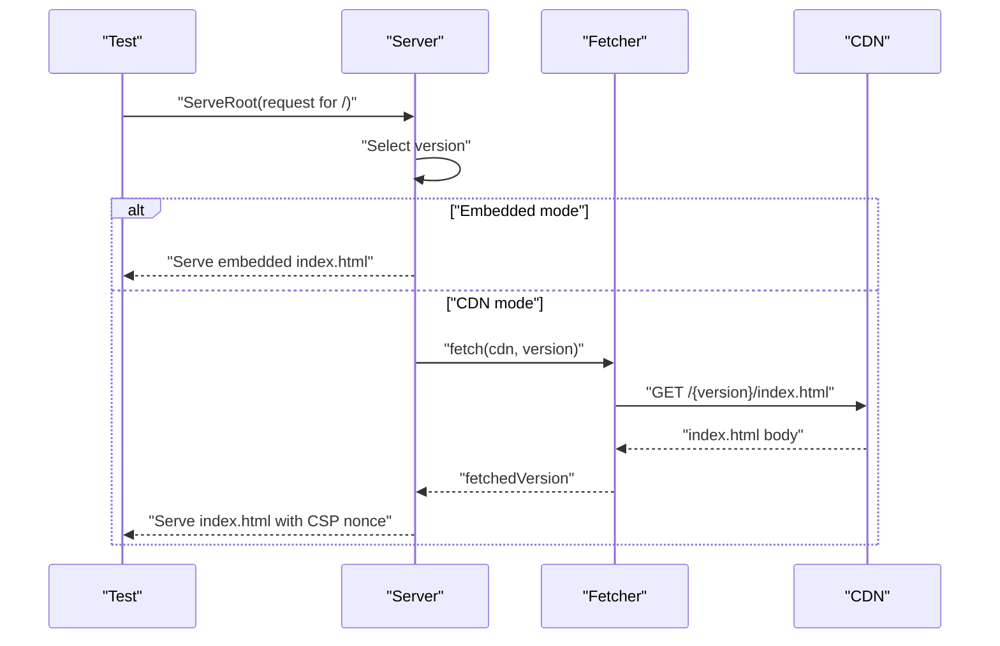
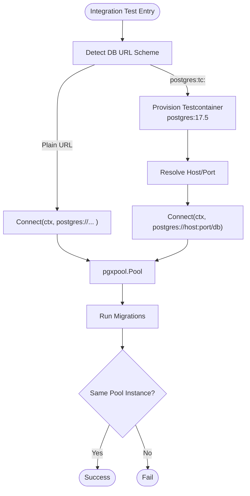
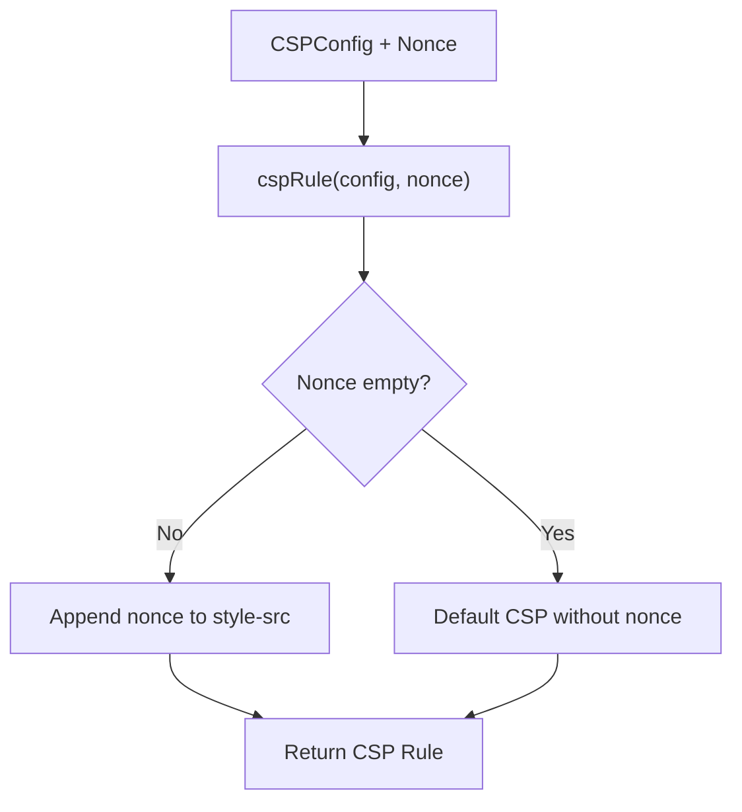
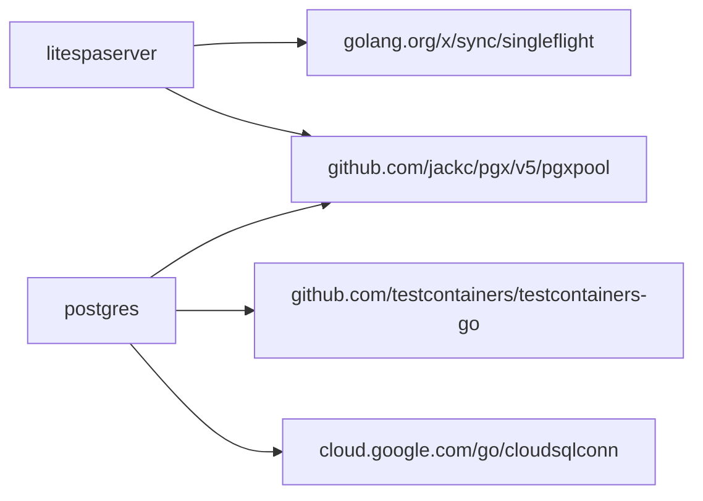
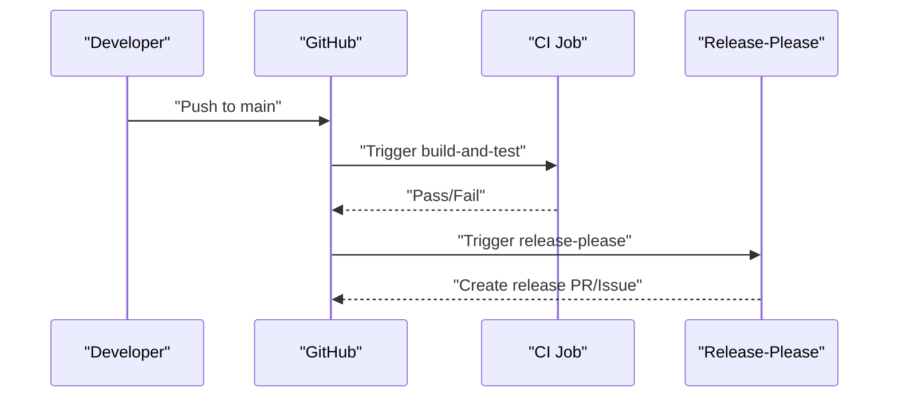

# Testing and Deployment

<cite>
**Referenced Files in This Document**
- [ci.yml](file://.github/workflows/ci.yml)
- [release-please.yml](file://.github/workflows/release-please.yml)
- [litespaserver.go](file://litespaserver/litespaserver.go)
- [serve.go](file://litespaserver/serve.go)
- [fetcher.go](file://litespaserver/fetcher.go)
- [static.go](file://litespaserver/static.go)
- [csp_test.go](file://litespaserver/csp_test.go)
- [serve_test.go](file://litespaserver/serve_test.go)
- [static_test.go](file://litespaserver/static_test.go)
- [fetcher_test.go](file://litespaserver/fetcher_test.go)
- [dbconfig.go](file://postgres/dbconfig.go)
- [pool.go](file://postgres/pool.go)
- [pool_test.go](file://postgres/pool_test.go)
- [index.html](file://litespaserver/testdata/embed/index.html)
- [unsubscribed.html](file://litespaserver/testdata/embed/unsubscribed.html)
- [atlas.sum](file://postgres/testdata/migrations/atlas.sum)
</cite>

## Table of Contents
1. [Introduction](#introduction)
2. [Project Structure](#project-structure)
3. [Core Components](#core-components)
4. [Architecture Overview](#architecture-overview)
5. [Detailed Component Analysis](#detailed-component-analysis)
6. [Dependency Analysis](#dependency-analysis)
7. [Performance Considerations](#performance-considerations)
8. [Troubleshooting Guide](#troubleshooting-guide)
9. [Conclusion](#conclusion)
10. [Appendices](#appendices)

## Introduction
This document describes the testing strategies and deployment procedures for Orcacommon. It covers:
- CI/CD pipeline configuration using GitHub Actions
- Unit testing approaches and integration testing patterns
- Module-specific testing methodologies, mocks, and test environments
- Deployment strategies, environment configuration management, and production readiness checks
- Continuous integration workflows, automated testing, release processes, and monitoring considerations

## Project Structure
Orcacommon is organized into focused modules:
- litespaserver: A CDN-backed SPA server with caching, CSP injection, and embedded content support
- postgres: Database configuration, connection pooling, migrations, and testcontainer-based integration tests
- utils: Shared utilities (not covered in depth here)
- .github/workflows: CI and release automation

**Diagram sources**
- [ci.yml](file://.github/workflows/ci.yml)
- [release-please.yml](file://.github/workflows/release-please.yml)

**Section sources**
- [ci.yml](file://.github/workflows/ci.yml)
- [release-please.yml](file://.github/workflows/release-please.yml)

## Core Components
- litespaserver: Provides a configurable SPA server with CDN fetch, embedded content, caching, and CSP enforcement
- postgres: Offers DB configuration via environment variables, connection pooling, optional Cloud SQL, and migration execution; includes integration tests using Testcontainers

Key responsibilities:
- litespaserver: Serve index.html with per-request CSP nonce, proxy static files, cache responses, and handle fallbacks
- postgres: Manage DB connections, migrations, and environment-driven configuration

**Section sources**
- [litespaserver.go](file://litespaserver/litespaserver.go)
- [serve.go](file://litespaserver/serve.go)
- [dbconfig.go](file://postgres/dbconfig.go)
- [pool.go](file://postgres/pool.go)

## Architecture Overview
The system integrates a lightweight SPA server with a PostgreSQL backend. The SPA server can operate in two modes:
- CDN-backed: Fetches index.html and static assets from a CDN
- Embedded: Serves content directly from an embedded filesystem for local development

Database connectivity supports:
- Plain Postgres connections
- Testcontainer-managed Postgres for integration tests
- Optional Google Cloud SQL dialer for managed instances

**Diagram sources**
- [serve.go](file://litespaserver/serve.go)
- [pool.go](file://postgres/pool.go)

## Detailed Component Analysis

### litespaserver: Unit and Integration Tests
Testing approach:
- Unit tests use httptest servers to simulate CDN responses and embedded filesystems
- Mocks are implemented via small helper constructors and static providers
- Embedded testdata is used to validate embedded mode behavior
- Singleflight and caching behavior are validated under concurrency

Key test categories:
- Fetcher correctness and failure modes (non-2xx, missing CDN prefix)
- CSP rule generation and nonce injection
- Static file retrieval and caching
- ServeRoot behavior for JSON, index.html, static files, and fallbacks
- Embedded filesystem mode and mixed embedded/static fallbacks
- Concurrency collapsing via singleflight

**Diagram sources**
- [serve.go](file://litespaserver/serve.go)
- [fetcher.go](file://litespaserver/fetcher.go)

**Section sources**
- [serve_test.go](file://litespaserver/serve_test.go)
- [fetcher_test.go](file://litespaserver/fetcher_test.go)
- [static_test.go](file://litespaserver/static_test.go)
- [csp_test.go](file://litespaserver/csp_test.go)
- [index.html](file://litespaserver/testdata/embed/index.html)
- [unsubscribed.html](file://litespaserver/testdata/embed/unsubscribed.html)

### postgres: Integration Tests with Testcontainers
Testing approach:
- Integration tests are gated by a build tag to isolate them from regular unit tests
- Uses Testcontainers to spin up a Postgres container for real DB connectivity
- Supports both plain postgres URLs and a special postgres:tc: scheme that auto-provisions a container
- Validates migrations are executed during pool creation and that the pool is a singleton

**Diagram sources**
- [pool.go](file://postgres/pool.go)
- [pool_test.go](file://postgres/pool_test.go)

**Section sources**
- [pool_test.go](file://postgres/pool_test.go)
- [pool.go](file://postgres/pool.go)
- [dbconfig.go](file://postgres/dbconfig.go)
- [atlas.sum](file://postgres/testdata/migrations/atlas.sum)

### CSP and Nonce Generation
Validation focuses on:
- Correct construction of CSP rules with optional nonce
- Nonce generation length and character set
- Injecting nonces into index.html while avoiding unintended replacements

**Diagram sources**
- [serve.go](file://litespaserver/serve.go)
- [csp_test.go](file://litespaserver/csp_test.go)

**Section sources**
- [csp_test.go](file://litespaserver/csp_test.go)
- [serve.go](file://litespaserver/serve.go)

## Dependency Analysis
- litespaserver depends on:
  - net/http for HTTP operations
  - golang.org/x/sync/singleflight for collapsing concurrent requests
  - pgxpool for optional DB-backed version management
- postgres depends on:
  - github.com/testcontainers/testcontainers-go for integration tests
  - cloud.google.com/go/cloudsqlconn for optional Cloud SQL dialing
  - pgx/v5 for connection pooling and migrations

**Diagram sources**
- [serve.go](file://litespaserver/serve.go)
- [pool.go](file://postgres/pool.go)

**Section sources**
- [serve.go](file://litespaserver/serve.go)
- [pool.go](file://postgres/pool.go)

## Performance Considerations
- Singleflight usage prevents thundering herds on CDN fetches and static file retrievals
- In-memory caches bound by capacity limits reduce redundant upstream calls
- Per-request CSP nonce generation is lightweight and deterministic
- Connection pooling and optional Cloud SQL dialer optimize DB connectivity

[No sources needed since this section provides general guidance]

## Troubleshooting Guide
Common issues and remedies:
- CDN fetch failures
  - Symptom: Fallback body served with plain text content type
  - Action: Verify CDN URL, version, and network connectivity; check logs for warnings
- Missing index.html in embedded mode
  - Symptom: Warning logged and fallback to CDN mode
  - Action: Ensure embedded fs.FS contains index.html at root; use fs.Sub to re-root
- Non-2xx responses from CDN
  - Symptom: Static file retrieval returns error; index.html fallback triggered
  - Action: Confirm CDN availability and response codes
- Testcontainer lifecycle
  - Symptom: Containers persist or Ryuk cleanup fails
  - Action: Disable Ryuk in restricted environments; ensure pool.Close() terminates containers
- Database migrations not applied
  - Symptom: Missing schema tables after OpenPool
  - Action: Verify migration files and migrator initialization

**Section sources**
- [serve_test.go](file://litespaserver/serve_test.go)
- [serve.go](file://litespaserver/serve.go)
- [pool_test.go](file://postgres/pool_test.go)
- [pool.go](file://postgres/pool.go)

## Conclusion
Orcacommon employs a pragmatic testing strategy:
- Unit tests for litespaserver validate HTTP behavior, CSP, caching, and embedded mode using httptest and embedded filesystems
- Integration tests for postgres leverage Testcontainers to validate real DB connectivity and migrations
- CI/CD automates building and testing across pushes, with release-please managing releases

Production readiness hinges on:
- Robust error handling and fallbacks
- Environment-driven configuration for databases
- Clear separation between unit and integration tests
- Observability and logging for diagnosing CDN and DB issues

[No sources needed since this section summarizes without analyzing specific files]

## Appendices

### CI/CD Pipeline Configuration
- CI workflow
  - Runs on pushes excluding release branches
  - Sets up Go, builds the project, and executes unit tests
- Release workflow
  - Automatically creates releases on pushes to main using release-please

**Diagram sources**
- [ci.yml](file://.github/workflows/ci.yml)
- [release-please.yml](file://.github/workflows/release-please.yml)

**Section sources**
- [ci.yml](file://.github/workflows/ci.yml)
- [release-please.yml](file://.github/workflows/release-please.yml)

### Environment Configuration Management
- Database configuration is loaded from environment variables with a DB_ prefix
- URL template expansion supports placeholder substitution
- Logging redacts sensitive fields

**Section sources**
- [dbconfig.go](file://postgres/dbconfig.go)

### Deployment Strategies
- Build and test are automated in CI
- Release artifacts are produced by release-please
- No explicit deployment scripts are present; adopters can integrate with their preferred platform using the built binaries and release artifacts

**Section sources**
- [ci.yml](file://.github/workflows/ci.yml)
- [release-please.yml](file://.github/workflows/release-please.yml)

### Monitoring Setup
- Logging uses structured slog entries for database configuration and runtime events
- Add application metrics and health endpoints as needed for production observability

**Section sources**
- [dbconfig.go](file://postgres/dbconfig.go)
- [serve.go](file://litespaserver/serve.go)