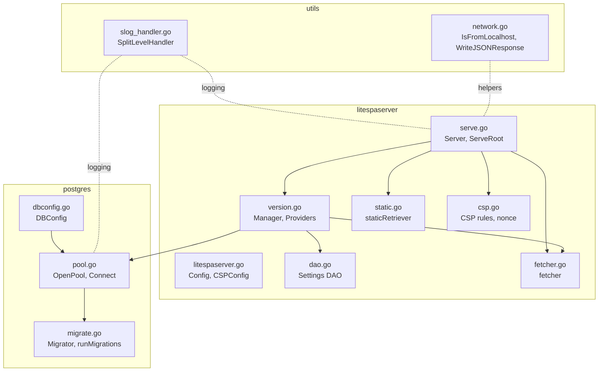
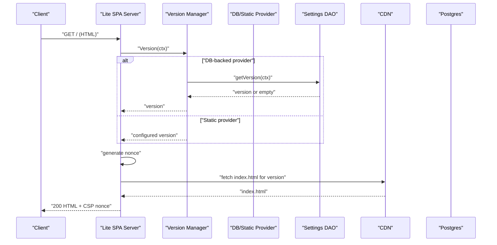
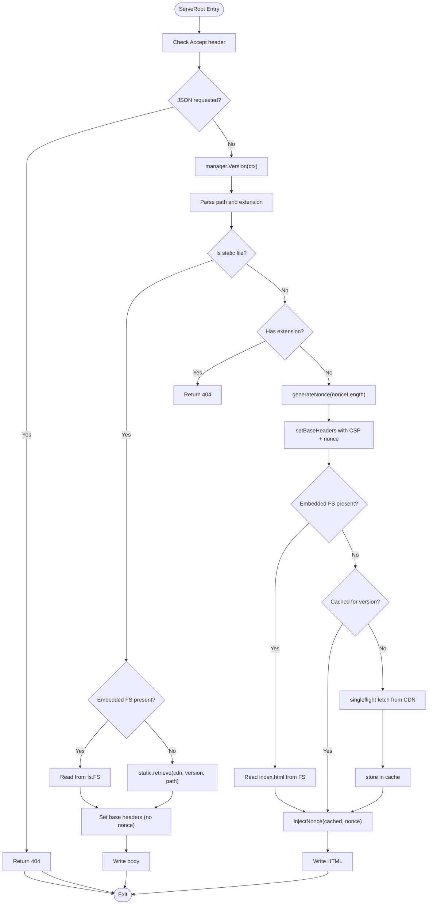
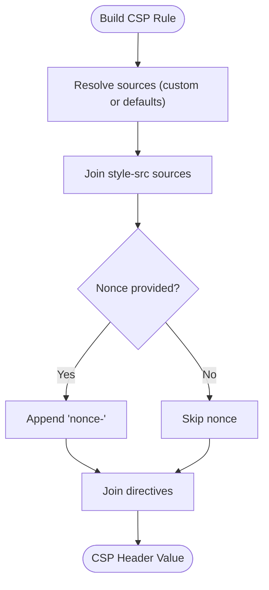
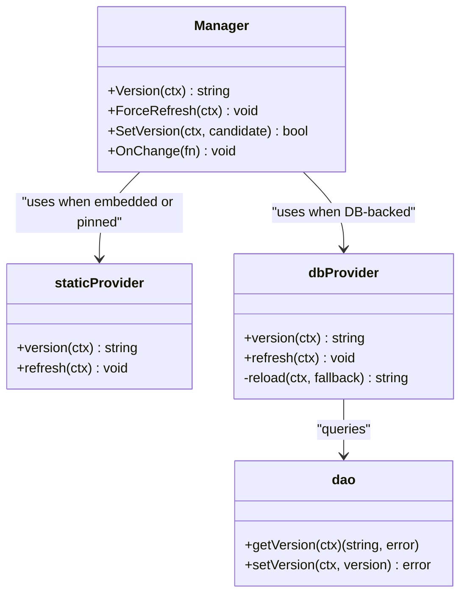
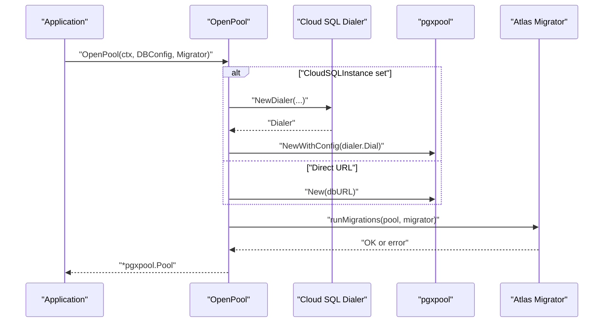
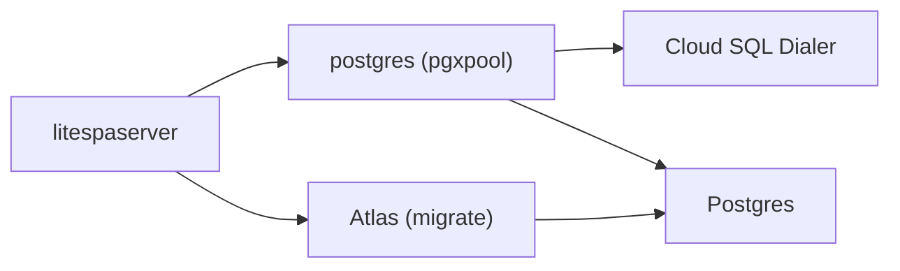

# Troubleshooting and FAQ

<cite>
**Referenced Files in This Document**
- [go.mod](file://go.mod)
- [litespaserver.go](file://litespaserver/litespaserver.go)
- [csp.go](file://litespaserver/csp.go)
- [serve.go](file://litespaserver/serve.go)
- [version.go](file://litespaserver/version.go)
- [dao.go](file://litespaserver/dao.go)
- [static.go](file://litespaserver/static.go)
- [fetcher.go](file://litespaserver/fetcher.go)
- [dbconfig.go](file://postgres/dbconfig.go)
- [pool.go](file://postgres/pool.go)
- [migrate.go](file://postgres/migrate.go)
- [network.go](file://utils/network.go)
- [slog_handler.go](file://utils/slog_handler.go)
- [serve_test.go](file://litespaserver/serve_test.go)
- [pool_test.go](file://postgres/pool_test.go)
</cite>

## Table of Contents
1. [Introduction](#introduction)
2. [Project Structure](#project-structure)
3. [Core Components](#core-components)
4. [Architecture Overview](#architecture-overview)
5. [Detailed Component Analysis](#detailed-component-analysis)
6. [Dependency Analysis](#dependency-analysis)
7. [Performance Considerations](#performance-considerations)
8. [Troubleshooting Guide](#troubleshooting-guide)
9. [Conclusion](#conclusion)
10. [Appendices](#appendices)

## Introduction
This document provides comprehensive troubleshooting guidance and frequently asked questions for Orcacommon. It focuses on diagnosing and resolving common issues during setup, configuration, and operation of the library’s components, including:
- Lite SPA server: CDN-hosted SPA serving, CSP configuration, static file proxying, and embedded content modes
- Postgres database: connection configuration, migrations, and pool lifecycle
- Utilities: structured logging and network helpers

It also covers debugging techniques, logging strategies, performance optimization tips, environment-specific pitfalls, dependency conflicts, and integration problems, with step-by-step troubleshooting guides and preventive measures.

## Project Structure
Orcacommon is organized into focused packages:
- litespaserver: CDN-hosted SPA serving, CSP, version management, static retrieval, and fetcher
- postgres: database configuration, connection pooling, migrations, and revision tracking
- utils: logging handler and network helpers

**Diagram sources**
- [litespaserver.go:10-57](file://litespaserver/litespaserver.go#L10-L57)
- [serve.go:29-228](file://litespaserver/serve.go#L29-L228)
- [version.go:80-199](file://litespaserver/version.go#L80-L199)
- [dao.go:15-56](file://litespaserver/dao.go#L15-L56)
- [static.go:17-117](file://litespaserver/static.go#L17-L117)
- [fetcher.go:12-70](file://litespaserver/fetcher.go#L12-L70)
- [csp.go:62-115](file://litespaserver/csp.go#L62-L115)
- [dbconfig.go:10-47](file://postgres/dbconfig.go#L10-L47)
- [pool.go:26-147](file://postgres/pool.go#L26-L147)
- [migrate.go:23-131](file://postgres/migrate.go#L23-L131)
- [slog_handler.go:8-42](file://utils/slog_handler.go#L8-L42)
- [network.go:10-27](file://utils/network.go#L10-L27)

**Section sources**
- [litespaserver.go:10-57](file://litespaserver/litespaserver.go#L10-L57)
- [serve.go:29-228](file://litespaserver/serve.go#L29-L228)
- [version.go:80-199](file://litespaserver/version.go#L80-L199)
- [dao.go:15-56](file://litespaserver/dao.go#L15-L56)
- [static.go:17-117](file://litespaserver/static.go#L17-L117)
- [fetcher.go:12-70](file://litespaserver/fetcher.go#L12-L70)
- [csp.go:62-115](file://litespaserver/csp.go#L62-L115)
- [dbconfig.go:10-47](file://postgres/dbconfig.go#L10-L47)
- [pool.go:26-147](file://postgres/pool.go#L26-L147)
- [migrate.go:23-131](file://postgres/migrate.go#L23-L131)
- [slog_handler.go:8-42](file://utils/slog_handler.go#L8-L42)
- [network.go:10-27](file://utils/network.go#L10-L27)

## Core Components
- Lite SPA Server: Serves index.html with per-request CSP nonce, proxies static files from CDN, supports embedded content mode, and caches index.html per version.
- Version Manager: Resolves live frontend version from database or configuration, with TTL caching and singleflight collapsing for reloads.
- Postgres Pool: Singleton connection pool with graceful shutdown, optional Cloud SQL dialer, and automatic Testcontainer provisioning for URLs prefixed with a special scheme.
- Migrations: Atlas-based migrations with advisory locking, baseline support, and revision tracking in a dedicated table.
- Utilities: Structured logging split between stdout/stderr and helpers for localhost checks and JSON responses.

**Section sources**
- [serve.go:29-228](file://litespaserver/serve.go#L29-L228)
- [version.go:80-199](file://litespaserver/version.go#L80-L199)
- [pool.go:26-147](file://postgres/pool.go#L26-L147)
- [migrate.go:23-131](file://postgres/migrate.go#L23-L131)
- [slog_handler.go:8-42](file://utils/slog_handler.go#L8-L42)
- [network.go:10-27](file://utils/network.go#L10-L27)

## Architecture Overview
The Lite SPA server orchestrates version resolution, CSP header generation, and content delivery. Database connectivity is handled by the Postgres package, which manages migrations and pool lifecycle.

**Diagram sources**
- [serve.go:93-188](file://litespaserver/serve.go#L93-L188)
- [version.go:138-146](file://litespaserver/version.go#L138-L146)
- [dao.go:28-43](file://litespaserver/dao.go#L28-L43)

## Detailed Component Analysis

### Lite SPA Server: Serving, CSP, and Caching
- Serving logic distinguishes JSON requests (404), static files (proxy from CDN or embedded FS), and index.html (per-request CSP nonce injection).
- Index.html caching is per-version with eviction when capacity is reached.
- Singleflight collapses concurrent fetches for the same version to reduce CDN load.
- Embedded content mode serves index.html and static files directly from an fs.FS; missing index.html disables embedded mode with a warning.

**Diagram sources**
- [serve.go:93-188](file://litespaserver/serve.go#L93-L188)
- [static.go:52-95](file://litespaserver/static.go#L52-L95)
- [version.go:167-176](file://litespaserver/version.go#L167-L176)

**Section sources**
- [serve.go:93-188](file://litespaserver/serve.go#L93-L188)
- [static.go:17-117](file://litespaserver/static.go#L17-L117)
- [version.go:167-176](file://litespaserver/version.go#L167-L176)

### CSP Configuration and Nonce Generation
- CSP rules are built from configurable sources with sensible defaults. A per-request nonce is appended to style-src unless disabled.
- Nonce generation uses crypto/rand and must succeed; failures return 500.

**Diagram sources**
- [csp.go:62-90](file://litespaserver/csp.go#L62-L90)
- [serve.go:190-202](file://litespaserver/serve.go#L190-L202)

**Section sources**
- [csp.go:62-115](file://litespaserver/csp.go#L62-L115)
- [serve.go:190-202](file://litespaserver/serve.go#L190-L202)

### Version Management and Settings DAO
- Manager selects provider based on configuration: embedded, pinned CDN version, or DB-backed with TTL cache.
- DAO reads/writes the frontend version key in litespa_settings; missing rows return empty string.
- Validation ensures candidate versions are fetchable from CDN before persistence.

**Diagram sources**
- [version.go:80-199](file://litespaserver/version.go#L80-L199)
- [dao.go:15-56](file://litespaserver/dao.go#L15-L56)

**Section sources**
- [version.go:80-199](file://litespaserver/version.go#L80-L199)
- [dao.go:15-56](file://litespaserver/dao.go#L15-L56)

### Postgres Pool and Migrations
- OpenPool initializes a singleton pool, optionally via Cloud SQL dialer, runs migrations, and registers graceful shutdown.
- Connect supports a special URL scheme to spawn a Testcontainer automatically for local testing.
- Migrations use Atlas with advisory locking and a dedicated revision table.

**Diagram sources**
- [pool.go:30-82](file://postgres/pool.go#L30-L82)
- [migrate.go:49-131](file://postgres/migrate.go#L49-L131)

**Section sources**
- [pool.go:26-147](file://postgres/pool.go#L26-L147)
- [migrate.go:23-131](file://postgres/migrate.go#L23-L131)

## Dependency Analysis
External dependencies relevant to troubleshooting:
- Cloud SQL: used when a Cloud SQL instance is configured; dialer creation and connection errors surface during pool initialization.
- Atlas migrations: require a working Postgres connection and proper migration files; advisory lock acquisition timeouts indicate contention or connectivity issues.
- Testcontainers: used for local DB provisioning; failures often relate to Docker availability or environment constraints.

**Diagram sources**
- [pool.go:14-17](file://postgres/pool.go#L14-L17)
- [migrate.go:12-18](file://postgres/migrate.go#L12-L18)
- [go.mod:5-11](file://go.mod#L5-L11)

**Section sources**
- [go.mod:5-11](file://go.mod#L5-L11)
- [pool.go:14-17](file://postgres/pool.go#L14-L17)
- [migrate.go:12-18](file://postgres/migrate.go#L12-L18)

## Performance Considerations
- Lite SPA server:
  - Index.html caching per version reduces CDN fetches; tune cache capacity if memory pressure occurs.
  - Singleflight collapses concurrent fetches for the same version; ensure version stability to maximize benefit.
  - Static file caching is bounded; monitor logs for frequent cache misses indicating dynamic paths or frequent version churn.
- Postgres:
  - Advisory lock waits can indicate concurrent replica migrations; ensure only one replica runs migrations at a time.
  - Pool reuse avoids connection overhead; avoid creating multiple pools unnecessarily.
  - Testcontainers auto-provisioning is convenient for local testing but adds startup latency.

[No sources needed since this section provides general guidance]

## Troubleshooting Guide

### Setup and Configuration Issues
- Lite SPA server not serving index.html:
  - Verify Accept header is not application/json; otherwise the route returns 404.
  - Confirm CDN prefix and version configuration; embedded mode requires index.html at the root of the fs.FS.
  - Check that the version is resolvable; embedded mode disables DB queries.
  - Review logs for warnings about missing index.html in embedded mode.

- CSP header missing or incorrect:
  - Ensure CSP is not disabled and nonce append is enabled; per-request nonce is required for style-src.
  - Validate custom CSP sources if overridden; defaults target known CDNs and Google services.

- Static files not found:
  - Confirm the path is in the static allow-list; non-allow-list paths return 404.
  - For embedded mode, ensure the file exists in the fs.FS; missing files fall back to CDN if configured.

- Database not initialized:
  - Ensure migrations ran successfully; the atlas schema revisions table must exist.
  - Check advisory lock acquisition; timeouts suggest contention or connectivity issues.

**Section sources**
- [serve.go:93-136](file://litespaserver/serve.go#L93-L136)
- [serve.go:190-202](file://litespaserver/serve.go#L190-L202)
- [version.go:105-120](file://litespaserver/version.go#L105-L120)
- [dao.go:28-43](file://litespaserver/dao.go#L28-L43)
- [migrate.go:155-179](file://postgres/migrate.go#L155-L179)

### Connection Problems
- Postgres connection fails:
  - For direct URLs, verify credentials, host, port, and database name; ensure SSL mode matches environment.
  - For Cloud SQL, confirm the instance connection string and that the dialer can establish a secure connection.
  - When using the special URL scheme for local testing, ensure Docker is available and Testcontainers can start the container.

- Pool lifecycle:
  - SIGTERM/SIGINT triggers graceful shutdown; ensure your process handles signals properly.
  - Avoid calling pool.Close() prematurely; rely on graceful shutdown for production.

**Section sources**
- [pool.go:84-146](file://postgres/pool.go#L84-L146)
- [pool.go:48-59](file://postgres/pool.go#L48-L59)

### CSP Configuration Issues
- Nonce generation fails:
  - Crypto randomness must be available; failures return 500. Investigate OS entropy and runtime environment.

- CSP validation:
  - The server validates that fetched index.html contains the CDN prefix; mismatches are rejected to avoid serving error pages.
  - Custom CSP sources must be explicitly set; defaults target known origins.

**Section sources**
- [serve.go:138-144](file://litespaserver/serve.go#L138-L144)
- [fetcher.go:32-69](file://litespaserver/fetcher.go#L32-L69)
- [csp.go:62-90](file://litespaserver/csp.go#L62-L90)

### Static File Serving Problems
- Embedded mode not serving static files:
  - Ensure fs.FS contains the requested file; missing files fall back to CDN if configured.
  - Confirm the allow-list includes the path; otherwise 404 is returned.

- CDN static file fetch failures:
  - Non-2xx responses trigger a 502; inspect logs for upstream status and URL.
  - Consider increasing retries or caching strategies at the CDN layer.

**Section sources**
- [serve.go:109-131](file://litespaserver/serve.go#L109-L131)
- [static.go:52-95](file://litespaserver/static.go#L52-L95)

### Database Connectivity Challenges
- Migration failures:
  - Advisory lock acquisition timeout indicates contention; ensure only one replica runs migrations.
  - Check that migration files are embedded and readable; errors during listing or writing revisions will abort migration.

- Version table issues:
  - litespa_settings must exist before DAO operations; missing table leads to errors when reading or writing the version.

**Section sources**
- [migrate.go:155-179](file://postgres/migrate.go#L155-L179)
- [dao.go:15-56](file://litespaserver/dao.go#L15-L56)

### Debugging Techniques and Logging Strategies
- Use structured logging handlers to separate info/warn from errors; errors are routed to stderr for better observability.
- Enable verbose logs around CDN fetches, static retrievals, and database operations to trace failures.
- For Lite SPA server, watch for warnings about upstream failures and cache hits/misses.

**Section sources**
- [slog_handler.go:8-42](file://utils/slog_handler.go#L8-L42)
- [serve.go:122-127](file://litespaserver/serve.go#L122-L127)
- [static.go:83-86](file://litespaserver/static.go#L83-L86)

### Environment-Specific Issues
- Local development:
  - Use embedded content mode for fast iteration; ensure fs.FS contains index.html.
  - For local Postgres, use the special URL scheme to spin up a Testcontainer automatically.

- Production:
  - Prefer Cloud SQL dialer for managed connectivity; ensure IAM permissions and network access.
  - Run migrations once per deployment; avoid concurrent replicas running migrations.

**Section sources**
- [serve.go:61-75](file://litespaserver/serve.go#L61-L75)
- [pool.go:89-138](file://postgres/pool.go#L89-L138)

### Dependency Conflicts and Integration Problems
- Atlas and pgx versions:
  - Ensure compatibility between Atlas drivers and pgx versions; mismatched versions can cause schema execution errors.

- Testcontainers and Docker:
  - Air-gapped environments may require disabling container reaping or pre-pulling images.
  - Container startup depends on Docker availability; failures are surfaced during Connect.

**Section sources**
- [go.mod:5-11](file://go.mod#L5-L11)
- [pool_test.go:32-36](file://postgres/pool_test.go#L32-L36)

### Step-by-Step Troubleshooting Guides

#### Lite SPA Server: “Index.html not loading”
1. Verify Accept header is not application/json.
2. Confirm CDN prefix and version; check embedded mode requirements.
3. Inspect CSP header presence and nonce inclusion.
4. Check logs for upstream fetch failures or cache misses.
5. Validate that index.html contains the CDN prefix when fetched.

**Section sources**
- [serve.go:93-188](file://litespaserver/serve.go#L93-L188)
- [fetcher.go:32-69](file://litespaserver/fetcher.go#L32-L69)

#### Lite SPA Server: “Static file 502”
1. Confirm the path is in the static allow-list.
2. Check CDN availability and response codes.
3. Review logs for upstream errors and URLs.
4. Consider embedded mode fallback if applicable.

**Section sources**
- [serve.go:109-131](file://litespaserver/serve.go#L109-L131)
- [static.go:83-86](file://litespaserver/static.go#L83-L86)

#### Postgres: “Migration lock timeout”
1. Ensure only one replica runs migrations concurrently.
2. Check Postgres connectivity and credentials.
3. Verify migration files are embedded and readable.
4. Review advisory lock acquisition logs.

**Section sources**
- [migrate.go:155-179](file://postgres/migrate.go#L155-L179)

#### Postgres: “Connection refused”
1. Validate DBConfig fields and URL template.
2. For Cloud SQL, confirm instance connection string and IAM permissions.
3. For local testing, ensure Docker is available and Testcontainers can start the container.

**Section sources**
- [dbconfig.go:10-47](file://postgres/dbconfig.go#L10-L47)
- [pool.go:84-146](file://postgres/pool.go#L84-L146)

### Preventive Measures
- Pin CDN versions in staging/production to avoid unexpected rollouts.
- Monitor CSP rule changes and nonce generation health.
- Keep migration files organized and validated before deployments.
- Use embedded content mode for local development to reduce external dependencies.

[No sources needed since this section provides general guidance]

## Conclusion
This guide consolidates practical troubleshooting steps and FAQs for Orcacommon’s Lite SPA server and Postgres components. By understanding the serving pipeline, CSP mechanics, database connectivity, and logging behavior, teams can quickly diagnose and resolve common issues while adopting preventive measures for robust operation across environments.

[No sources needed since this section summarizes without analyzing specific files]

## Appendices

### Quick Reference: Common Symptoms and Actions
- Symptom: “Index.html returns 500” → Check nonce generation and CSP header; review embedded mode requirements.
- Symptom: “Static file returns 502” → Inspect CDN status and logs; verify allow-list membership.
- Symptom: “Migrations stuck” → Check advisory lock acquisition; ensure single replica runs migrations.
- Symptom: “Connection fails” → Validate DBConfig and URL; for Cloud SQL, verify dialer and instance settings.

[No sources needed since this section provides general guidance]