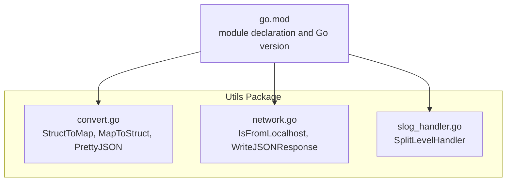
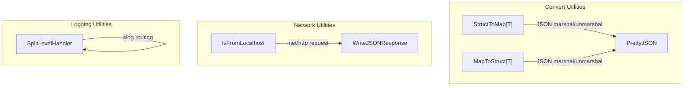
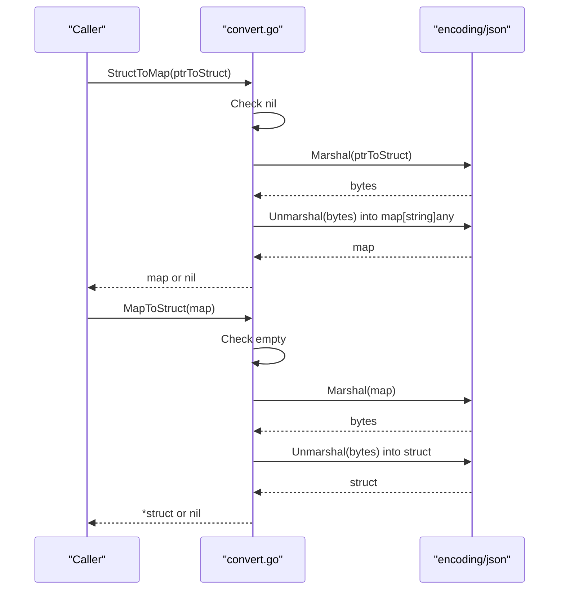
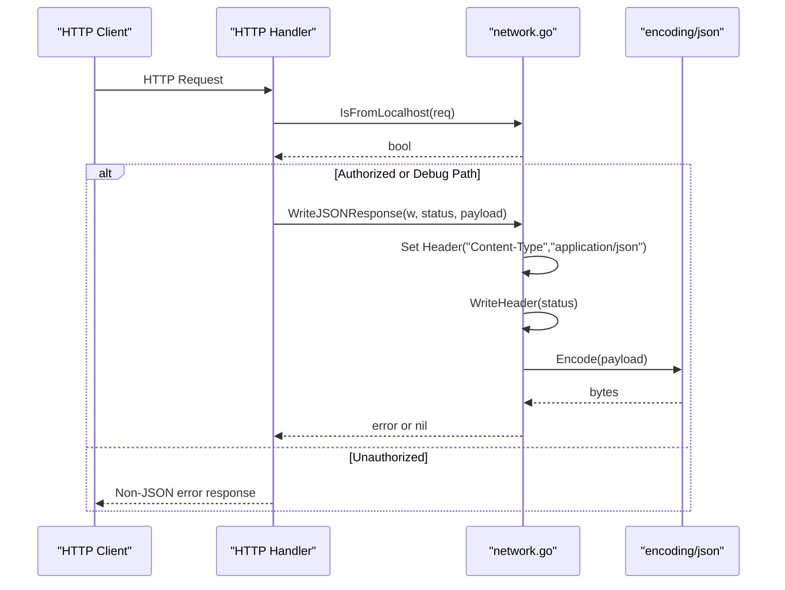
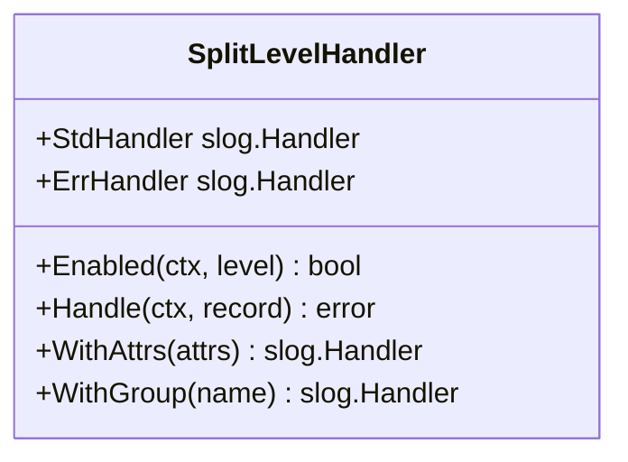
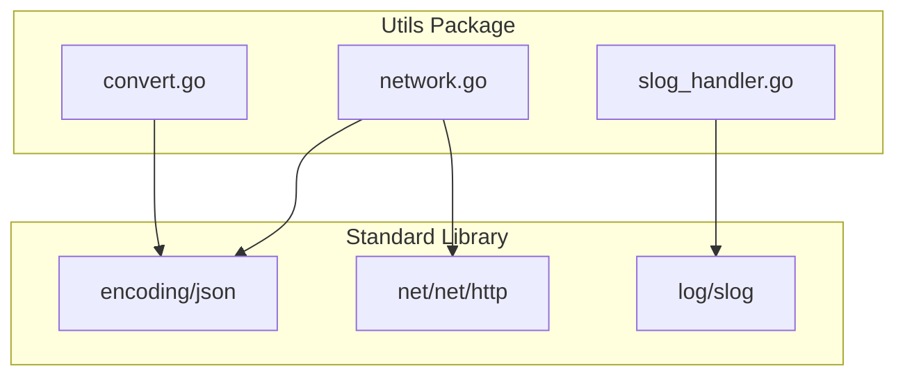

# Utility Functions Module

<cite>
**Referenced Files in This Document**
- [convert.go](file://utils/convert.go)
- [network.go](file://utils/network.go)
- [slog_handler.go](file://utils/slog_handler.go)
- [go.mod](file://go.mod)
</cite>

## Table of Contents
1. [Introduction](#introduction)
2. [Project Structure](#project-structure)
3. [Core Components](#core-components)
4. [Architecture Overview](#architecture-overview)
5. [Detailed Component Analysis](#detailed-component-analysis)
6. [Dependency Analysis](#dependency-analysis)
7. [Performance Considerations](#performance-considerations)
8. [Troubleshooting Guide](#troubleshooting-guide)
9. [Conclusion](#conclusion)

## Introduction
This document describes the Utility Functions module, focusing on three categories of helpers:
- Type conversion utilities for transforming between structs and maps with JSON serialization support
- Network utilities for localhost detection and JSON response handling
- Structured logging handler with split-level routing to stdout and stderr

It provides practical examples, common use cases, integration patterns, performance considerations, error handling, and best practices for using these utilities in larger applications.

## Project Structure
The Utility Functions module resides under the utils directory and exposes three primary packages:
- Struct/map conversions
- Network helpers
- Structured logging handler

**Diagram sources**
- [convert.go](file://utils/convert.go)
- [network.go](file://utils/network.go)
- [slog_handler.go](file://utils/slog_handler.go)
- [go.mod](file://go.mod)

**Section sources**
- [convert.go](file://utils/convert.go)
- [network.go](file://utils/network.go)
- [slog_handler.go](file://utils/slog_handler.go)
- [go.mod](file://go.mod)

## Core Components
This section summarizes the responsibilities and behaviors of each utility.

- StructToMap[T any](v *T) -> map[string]any
  - Serializes a pointer to a JSON-tagged struct into a map[string]any
  - Returns nil if v is nil
  - Uses JSON marshal/unmarshal internally

- MapToStruct[T any](m map[string]any) -> *T
  - Deserializes a map[string]any back into a typed struct pointer
  - Returns nil if m is nil or empty
  - Uses JSON marshal/unmarshal internally

- PrettyJSON(v any) -> json.RawMessage
  - Produces indented JSON bytes for pretty-printing
  - Returns an empty raw message on error

- IsFromLocalhost(req *http.Request) -> bool
  - Determines whether the incoming request originates from localhost
  - Handles IPv4 and IPv6 address literals
  - Falls back to RemoteAddr if parsing fails

- WriteJSONResponse(w http.ResponseWriter, status int, v any) -> error
  - Writes a JSON-encoded response with Content-Type set to application/json
  - Sets the HTTP status code and encodes the payload

- SplitLevelHandler
  - A slog.Handler wrapper that routes logs below Error to StdHandler and Error and above to ErrHandler
  - Supports WithAttrs and WithGroup delegation

**Section sources**
- [convert.go](file://utils/convert.go)
- [network.go](file://utils/network.go)
- [slog_handler.go](file://utils/slog_handler.go)

## Architecture Overview
The utilities are cohesive, self-contained packages with minimal external dependencies. They rely on standard library facilities:
- encoding/json for serialization/deserialization
- net/net/http for network-related checks and HTTP response writing
- log/slog for structured logging

**Diagram sources**
- [convert.go](file://utils/convert.go)
- [network.go](file://utils/network.go)
- [slog_handler.go](file://utils/slog_handler.go)

## Detailed Component Analysis

### Struct-to-Map and Map-to-Struct Conversions
These functions enable flexible data interchange between typed structs and dynamic maps, leveraging JSON serialization.

Key behaviors:
- Nil pointer handling: StructToMap returns nil for nil input; MapToStruct returns nil for empty map
- JSON round-trip: Both functions rely on JSON marshal/unmarshal, so struct fields must be JSON serializable
- Error propagation: On any JSON error, the functions return nil or an empty raw message

Common use cases:
- Building dynamic payloads for APIs or configuration systems
- Normalizing heterogeneous inputs into a uniform map representation
- Interoperating with libraries that expect map[string]any

Integration patterns:
- Use StructToMap to transform a typed struct into a map for downstream processing
- Use MapToStruct to reconstruct a typed struct from a map, validating keys and types
- Combine with PrettyJSON for human-readable logs or diagnostics

**Diagram sources**
- [convert.go](file://utils/convert.go)

**Section sources**
- [convert.go](file://utils/convert.go)

### Network Utilities: Localhost Detection and JSON Responses
These utilities simplify common HTTP tasks: determining origin and sending JSON responses.

Key behaviors:
- IsFromLocalhost handles IPv4 and IPv6 address literals, trimming brackets for IPv6
- WriteJSONResponse sets Content-Type, writes status, and encodes the payload; returns any encoding error

Common use cases:
- Debug endpoints that should only be accessible from localhost
- API handlers that consistently return JSON with appropriate status codes

Integration patterns:
- Gate sensitive endpoints behind IsFromLocalhost checks
- Centralize JSON responses via WriteJSONResponse to ensure consistent headers and error handling

**Diagram sources**
- [network.go](file://utils/network.go)

**Section sources**
- [network.go](file://utils/network.go)

### Structured Logging Handler: Split-Level Routing
This handler routes log records differently based on severity, sending lower-than-error logs to stdout and error-and-above logs to stderr.

Routing logic:
- Levels below Error: routed to StdHandler
- Levels Error and above: routed to ErrHandler

Common use cases:
- Ensuring errors appear in stderr for better visibility and capture by monitoring systems
- Keeping stdout clean for normal operational logs while still capturing warnings and above

Integration patterns:
- Wrap existing slog handlers (e.g., JSON or text) with SplitLevelHandler
- Configure StdHandler for info/debug and ErrHandler for error/warn

**Diagram sources**
- [slog_handler.go](file://utils/slog_handler.go)

**Section sources**
- [slog_handler.go](file://utils/slog_handler.go)

## Dependency Analysis
The utilities depend on standard library packages only, minimizing external coupling.

**Diagram sources**
- [convert.go](file://utils/convert.go)
- [network.go](file://utils/network.go)
- [slog_handler.go](file://utils/slog_handler.go)

**Section sources**
- [convert.go](file://utils/convert.go)
- [network.go](file://utils/network.go)
- [slog_handler.go](file://utils/slog_handler.go)
- [go.mod](file://go.mod)

## Performance Considerations
- JSON serialization cost: StructToMap and MapToStruct perform two JSON operations per call (marshal then unmarshal). For large structs or frequent conversions, consider caching or avoiding repeated conversions.
- PrettyJSON produces indented output suitable for human readability but increases payload size; reserve for logs and diagnostics rather than production API responses.
- Network utilities are lightweight; IsFromLocalhost performs simple string operations and a single header parse. WriteJSONResponse encodes once per call; batch responses when possible to reduce overhead.
- SplitLevelHandler adds negligible overhead compared to standard slog handlers; the routing decision is constant-time.

[No sources needed since this section provides general guidance]

## Troubleshooting Guide
- StructToMap returns nil:
  - Occurs when input is nil or JSON marshal fails
  - Verify the struct pointer is non-nil and fields are JSON serializable
- MapToStruct returns nil:
  - Occurs when input map is empty or JSON unmarshal fails
  - Ensure the map contains serialized JSON-compatible data and keys match struct field names
- PrettyJSON returns empty raw message:
  - Indicates JSON marshal failure; inspect the input value for unsupported types
- IsFromLocalhost returns false unexpectedly:
  - Confirm the client’s IP is indeed localhost
  - For IPv6, ensure brackets are handled correctly; the function trims brackets before comparison
- WriteJSONResponse returns an error:
  - Likely indicates an encoding issue or closed connection; handle the error and log appropriately
- SplitLevelHandler not routing as expected:
  - Verify the underlying handlers’ Enabled behavior and ensure levels are set correctly

**Section sources**
- [convert.go](file://utils/convert.go)
- [network.go](file://utils/network.go)
- [slog_handler.go](file://utils/slog_handler.go)

## Conclusion
The Utility Functions module provides focused, composable helpers for:
- Flexible struct-to-map conversions with JSON serialization
- Practical network checks and JSON response writing
- Structured logging with split-level routing

Adopt these utilities to streamline data interchange, simplify HTTP handling, and improve log observability. Apply the performance and troubleshooting guidance to ensure robust operation in production environments.